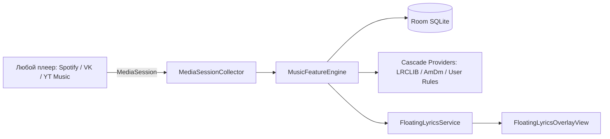

# Как мы научили Android показывать тексты и аккорды поверх любого плеера (и не дали системе убить процесс)

*Теги: Android, Jetpack Compose, Kotlin, Open Source, Reverse Engineering*  
*Хабы: Разработка под Android, Ненормальное программирование, Open Source*

Привет, Хабр! 

Если вы когда-нибудь пробовали играть на гитаре под любимый трек в Spotify или петь караоке под трек из VK Музыки, вы наверняка сталкивались с вечной болью мобильного мультитаскинга. Переключаться между окнами неудобно, split-screen делит экран пополам и съедает всё полезное пространство, а официальные клиенты либо прячут тексты за пейволлами, либо вовсе не знают про аккорды.

Мы разрабатываем **Lirix** — полностью открытый, offline-first музыкальный хаб для Android. В этом релизе мы решили две инженерные задачи, на которых обычно спотыкаются мобильные разработчики:
1. Как в реальном времени перехватывать метаданные и таймкоды из любого запущенного плеера без root-прав (`MediaSessionCompat`).
2. Как поднять легковесный плавающий оверлей с синхронизированными строками караоке и аккордами поверх чужих приложений (`SYSTEM_ALERT_WINDOW`) и реализовать кинетическую физику магнитного прилипания к краям экрана без лагов.
3. Как нарисовать виниловый проигрыватель с процедурным звукоснимателем (тонармом) на чистом Jetpack Compose `Canvas` без тяжелых Lottie-анимаций.

В этой статье — полный архитектурный разбор, математика снапа и подводные камни современных Android 14/15 и HyperOS/MIUI.

---

## 1. Архитектура: как Lirix слушает систему

Главный принцип Lirix — **zero telemetry** и полная автономность. Никаких серверов, аналитики и трекеров. Все тексты и аккорды кэшируются локально в Room SQLite.



### Перехват MediaSession
Мы используем системный `NotificationListenerService` в связке с `MediaSessionManager.addOnActiveSessionsChangedListener`. Это позволяет мгновенно реагировать на смену трека, изменения состояния воспроизведения (`PlaybackState.STATE_PLAYING`) и получать актуальную позицию дорожки с субсекундной точностью.

---

## 2. Плавающий оверлей: Foreground Service и математика Magnetic Snap

Отображение поверх других окон требует разрешения `SYSTEM_ALERT_WINDOW`. Но в современных версиях Android фоновый сервис моментально выгружается системой через несколько минут, если не объявлен как `foregroundServiceType="mediaPlayback"` с валидным `Notification`.

### Математика кинетического примагничивания
Плавающее окно не должно болтаться посередине экрана и перекрывать кнопки чужих приложений. При отпускании пальца окно обязано плавно «прилипать» к левой или правой грани экрана:

```kotlin
fun calculateSnapTargetX(
    currentX: Int,
    viewWidth: Int,
    screenWidth: Int,
    marginPx: Int = 32
): Int {
    if (screenWidth <= 0 || viewWidth <= 0) return currentX
    val viewCenterX = currentX + viewWidth / 2
    val screenCenterX = screenWidth / 2

    return if (viewCenterX < screenCenterX) {
        marginPx.coerceAtLeast(0)
    } else {
        (screenWidth - viewWidth - marginPx).coerceAtLeast(0)
    }
}
```

Анимация рассчитывается через `DecelerateInterpolator` за 240 мс, создавая тактильное ощущение физического объекта.

---

## 3. Кинетический тонарм на чистом Compose Canvas

Большинство приложений используют тяжелые JSON-анимации Lottie для декоративных элементов. Мы пошли по пути процедурной отрисовки на `Canvas`. 

Тонарм (звукосниматель) пластинки имеет два состояния:
- **Play:** игла плавно опускается на край вращающейся пластинки (`targetAngle = 24f`).
- **Pause:** игла поднимается и паркуется на стойку держателя (`targetAngle = 0f`).

```kotlin
val tonearmAngle by animateFloatAsState(
    targetValue = if (isPlaying) 24f else 0f,
    animationSpec = spring(
        dampingRatio = Spring.DampingRatioLowBouncy,
        stiffness = Spring.StiffnessLow
    )
)
```

При этом кончик иглы снабжен процедурным градиентом с неоновым свечением CyberCyan, которое пульсирует в такт воспроизведению.

---

## 4. Scraper Community: открытый обмен правилами парсинга

Чтобы не зависеть от централизованных API, мы внедрили движок **TeachMode**. Пользователь может открыть любой сайт с текстами в мобильном веб-инспекторе и в 1 тап выделить блок с текстом.

Правила упаковываются в открытый переносимый JSON-пакет (`LirixScraperRuleBundle` v1):
- Криптографическая подпись **SHA-256** для защиты от повреждений.
- Санитизация CSS-селекторов без опасного `eval()` (защита от XSS/SSRF).
- Экспорт через стандартный системный `Android Share Intent` прямо в Telegram или Discord.

---

## Исходный код и сборка

Проект полностью открыт под лицензией MIT:
* GitHub: [https://github.com/Asm-o-Dan/lirix](https://github.com/Asm-o-Dan/lirix)
* Релизные APK без рекламы доступны во вкладке Releases.

Будем рады вашему фидбеку и звёздочкам на GitHub!
