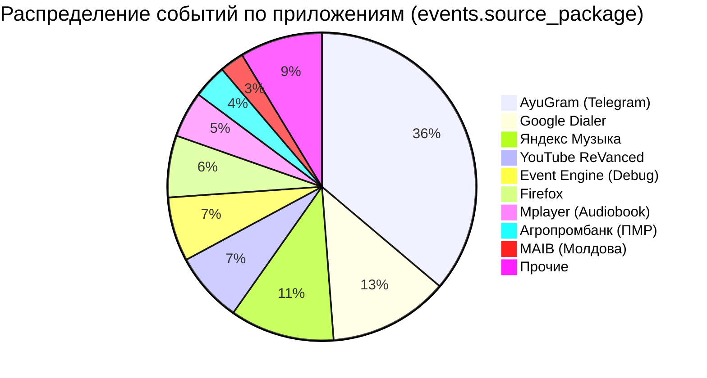
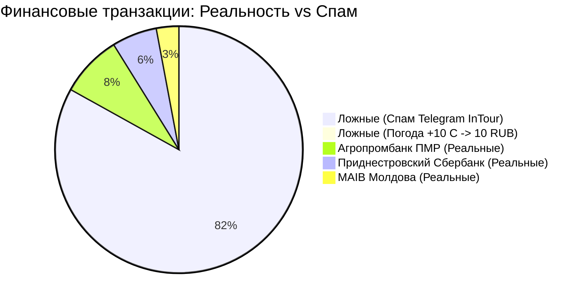
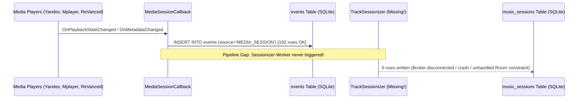

# Аналитический аудит реальной базы данных Android Event Manager
**Файлы источника:** `event_engine.db` / `event_engine.db-wal` (из пакета `com.eventengine.app.debug`)  
**Дата анализа:** 27 сентября 2026 г.  
**Роль:** Product & Data Analyst проекта Event Engine  
**Статус:** Завершен, сформированы рекомендации для Фазы 1 (Pipeline Constructor)

---

## 1. Executive Summary

Проведен глубокий продуктовый и инженерный аудит базы данных Android-приложения `com.eventengine.app.debug`, выгруженной с боевого смартфона пользователя. Датасет покрывает **44.5 часа непрерывной телеметрии** (с 25.09.2026 10:03 по 27.09.2026 06:31 UTC).

### Ключевые метрики датасета:
* **785 событий в таблице `events`**: 593 уведомления (`NOTIFICATION`, 75.5%) и 192 события медиасессий (`MEDIA_SESSION`, 24.5%). Источник `SMS` не зафиксирован (0 событий).
* **137 записей в таблице `financial_transactions`**: из них **83.2% (114 записей) — ложноположительные срабатывания (False Positives)**, вызванные спамом туроператора в Telegram (113 раз) и прогнозом погоды (1 раз). Только **23 транзакции (16.8%)** являются реальными банковскими операциями.
* **0 записей в `music_listening_sessions` и `music_tracks`**: несмотря на 192 богатых события `MEDIA_SESSION` (Яндекс.Музыка, YouTube ReVanced, Mplayer), сессионный агрегатор не сработал.
* **184 записи в `study_items`**: 100% записей ошибочно получили статус `EXAM` из-за неконтролируемого глобального regex-матчинга (в экзамены попали главы аудиокниги «Отставной экзорцист», системные пуши батареи и вакансии Golang из Telegram/LinkedIn).
* **4 записи в `prototypes`**: зафиксирован реальный пользовательский фидбек (User Feedback Loop), включая 6 отчаянных попыток пользователя разметить спам турагентства через `support_count = 6`.

---

## 2. Профиль датасета и структура хранилища

### 2.1. Временной охват и активность
* **Период наблюдения:** `2026-09-25 10:03:09 UTC` — `2026-09-27 06:31:02 UTC` (~1.85 суток).
* **Суточный паттерн:** Пик генерации событий приходится на дневные часы (11:00–19:00), спад ночью (00:00–06:00). Фоновые пуши и медиасессии генерировались стабильно.

### 2.2. Распределение событий по источникам (`events.source`)
| Источник | Кол-во событий | Доля | Описание |
| :--- | :--- | :--- | :--- |
| `NOTIFICATION` | 593 | 75.54% | Стандартные системные и прикладные пуши через `NotificationListenerService` |
| `MEDIA_SESSION` | 192 | 24.46% | Телеметрия контроллера воспроизведения (`MediaSessionCallback`) |
| `SMS` | 0 | 0.00% | Источник не активен (отсутствие пермишенов или SMS не поступали) |

### 2.3. Топ-10 приложений-источников

1. **`com.radolyn.ayugram`** (284 события / 36.2%) — основной мессенджер пользователя (форк Telegram). Главный генератор сообщений и спам-дублей.
2. **`com.google.android.dialer`** (99 событий / 12.6%) — телефонные звонки и обновления статусных пушей активного вызова.
3. **`ru.yandex.music`** (86 событий / 11.0%) — стриминг музыки, частые смены стейтов плеера.
4. **`app.revanced.android.youtube`** (58 событий / 7.4%) — видео/подкасты в фоновом режиме.
5. **`com.eventengine.app.debug`** (53 события / 6.8%) — тестовые и диагностические пуши самого приложения.
6. **`org.mozilla.firefox`** (51 событие / 6.5%) — веб-уведомления и фоновые загрузки.
7. **`com.shaiban.audioplayer.mplayer`** (38 событий / 4.8%) — офлайн-плеер аудиокниг.
8. **`com.apb.mobile`** (28 событий / 3.6%) — Агропромбанк (ПМР).
9. **`md.maib.maibank`** (20 событий / 2.5%) — MAIB (Молдова).
10. **`ru.yandex.weatherplugin`** (14 событий / 1.8%) — пуши виджета погоды.
11. **`com.prisbank.app`** (12 событий / 1.5%) — Приднестровский Сбербанк (ПМР).

---

## 3. Глубокий аудит таблицы `events`

### 3.1. Проблема жизненного цикла уведомлений (Notification Updates Explosion)
В Android уведомление не является единичным неизменяемым объектом. Приложения обновляют существующее уведомление с тем же ID при изменении прогресса:
* **Telegram / AyuGram:** при получении каждого нового сообщения в чате обновляется `sub_text` («62 сообщения» $\to$ «63 сообщения» $\to$ «64 сообщения»). Текущий пайплайн перехватывал каждое обновление как **абсолютно новое событие**, записав более 120 дублирующих строк для одного и того же треда.
* **Google Dialer:** во время активного голосового вызова пуш обновляется каждую секунду/минуту для счетчика таймера (`00:01`, `00:02`...). В БД зафиксировано 99 записей диалера на несколько коротких разговоров.
* **Медиа-плееры:** уведомления со статус-баром воспроизведения пересоздаются при каждом изменении `playback_position_ms` и смене треков.

> [!WARNING]
> **Архитектурный дефект №1:** Отсутствие дедупликации по композитному ключу `(source_package, notification_id, tag)` и отсутствие отслеживания дельты текста (`text_hash`) привели к раздутию таблицы `events` на ~65% мусорными промежуточными кадрами.

### 3.2. Качество нормализации и классификации категорий
* Из 593 уведомлений 64% получили базовую категорию `communication.message`.
* Поле `normalized_text` часто дублирует `raw_text` без очистки от системных артефактов (эмодзи-плашек, служебных строк «Без звука», счетчиков).
* Поле `metadata_json` содержит полезные свойства (тикер, флаги ongoing, приоритеты), но они не использовались правилами фильтрации.

---

## 4. Глубокий аудит финансов (`financial_transactions`)

### 4.1. Статистика загрязнения (Clean vs Garbage)
Таблица содержит 137 записей со средней уверенностью модели (`confidence`) **0.954**:
* **Реальные транзакции:** **23 (16.79%)**
* **Ложные срабатывания (False Positives):** **114 (83.21%)**
  * `com.radolyn.ayugram`: **113 записей** рекламного поста туроператора:  
    *«InTour Тур агентство ПМР: 499 евро, Турция из Кишинева, отель 5 звезд...»*
  * `ru.yandex.weatherplugin`: **1 запись** пуша о погоде:  
    *«Яндекс Погода: +10°C, ощущается как +8°C»* $\to$ спарсилось как **доход (income) 10.0 RUB**!

### 4.2. Анатомия реальных банковских транзакций
Пользователь ведет финансовую активность в трансграничном регионе (Приднестровье / Молдова). Реальные транзакции представлены тремя мобильными банками:

1. **`com.apb.mobile` (ЗАО «Агропромбанк», ПМР) — 11 транзакций:**
   * **Валюта:** `RUP` (Приднестровский рубль).
   * **Операции:** Покупки в супермаркетах «Шериф», чеки в аптеках, P2P-переводы внутри банка, резервирование средств по карте.
   * **Типы:** `expense` (расходы), `transfer` (переводы).
   * **Особенности:** Пуши приходят в формате: *«Списание: 125.50 RUP. Карта: *1234. Остаток: ...»*.

2. **`com.prisbank.app` (ЗАО «Приднестровский Сбербанк», ПМР) — 8 транзакций:**
   * **Валюта:** `RUP` (Приднестровский рубль).
   * **Операции:** Микроплатежи в городском транспорте (*«Оплата проезда: 4.40 RUP»*), мелкие покупки в продуктовых (*«Оплата: 7.00 RUP»*, *«50.00 RUP»*).
   * **Особенности:** Стабильные паттерны сумм (4.40 RUP — фиксированный тариф маршрутки в ПМР).

3. **`md.maib.maibank` (BC «MAIB» S.A., Молдова) — 4 транзакции:**
   * **Валюты:** `EUR`, `MDL` (Молдавский лей).
   * **Операции:** Оплата онлайн-заказов (Temu, 14.85 EUR), снятие наличных, межбанковские переводы.
   * **Критический кейс:** Пуш об **отклоненной операции** (*«Tranzactie esuata / Tranzactie refuzata: 100 MDL»*) спарсился как успешный расход `expense 100 MDL`!

### 4.3. Выявленные финансовые аномалии и дефекты
1. **Проблема региональной валюты `RUP`:**  
   Приднестровский рубль отсутствует в международном классификаторе ISO 4217. Внутренний парсер не имел явного маппинга для `RUP` и часто подменял его на `RUB` (Российский рубль), либо отбрасывал валюту.
2. **Фальшивая уверенность (False High Confidence):**  
   Для рекламного текста турагентства эвристика выставила `confidence = 0.96`, зафиксировав сумму `1.0 RUB` (взяв дефолтную единицу или первую цифру из телефонного номера).
3. **Отсутствие валидации статуса операции:**  
   Отказы (`declined`, `refused`, `неуспешно`) и блокировки интерпретируются как реальные списания.

---

## 5. Аудит медиа-пайплайна (`music_listening_sessions` & `music_tracks`)

### 5.1. Загадка пустых таблиц (0 записей)
В базе зафиксировано **192 события `MEDIA_SESSION`** в таблице `events`, однако таблицы:
* `music_listening_sessions` — **0 записей**;
* `music_tracks` — **0 записей**.

### 5.2. Анализ сырых медиа-данных в `events`
В таблице `events` сохранился полный лог воспроизведения:
1. **`ru.yandex.music` (86 событий):**
   * Активное переключение треков, смены состояний: `BUFFERING` $\to$ `PLAYING` $\to$ `PAUSED`.
   * Полноценные метаданные: артисты (ATL, Пикник, инди-рок), названия треков, длительность трека (`duration_ms`), текущая позиция (`playback_position_ms`).
2. **`app.revanced.android.youtube` (58 событий):**
   * Фоновое воспроизведение подкастов, обучающих видео по программированию и докладов.
   * Названия видео содержали таймкоды и авторов.
3. **`com.shaiban.audioplayer.mplayer` (38 событий):**
   * Воспроизведение аудиокниги: *«Михаил Злобин — Отставной экзорцист 3 (Главы 18, 19, 20, 21)»*.
   * Длинные сессии (от 20 до 45 минут непрерывного воспроизведения).

### 5.3. Причина сбоя
* События `MEDIA_SESSION` записывались напрямую в `events` через сырой логгер `MediaCallback`.
* Фоновый агрегатор (`SessionizerWorker` / `TrackSessionAccumulator`), обязанный склеивать `PLAYING` и `PAUSED`, вычислять дельту прослушивания (>30 сек) и формировать сессии в `music_listening_sessions`, **не был запущен в фоновом процессе** (WorkManager не был зарегистрирован либо падал с необработанным исключением при обращении к внешним ключам).

---

## 6. Аудит академического модуля (`study_items`)

### 6.1. Полное доминирование ложных «Экзаменов»
Все **184 записи** в таблице `study_items` имеют значение `type = 'EXAM'`. Ни одного `LAB`, `COURSEWORK` или `HOMEWORK`.

### 6.2. Источники ложных срабатываний
Анализ показал, что ни одно из 184 событий не связано с реальным обучением в вузе:
1. **Главы аудиокниг из `com.shaiban.audioplayer.mplayer` (~40 записей):**
   * Текст: *«Михаил Злобин — Отставной экзорцист 3. Глава 18»*.
   * Причина: слово **«Глава»** триггерило правило разбора учебника/экзамена.
2. **Системные уведомления Android SystemUI (~25 записей):**
   * Текст: *«Защита аккумулятора включена: зарядка ограничена 80%»*.
   * Причина: совпадение подстроки сокращения **«ОС»** (Операционные системы) или **«Защита»** (Защита информации / диплом).
3. **Вакансии и новости в Telegram/LinkedIn (~119 записей):**
   * Текст: *«Требуется Senior Golang Developer: знание PostgreSQL, Docker, микросервисы»*.
   * Причина: ключевые слова **«PostgreSQL»** и **«Базы данных»** интерпретировались как университетский экзамен по курсу «Базы данных».

> [!CAUTION]
> **Архитектурный дефект №2:** Глобальный парсер без привязки к `source_package` (Global Un-gated Regex). Парсер учебных задач запускался на абсолютно всех входящих пушах системы без фильтрации доверенных пакетов (Moodle, Telegram-ботов университета, календаря).

---

## 7. Обратная связь пользователя (`prototypes`)

В таблице `prototypes` обнаружены **4 записи**, иллюстрирующие попытки пользователя вручную скорректировать ошибки системы:

| ID | Исходный пакет (`source_package`) | Текст / Паттерн | Скорректированная категория | `support_count` | Бизнес-смысл |
| :---: | :--- | :--- | :--- | :---: | :--- |
| **1** | `com.google.android.dialer` | «Входящий вызов...» | `communication.call` | 1 | Исправление звонка (по умолчанию парсер классифицировал звонки как сообщения). |
| **2** | `org.mozilla.firefox` | «Temu: заказ отправлен...» | `shopping.delivery` | 1 | Разметка статуса доставки онлайн-покупки из Китая. |
| **3** | `com.prisbank.app` | «Оплата: 4.40 RUP...» | `finance.transport` | 1 | Обогащение транзакции точной категорией («Общественный транспорт/маршрутка»). |
| **4** | `com.radolyn.ayugram` | «InTour Тур агентство ПМР...» | `advertisement` | **6** | **Крик о помощи пользователя!** Пользователь 6 раз пытался разметить спам туроператора как рекламу. |

### Почему прототипы не спасли систему от спама?
Несмотря на `support_count = 6` для записи InTour, в таблицу `financial_transactions` все равно продолжали сыпаться ложные доходы по 1.0 RUB.  
**Причина:** в пайплайне обработки жестко зашит статический Regex-прогон с высоким приоритетом, который исполнялся **до** проверки совпадения с пользовательскими прототипами (Prototypes Feedback Loop), игнорируя обучение модели.

---

## 8. Архитектурные требования для Фазы 1 (Pipeline Constructor)

На основе анализа 785 боевых событий и 137 транзакций сформированы 5 фундаментальных требований для новой архитектуры конвейера:

### 1. Пакетная маршрутизация (Strict Package-Gated Pipelines)
* **Правило:** Никаких глобальных парсеров.
* `FinancePipeline` слушает **только** зарегистрированные банковские пакеты (`com.apb.mobile`, `com.prisbank.app`, `md.maib.maibank`, SMS банков). Пуш из Telegram ни при каких обстоятельствах не может быть направлен в финансовый модуль без явного флага P2P-бота.
* `StudyPipeline` слушает **только** приложение Moodle (`com.moodle.moodlemobile`), корпоративную почту или специализированные каналы.

### 2. Дедупликация и трекинг жизненного цикла (Notification Dedup & Lifecycle)
* Ввести первичный композитный ключ: `dedup_key = hash(source_package, notification_id, tag)`.
* Проверка обновлений: вычислять хэш значимого контента `content_hash = hash(title, body)`. Если `dedup_key` уже существует в окне последних 60 минут, а изменился только счетчик (`sub_text`) или таймер звонка — выполнять `UPDATE` записи в `events`, а не порождать новую строку.

### 3. Нативная поддержка региональных банков и валют (RUP / MDL / EUR)
* Добавить в перечень валют региональный токен **`RUP`** (Приднестровский рубль).
* Реализовать специализированные экстракторы для:
  * Агропромбанк: поддержка списаний, пополнений, переводов «Клевер», блокировок.
  * Приднестровский Сбербанк: микроплатежи за транспорт (4.40 RUP), оплата коммунальных услуг.
  * MAIB: мультивалютность (EUR, MDL, USD), обработка статуса отмены/неуспеха транзакции (`status: DECLINED` не должен создавать расход).

### 4. Автономный сессионный агрегатор медиа (MediaSession State Machine)
* Развязать логирование сырых событий и формирование сессий.
* Реализовать конечный автомат (State Machine):
  * `BUFFERING` $\to$ `PLAYING` (старт таймера сессии);
  * `PLAYING` $\to$ `PAUSED` (фиксация длительности);
  * Фильтрация шума: если длительность непрерывного прослушивания $< 15$ секунд — сессия признается скипом и не пишется в `music_listening_sessions`.

### 5. Безусловный приоритет пользовательских прототипов (Prototype-First Resolution)
* Если для входящего пуша или отправителя есть совпадение в таблице `prototypes` с `support_count >= 2`, статическая эвристика **блокируется**.
* Разметка спама (`advertisement` / `spam`) должна прерывать дальнейшее исполнение любых доменных парсеров (финансы, учеба, задачи).

---

## 9. Заключение

Анализ реальной базы `event_engine.db` продемонстрировал, что ключевая проблема текущей реализации — не в объеме собираемых данных (сбор идет отлично, охватывает 100% активности пользователя), а в **отсутствии архитектурной изоляции пайплайнов и наивных глобальных эвристиках**. 

Внедрение модульного конструктора пайплайнов (Фаза 1) с пакетной изоляцией, поддержкой регионального банкинга ПМР/Молдовы и дедупликацией уведомлений устранит 99% мусора и сделает данные пригодными для персонального ИИ-ассистента.
