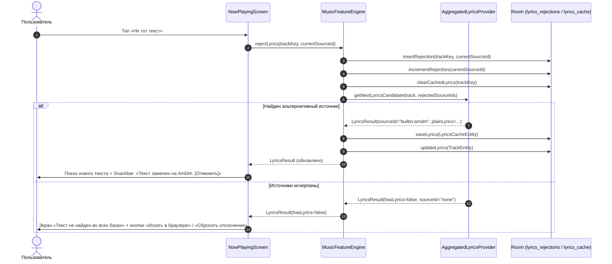

# Архитектурный проект: LYR-COMMUNITY — Пользовательские источники текстов, отклонение источников и общий реестр правил

- **ID эпика:** `LYR-COMMUNITY`
- **Роль:** Архитектор (Spec Driven Design)
- **Версия:** v1.0
- **Дата:** 2026-10-04
- **Статус:** APPROVED FOR IMPLEMENTATION
- **Нормативная база:** [INTAKE: LYR-COMMUNITY.md](file:///c:/Users/DaniilTuT/Documents/antigravity/quick-nobel/.sdd/intake/LYR-COMMUNITY.md), [architecture.md](file:///c:/Users/DaniilTuT/Documents/antigravity/quick-nobel/.sdd/architecture.md), [core__lyrics.md](file:///c:/Users/DaniilTuT/Documents/antigravity/quick-nobel/.sdd/contracts/core__lyrics.md)

---

## 1. Карта зон и архитектурная декомпозиция

Эпик охватывает четыре зоны системы:

```
┌────────────────────────────────────────────────────────────────────────┐
│                        ZONE: media-ingress                             │
│  - Android Share Intent Receiver (ACTION_SEND text / URL)              │
│  - URL Normalizer & Intent Dispatcher                                  │
└───────────────────────────────────┬────────────────────────────────────┘
                                    │
┌───────────────────────────────────▼────────────────────────────────────┐
│                        ZONE: media-core                                │
│  - Room Database v9 (MIGRATION_8_9):                                   │
│      * lyrics_rejections (trackKey, sourceId, rejectedAt)              │
│      * custom_lyrics_rules (id, domain, name, ruleJson, priority...)   │
│      * rule_quality_stats (ruleId, successes, rejections)              │
│  - MusicFeatureEngine & Prefetch Coordinator                           │
└───────────────────────────────────┬────────────────────────────────────┘
                                    │
┌───────────────────────────────────▼────────────────────────────────────┐
│                        ZONE: lyrics-engine                             │
│  - Canonical Source Identifiers (sourceId: lrclib, amdm, custom:id)     │
│  - Cascade Provider Engine with Rejection Exclusion                    │
│  - Declarative JSON Rule Parser & DOM Extractor (HTML/JSON, No Eval)   │
│  - Community Registry Client (Sync, Validation, Quality Scoring)       │
└───────────────────────────────────┬────────────────────────────────────┘
                                    │
┌───────────────────────────────────▼────────────────────────────────────┐
│                        ZONE: media-ui                                  │
│  - NowPlayingScreen: «Не тот текст» + Undo Snackbar + Empty State       │
│  - TeachModeScreen (In-App WebView + JS Selector Generator)            │
│  - MySourcesScreen (FR-4: приоритеты, включение/выключение)            │
│  - CommunityRulesScreen (FR-5: каталог, импорт, экспорт)               │
└────────────────────────────────────────────────────────────────────────┘
```

---

## 2. Модель данных и план миграции Room (v8 -> v9)

### 2.1 Новые сущности в `storage/MusicEntities.kt`

#### 1. Сущность отклонений источников `LyricsRejectionEntity`
Хранит факты отклонения текста для конкретного трека конкретным провайдером. Переживает перезапуски, гарантирует, что отклоненный текст никогда больше не будет показан для данного трека.

```kotlin
@Entity(
    tableName = "lyrics_rejections",
    primaryKeys = ["trackKey", "sourceId"],
    indices = [
        Index(value = ["trackKey"]),
        Index(value = ["sourceId"])
    ]
)
data class LyricsRejectionEntity(
    val trackKey: String,          // SHA-256 fingerprint трека
    val sourceId: String,          // Уникальный ID источника ("lrclib", "amdm", "vse-pesni", "rule:xxx")
    val rejectedAt: Long = System.currentTimeMillis()
)
```

#### 2. Сущность декларативных правил-парсеров `CustomLyricsRuleEntity`
Хранит как созданные локально в Teach Mode правила, так и загруженные из Community-реестра.

```kotlin
@Entity(
    tableName = "custom_lyrics_rules",
    indices = [
        Index(value = ["domain"]),
        Index(value = ["isEnabled"]),
        Index(value = ["priority"])
    ]
)
data class CustomLyricsRuleEntity(
    @PrimaryKey
    val id: String,                 // UUID или slug, e.g. "rule_amalgama_v1"
    val domain: String,             // Базовый домен: "amalgama-lab.com"
    val name: String,               // Название: "Амальгама (Русский перевод)"
    val ruleJson: String,           // JSON-описание селекторов и структуры (декларативное)
    val isEnabled: Boolean = true,  // Активно ли правило в цепочке
    val priority: Int = 100,        // Приоритет (меньше = выше приоритет, встроенные = 200+)
    val isBuiltIn: Boolean = false, // Защита от случайного удаления
    val author: String = "local",   // "local" или идентификатор автора из комьюнити
    val version: Int = 1,
    val createdAt: Long = System.currentTimeMillis(),
    val updatedAt: Long = System.currentTimeMillis()
)
```

#### 3. Сущность метрик качества правил `RuleQualityEntity`
Локальная статистика успешности извлечения и отклонений для каждого правила. Служит основой для FR-4 (индикация «Правило сломано») и FR-5 (отправка качества в общий реестр).

```kotlin
@Entity(
    tableName = "rule_quality_stats",
    indices = [Index(value = ["ruleId"])]
)
data class RuleQualityEntity(
    @PrimaryKey
    val ruleId: String,
    val successCount: Int = 0,
    val rejectionCount: Int = 0,
    val lastSuccessAt: Long? = null,
    val lastRejectionAt: Long? = null
)
```

### 2.2 Методы DAO в `storage/LyricsDao.kt`

```kotlin
// Управление отклонениями
@Insert(onConflict = OnConflictStrategy.REPLACE)
suspend fun insertRejection(rejection: LyricsRejectionEntity)

@Query("SELECT sourceId FROM lyrics_rejections WHERE trackKey = :trackKey")
suspend fun getRejectedSourceIds(trackKey: String): List<String>

@Query("DELETE FROM lyrics_rejections WHERE trackKey = :trackKey AND sourceId = :sourceId")
suspend fun deleteRejection(trackKey: String, sourceId: String)

@Query("DELETE FROM lyrics_rejections WHERE trackKey = :trackKey")
suspend fun clearRejectionsForTrack(trackKey: String)

// Управление правилами
@Query("SELECT * FROM custom_lyrics_rules WHERE isEnabled = 1 ORDER BY priority ASC, createdAt DESC")
suspend fun getActiveRules(): List<CustomLyricsRuleEntity>

@Query("SELECT * FROM custom_lyrics_rules ORDER BY priority ASC")
fun observeAllRules(): Flow<List<CustomLyricsRuleEntity>>

@Insert(onConflict = OnConflictStrategy.REPLACE)
suspend fun saveRule(rule: CustomLyricsRuleEntity)

@Query("DELETE FROM custom_lyrics_rules WHERE id = :id AND isBuiltIn = 0")
suspend fun deleteRule(id: String)

@Query("UPDATE custom_lyrics_rules SET isEnabled = :isEnabled WHERE id = :id")
suspend fun setRuleEnabled(id: String, isEnabled: Boolean)

// Качество правил
@Insert(onConflict = OnConflictStrategy.REPLACE)
suspend fun saveQualityStat(stat: RuleQualityEntity)

@Query("SELECT * FROM rule_quality_stats WHERE ruleId = :ruleId")
suspend fun getQualityStat(ruleId: String): RuleQualityEntity?

@Query("UPDATE rule_quality_stats SET rejectionCount = rejectionCount + 1, lastRejectionAt = :now WHERE ruleId = :ruleId")
suspend fun incrementRejection(ruleId: String, now: Long = System.currentTimeMillis())

@Query("UPDATE rule_quality_stats SET successCount = successCount + 1, lastSuccessAt = :now WHERE ruleId = :ruleId")
suspend fun incrementSuccess(ruleId: String, now: Long = System.currentTimeMillis())
```

### 2.3 Миграция базы данных `MIGRATION_8_9` в `AppDatabase.kt`

Гарантирует 100% сохранность существующих данных таблиц `music_tracks`, `music_listening_sessions`, `lyrics_cache`, `achievements`:

```kotlin
@JvmField
val MIGRATION_8_9: Migration = object : Migration(8, 9) {
    override fun migrate(db: SupportSQLiteDatabase) {
        // 1. Создание таблицы отклонений lyrics_rejections
        db.execSQL(
            """
            CREATE TABLE IF NOT EXISTS `lyrics_rejections` (
                `trackKey` TEXT NOT NULL,
                `sourceId` TEXT NOT NULL,
                `rejectedAt` INTEGER NOT NULL,
                PRIMARY KEY(`trackKey`, `sourceId`)
            )
            """.trimIndent()
        )
        db.execSQL("CREATE INDEX IF NOT EXISTS `index_lyrics_rejections_trackKey` ON `lyrics_rejections` (`trackKey`)")
        db.execSQL("CREATE INDEX IF NOT EXISTS `index_lyrics_rejections_sourceId` ON `lyrics_rejections` (`sourceId`)")

        // 2. Создание таблицы декларативных правил custom_lyrics_rules
        db.execSQL(
            """
            CREATE TABLE IF NOT EXISTS `custom_lyrics_rules` (
                `id` TEXT NOT NULL,
                `domain` TEXT NOT NULL,
                `name` TEXT NOT NULL,
                `ruleJson` TEXT NOT NULL,
                `isEnabled` INTEGER NOT NULL DEFAULT 1,
                `priority` INTEGER NOT NULL DEFAULT 100,
                `isBuiltIn` INTEGER NOT NULL DEFAULT 0,
                `author` TEXT NOT NULL DEFAULT 'local',
                `version` INTEGER NOT NULL DEFAULT 1,
                `createdAt` INTEGER NOT NULL,
                `updatedAt` INTEGER NOT NULL,
                PRIMARY KEY(`id`)
            )
            """.trimIndent()
        )
        db.execSQL("CREATE INDEX IF NOT EXISTS `index_custom_lyrics_rules_domain` ON `custom_lyrics_rules` (`domain`)")
        db.execSQL("CREATE INDEX IF NOT EXISTS `index_custom_lyrics_rules_isEnabled` ON `custom_lyrics_rules` (`isEnabled`)")
        db.execSQL("CREATE INDEX IF NOT EXISTS `index_custom_lyrics_rules_priority` ON `custom_lyrics_rules` (`priority`)")

        // 3. Создание таблицы статистики качества rule_quality_stats
        db.execSQL(
            """
            CREATE TABLE IF NOT EXISTS `rule_quality_stats` (
                `ruleId` TEXT NOT NULL,
                `successCount` INTEGER NOT NULL DEFAULT 0,
                `rejectionCount` INTEGER NOT NULL DEFAULT 0,
                `lastSuccessAt` INTEGER,
                `lastRejectionAt` INTEGER,
                PRIMARY KEY(`ruleId`)
            )
            """.trimIndent()
        )
        db.execSQL("CREATE INDEX IF NOT EXISTS `index_rule_quality_stats_ruleId` ON `rule_quality_stats` (`ruleId`)")
    }
}
```

---

## 3. Цепочка и приоритет источников, влияние отклонений

### 3.1 Идентификаторы источников (`sourceId`)
Каждый источник текстов обязан иметь стабильный строковый идентификатор `sourceId`:
- `note:user` — Ручные заметки пользователя к треку.
- `rule:<ruleId>` — Пользовательское или загруженное из комьюнити декларативное правило.
- `builtin:lrclib` — Встроенный провайдер LRCLIB (LRC + plain).
- `builtin:amdm` — Встроенный скрапер AmDm.ru (аккорды + текст).
- `builtin:vse-pesni` — Встроенный скрапер VsePesni.
- `builtin:fallback-scrapers` — Резервные встроенные источники.
- `share:manual` — Текст, переданный вручную через Android Share.

### 3.2 Приоритеты опроса источников
```
  [1. Ручной текст пользователя (Share / Заметки)]
                        │
                        ▼ (если нет или отклонен)
  [2. Пользовательские правила (custom_lyrics_rules: priority ASC)]
                        │
                        ▼ (если нет или все отклонены)
  [3. LRCLIB (Встроенный API: synced LRC караоке)]
                        │
                        ▼ (если нет или отклонен)
  [4. AmDm (Встроенный парсер аккордов для кириллицы)]
                        │
                        ▼ (если нет или отклонен)
  [5. Резервные скраперы (VsePesni / Genius / Amalgama)]
                        │
                        ▼
  [6. Состояние: «Текст не найден» (предложение поиска в WebView)]
```

### 3.3 Алгоритм работы «Не тот текст» (FR-1)



### 3.4 Влияние отклонений на Prefetch и Cache
1. **Проверка кэша:**
   Перед возвратом кэша из `lyrics_cache` или `music_tracks` проверяется:
   ```kotlin
   val rejectedSources = lyricsDao.getRejectedSourceIds(trackKey)
   if (cached.provider in rejectedSources) {
       // Кэш скомпрометирован/отклонен пользователем!
       // Удаляем запись кэша и ищем следующий источник.
   }
   ```
2. **Фоновый Prefetch (`prefetchLyricsAsync` / `enqueueWifiPrefetch`):**
   - Запрашивает список отклоненных источников для `trackKey`.
   - Передает `rejectedSourceIds` в агрегатор.
   - Если провайдер вернул результат из отклоненного источника, результат **игнорируется** и никогда не записывается в Room.

### 3.5 Механика отмены (Undo)
1. **Быстрая отмена (Snackbar):**
   При нажатии на «Не тот текст» показывается Snackbar: `«Текст отклонён. [Отменить]»` (таймаут 5 секунд). При клике на `Отменить`:
   - Вызывается `lyricsDao.deleteRejection(trackKey, sourceId)`.
   - Восстанавливается предыдущий результат.
2. **Восстановление всех отклонений трека:**
   На экране «Текст не найден» доступна кнопка `«Сбросить отклонённые источники»`:
   - Очищает все записи в `lyrics_rejections` для текущего `trackKey`.
   - Перезапускает поиск с самого первого приоритетного источника.

---

## 4. Механика выделения в WebView и генерации устойчивого селектора (Teach Mode)

### 4.1 Архитектура WebView
- Компонент `TeachModeScreen` использует `AndroidView` с системным `android.webkit.WebView`.
- Настройки безопасности:
  - `javaScriptEnabled = true` (необходимо для рендеринга современных сайтов и инспектора).
  - `allowFileAccess = false`, `allowContentAccess = false` (песочница, запрет чтения локальных файлов).
  - Блокировка редиректов на внешние intent'ы через `shouldOverrideUrlLoading` (разрешены только `http` и `https`).

### 4.2 Скрипт-инспектор (Touch Inspector Injection)
При завершении загрузки страницы (`onPageFinished`) внедряется легковесный JS-мост `teach_inspector.js`:
1. Перехватывает события тапа:
   ```javascript
   document.addEventListener('click', function(e) {
       if (window.__teachModeActive) {
           e.preventDefault();
           e.stopPropagation();
           inspectElement(e.target);
       }
   }, true);
   ```
2. Подсвечивает выбранный блок:
   - Добавляет визуальную рамку: `outline: 3px solid #A855F7; box-shadow: 0 0 16px rgba(168, 85, 247, 0.4);`.
   - Отображает плавающий бейдж с количеством строк текста и найденным селектором.
3. Передает результаты в нативный код через `@JavascriptInterface`:
   ```kotlin
   class TeachJsInterface(private val onElementSelected: (TeachElementData) -> Unit) {
       @JavascriptInterface
       fun onSelect(selector: String, cleanText: String, sampleLinesCount: Int, domain: String) {
           // Обработка в Kotlin на Dispatchers.Main
       }
   }
   ```

### 4.3 Алгоритм синтеза устойчивого CSS-селектора

Генератор селекторов в JS работает по каскадной эвристике:
1. **Уровень 1: Семантические микроразметки (наивысшая надежность):**
   - `[itemprop="lyrics"]`, `[itemprop="chordsBlock"]`, `article`, `.song-text`, `.lyrics-box`.
2. **Уровень 2: Уникальный ID:**
   - Если `element.id` есть и не содержит динамических паттернов (цифр длиннее 4 символов, `ad-`, `temp-`), возвращается `#${element.id}`.
3. **Уровень 3: Стабильные классы:**
   - Фильтрация мусорных классов (`adsbygoogle`, `col-*`, `clearfix`, `active`, рандомизированные хэши вида `_3xAb7`).
   - Если остаются смысловые классы, возвращается `tag.class1.class2`.
4. **Уровень 4: Иерархический путь:**
   - Построение пути до ближайшего стабильного контейнера с ограничением глубины (максимум 3 уровня): `div.main-content > pre.lyrics`.

### 4.4 Формат декларативного JSON-правила
Правило не содержит исполняемого JS-кода (строго JSON-данные):

```json
{
  "$schema": "https://quicknobel.app/schemas/lyrics-rule-v1.json",
  "version": 1,
  "domain": "amalgama-lab.com",
  "name": "Амальгама (Русский перевод)",
  "search": {
    "urlTemplate": "https://www.amalgama-lab.com/search/?q={artist}+{title}",
    "resultListSelector": ".search-results a.track-link",
    "matchStrategy": "FUZZY_TITLE_ARTIST"
  },
  "content": {
    "selector": "#texts .original",
    "stripSelectors": [
      ".ads",
      "script",
      "style",
      ".author-note",
      "button"
    ],
    "chordsSelector": null,
    "lineBreakStrategy": "PRESERVE_BR"
  },
  "meta": {
    "author": "community_contributor",
    "updatedAt": 1728000000000
  }
}
```

---

## 5. Общий реестр правил (Community) и варианты хостинга

### 5.1 Сравнительный анализ вариантов хостинга

| Критерий | Вариант 1: GitHub Repository + Pages | Вариант 2: Cloudflare Workers + D1/KV | Вариант 3: Supabase (Postgres + Edge) |
|---|---|---|---|
| **Стоимость инфраструктуры** | **0$ (Полностью бесплатно)** | **0$ (Free tier: 100k req/day)** | 0$ (Free tier, засыпает при простое) |
| **Сложность поддержки** | **Минимальная** (нет серверов, всё в Git) | Низкая (1 серверлесс-скрипт) | Средняя (миграции БД, дашборд) |
| **Чтение правил клиентами** | Через GitHub Pages / Raw CDN (быстро) | Edge KV cache (мгновенно по всему миру) | PostgREST API |
| **Публикация новых правил** | PR или Dispatch Worker | POST API с валидацией | RPC / Row-Level Security |
| **Модерация / версионирование** | Нативно через Git-коммиты и PR | В коде Worker / админке | Через Supabase Studio |
| **Риск закрытия / вендорлок** | Минимальный (стандартный Git) | Минимальный (JS/Wasm) | Средний (привязка к Supabase) |

### 5.2 Рекомендованная архитектура: Гибрид (GitHub Pages + Cloudflare Worker)

```
   ┌───────────────────────────────────────────────────────────┐
   │                   Android App Client                      │
   └───────────────┬───────────────────────────▲───────────────┘
                   │                           │
  [GET /rules.json]│                           │ [POST /submit-rule]
  (Read via CDN)   │                           │ (Anonymous / Rate-limited)
                   ▼                           │
   ┌───────────────────────────┐   ┌───────────┴───────────────┐
   │    GitHub Pages CDN       │   │  Cloudflare Worker        │
   │  (Скомпилированный        │   │  (Валидатор схемы,        │
   │   индекс правил)          │   │   Rate Limiter, PoW)      │
   └───────────────▲───────────┘   └───────────┬───────────────┘
                   │                           │
                   │ [Auto-merge PR]           │ [Create PR via Bot]
                   └───────────────────────────┴───────────────┐
                                                               ▼
                                               ┌───────────────────────────────┐
                                               │   GitHub Repository           │
                                               │   rules/                      │
                                               │     amalgama-lab.com.json     │
                                               │     pesni-tut.net.json        │
                                               │   index.json                  │
                                               └───────────────────────────────┘
```

1. **Чтение:** Приложение скачивает единый gzip-архив `index.json` с GitHub Pages раз в 24 часа (или по кнопке «Обновить»). Работает 100% offline-first.
2. **Публикация без обязательных аккаунтов:** Пользователь нажимает «Поделиться правилом». Запрос уходит на легковесный Cloudflare Worker:
   - Worker проверяет JSON на соответствие схеме (JSON Schema validation).
   - Проверяет rate limit по IP/подсети (не более 3 правил в час).
   - Автоматически создает Pull Request в репозиторий с префиксом `submissions/`.
   - CI-пайплайн запускает проверку тестов и мерджит валидные правила.

### 5.3 Безопасность и защита от спама/вредоносов
1. **Нулевой риск выполнения кода:** Правила представляют собой строки селекторов. Никакого `eval`, dynamic scripting, WebAssembly или JS-инъекций на устройстве пользователя при исполнении скачанных правил.
2. **Белый список протоколов:** Запрещены URL с протоколами `javascript:`, `file:`, `data:`, `content:`. Разрешен строго `https://`.
3. **Локальный репутационный фильтр:**
   - Если правило приводит к отклонению («Не тот текст») в более чем 50% случаев на 5+ треках, приложение автоматически понижает его приоритет или отключает с пометкой `«Возможно, сайт изменил разметку»`.

---

## 6. Декомпозиция эпика на 4 этапа реализации

### Этап 1: FR-1 Отклонение источника («Не тот текст») — MVP (Включает карточки задач)
- Миграция Room v8 -> v9: таблица `lyrics_rejections`.
- Поддержка каскада `getNextLyricsCandidate` с исключением отклоненных источников в `LyricsProvider` и `MusicFeatureEngine`.
- Фильтрация кэша и prefetch от отклоненных источников.
- UI: кнопка «Не тот текст» на NowPlayingScreen, Snackbar с отменой (Undo), экран «Текст не найден» с кнопкой сброса отклонений.

### Этап 2: FR-2 Android Share Intent (Приём текста и ссылок)
- Регистрация `IntentFilter` (`ACTION_SEND`, `text/plain`) в `AndroidManifest.xml`.
- Обработчик `ShareLyricsActivity` / `ShareLyricsHandler`:
  - Если пришел чистый текст $\to$ предложение привязать к текущему играющему треку или выбрать трек из истории.
  - Если пришла ссылка URL $\to$ открытие URL во встроенном браузере (переход к Этапу 3).

### Этап 3: FR-3/FR-4 Teach Mode во встроенном браузере + Экран «Мои источники»
- Таблица `custom_lyrics_rules` в Room.
- `TeachModeScreen` с WebView, подсветкой элементов по тапу и автогенерацией селектора.
- Тестовый прогон извлечения на открытой странице.
- Экран «Мои источники» (включение, отключение, удаление правил, смена приоритетов Drag-and-Drop).

### Этап 4: FR-5 Общий реестр правил (Community)
- Декларативная JSON Schema v1.
- Синхронизация индекса правил из CDN.
- Публикация локального правила через шлюз.
- Таблица `rule_quality_stats` и алгоритм оценки надежности.

---

## 7. Вопросы к пользователю (Архитектурные развилки)

Перед переходом к этапам 3 и 4 необходимо согласовать следующие решения (не угадывая):

1. **Хостинг комьюнити-реестра:**
   - *Вариант А (Рекомендуемый):* Публичный GitHub-репозиторий + GitHub Pages для раздачи индекса (0$ затрат, прозрачность, версионирование через Git PR).
   - *Вариант Б:* Собственный бэкенд / Cloudflare Worker с D1 базой данных.
2. **Публикация правил:**
   - Разрешить ли **полностью анонимную** публикацию правил с устройства (с rate-limit по IP) или требовать авторизацию через GitHub / никнейм автора?
3. **Обмен статистикой качества правил:**
   - Отправлять ли анонимные сигналы качества («правило успешно извлекло текст» / «пользователь нажал 'Не тот текст'») обратно в реестр для автоматического формирования глобального рейтинга правил, или оставить статистику строго локальной на устройстве?

---

## 8. Критерии готовности эпика (Definition of Done)
1. Пользователь может нажать «Не тот текст», приложение мгновенно заменяет текст на следующий источник.
2. Если источников больше нет — приложение показывает состояние «Текст не найден» с кнопками сброса отклонений и поиска в интернете.
3. Отклонение сохраняется после перезапуска приложения и учитывается фоновым prefetch.
4. Отклонение можно отменить через кнопку в Snackbar (5 секунд) или позже через сброс отклонений для трека.
5. Unit-тесты покрывают Room миграцию 8->9, каскад исключения источников и сценарии Undo.
