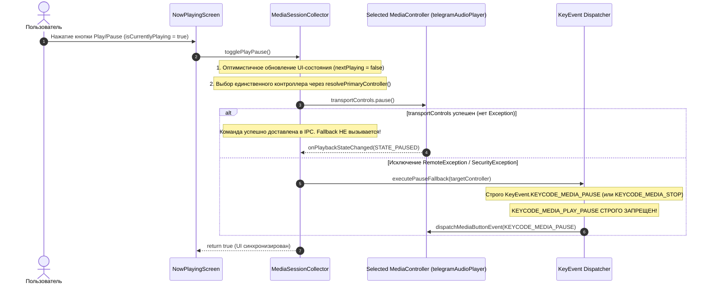

# Архитектурный отчёт: BUG-TG-01 (Дефект управления воспроизведением Telegram / AyuGram)

- **ID задачи:** `ARCH-TG-01`
- **Проблема:** При нажатии паузы в Lirix воспроизведение в Telegram / AyuGram не останавливается или срывается обратно в воспроизведение (`PLAY`).
- **Зона ответственности:** `media-ingress` / `media-core`
- **Роль:** Архитектор (Spec Driven Design)
- **Статус анализа:** COMPLETED
- **Целевой файл отчёта:** `.sdd/reports/BUG_TG_01.architect.md`

---

## 1. Root Cause (Точная первопричина дефекта со ссылками на строки кода)

Анализ кода [MediaSessionCollector.kt](file:///c:/Users/DaniilTuT/Documents/antigravity/quick-nobel/app/src/main/java/com/lirix/app/ingestion/MediaSessionCollector.kt), [NowPlayingScreen.kt](file:///c:/Users/DaniilTuT/Documents/antigravity/quick-nobel/app/src/main/java/com/lirix/app/ui/NowPlayingScreen.kt) и дампов Android-подсистемы `dumpsys media_session` на реальном устройстве выявил комплексную первопричину, состоящую из четырех взаимосвязанных дефектов:

### 1.1 Дефект №1: Безусловный вызов Fallback поверх успешного `transportControls.pause()`
**Локация:** [MediaSessionCollector.kt:450-464](file:///c:/Users/DaniilTuT/Documents/antigravity/quick-nobel/app/src/main/java/com/lirix/app/ingestion/MediaSessionCollector.kt#L450-L464)
```kotlin
450:             for (controller in targetControllers) {
451:                 try {
452:                     if (isCurrentlyPlaying) {
453:                         controller.transportControls.pause()
454:                     } else {
455:                         controller.transportControls.play()
456:                     }
457:                     anySuccess = true
458:                 } catch (e: Exception) {
459:                     Timber.tag(TAG).w(e, "transportControls failed on %s", controller.packageName)
460:                 }
461:                 val fallbackOk = sendMediaButtonFallback(controller, isCurrentlyPlaying)
462:                 if (fallbackOk) anySuccess = true
463:             }
```
- **Механика сбоя:** Строка 461 `sendMediaButtonFallback(controller, isCurrentlyPlaying)` вынесена **за пределы блока `catch`**. В предыдущей версии проекта фоллбэк вызывался только при исключении. В текущей реализации метод `sendMediaButtonFallback()` выполняется **всегда и безусловно** на каждой итерации цикла, даже когда `controller.transportControls.pause()` (строка 453) успешно передал команду паузы в IPC-канал Telegram!

### 1.2 Дефект №2: Отправка Toggle-события `KEYCODE_MEDIA_PLAY_PAUSE` при намерении поставить на ПАУЗУ
**Локация:** [MediaSessionCollector.kt:468-486](file:///c:/Users/DaniilTuT/Documents/antigravity/quick-nobel/app/src/main/java/com/lirix/app/ingestion/MediaSessionCollector.kt#L468-L486)
```kotlin
468:         private fun sendMediaButtonFallback(controller: MediaController, wasPlaying: Boolean): Boolean {
469:             return try {
470:                 val keyCode = if (wasPlaying) KeyEvent.KEYCODE_MEDIA_PAUSE else KeyEvent.KEYCODE_MEDIA_PLAY
471:                 val downEvent = KeyEvent(KeyEvent.ACTION_DOWN, keyCode)
472:                 val upEvent = KeyEvent(KeyEvent.ACTION_UP, keyCode)
473:                 val downHandled = controller.dispatchMediaButtonEvent(downEvent)
474:                 val upHandled = controller.dispatchMediaButtonEvent(upEvent)
475:                 val directHandled = downHandled || upHandled
476: 
477:                 // Дополнительный fallback: KEYCODE_MEDIA_PLAY_PAUSE
478:                 if (!directHandled) {
479:                     val toggleDown = KeyEvent(KeyEvent.ACTION_DOWN, KeyEvent.KEYCODE_MEDIA_PLAY_PAUSE)
480:                     val toggleUp = KeyEvent(KeyEvent.ACTION_UP, KeyEvent.KEYCODE_MEDIA_PLAY_PAUSE)
481:                     controller.dispatchMediaButtonEvent(toggleDown) || controller.dispatchMediaButtonEvent(toggleUp)
482:                 } else true
483:             } catch (e: Exception) {
484:                 Timber.tag(TAG).e(e, "dispatchMediaButtonEvent failed completely")
485:                 false
486:             }
487:         }
```
- **Механика сбоя:**
  1. Реальный дамп `dumpsys media_session` показывает следующую структуру сессий Telegram/AyuGram:
     - `MediaSessionHelper/42`: `flags = 2` (`FLAG_HANDLES_TRANSPORT_CONTROLS`), `actions = 567`, бит `FLAG_HANDLES_MEDIA_BUTTONS (1)` **отсутствует**.
     - `telegramAudioPlayer/41`: `flags = 0`, `actions = 822`, бит `FLAG_HANDLES_MEDIA_BUTTONS (1)` **отсутствует**.
     - `MediaSessionHelper/16`: `flags = 1` (`FLAG_HANDLES_MEDIA_BUTTONS`), но `state = null`, `metadata = null`.
  2. Поскольку сессии 42 и 41 не имеют флага `FLAG_HANDLES_MEDIA_BUTTONS` (или их `MediaSession.Callback.onMediaButtonEvent` не возвращает `true`), системный вызов `controller.dispatchMediaButtonEvent(downEvent)` возвращает `false`.
  3. Переменная `directHandled` на строке 475 становится `false`.
  4. Срабатывает ветка на строке 478 (`if (!directHandled)`), которая генерирует и отправляет `KeyEvent.KEYCODE_MEDIA_PLAY_PAUSE`.
  5. `KEYCODE_MEDIA_PLAY_PAUSE` — это **двунаправленный переключатель (TOGGLE)**. Так как плеер за доли миллисекунды до этого уже перешел в состояние паузы от `transportControls.pause()`, получение `KEYCODE_MEDIA_PLAY_PAUSE` немедленно **возобновляет воспроизведение (PLAY)**!

### 1.3 Дефект №3: Циклический обход всех контроллеров и межсессионная интерференция (Race Condition)
**Локация:** [MediaSessionCollector.kt:421-424, 443-463](file:///c:/Users/DaniilTuT/Documents/antigravity/quick-nobel/app/src/main/java/com/lirix/app/ingestion/MediaSessionCollector.kt#L421-L424)
- **Механика сбоя:**
  1. Telegram регистрирует сразу несколько параллельных `MediaSession`: сессию уведомлений/хелпера (`MediaSessionHelper/42`) и сессию аудиоплеера (`telegramAudioPlayer/41`).
  2. На строках 421 и 443 обе сессии со статусом `STATE_PLAYING` попадают в список `targetControllers`.
  3. В цикле (строки 450–463) поочередно вызывается `pause()` и `sendMediaButtonFallback()` для сессии 42, а затем сразу же для сессии 41.
  4. Обе сессии Telegram привязаны к одному общему сервису воспроизведения (`AudioPlayerService`). Пакетная посылка взаимоисключающих команд (`pause` $\to$ `fallback toggle` $\to$ `pause` $\to$ `fallback toggle`) вызывает состояние гонки (race condition) внутри движка Telegram, приводя к хаотичному срыву воспроизведения и возобновлению трека.

### 1.4 Дефект №4: Коллизия ключа пакета в кэше `activeMediaControllers` и потеря коллбэков
**Локация:** [MediaSessionCollector.kt:42, 123-140, 364, 381-390](file:///c:/Users/DaniilTuT/Documents/antigravity/quick-nobel/app/src/main/java/com/lirix/app/ingestion/MediaSessionCollector.kt#L123-L140)
- `activeMediaControllers` (строка 364) и `activeControllers` (строка 42) используют в качестве ключа имя пакета `packageName: String`.
- Когда от Telegram поступают три сессии с одним и тем же пакетом `com.radolyn.ayugram` / `org.telegram.messenger`:
  - В методе `updateControllers` (строка 126) проверка `if (activeControllers.containsKey(pkg)) continue` приводит к тому, что коллбэк регистрируется **только на одну из трех сессий**! На настоящий аудиоплеер `telegramAudioPlayer` коллбэк вообще не вешается, если он шел вторым в списке.
  - На строке 125 кэш `activeMediaControllers[pkg]` может быть перезаписан «пустой» сессией 16 (`state = null`).
  - Метод `getControllers()` (строки 393–397) сортирует сессии без проверки битмаски `playbackState.actions` (не отличает сессию с поддержкой `ACTION_SEEK_TO` (822) от вспомогательной сессии без перемотки (567)).

---

## 2. Архитектурное решение

Архитектурный принцип: **Управление воспроизведением должно осуществляться строго через ОДИН детерминированно выбранный контроллер сессии (Single Target Controller). Любые циклические рассылки команд по множеству сессий одного приложения категорически запрещены.**

### 2.1 Схема взаимодействия компонентов (Sequence Diagram)



---

### 2.2 Детальный проект изменений

#### 1. Кэширование по `sessionToken` вместо имени пакета
- Заменить структуру кэша контроллеров и коллбэков в `MediaSessionCollector`:
  ```kotlin
  // Вместо ConcurrentHashMap<String, MediaController>
  private val activeMediaControllers = ConcurrentHashMap<MediaSession.Token, MediaController>()
  private val activeCallbacks = ConcurrentHashMap<MediaSession.Token, MediaController.Callback>()
  ```
- В `updateControllers(controllers: List<MediaController>?)`:
  - Итерироваться по всем контроллерам.
  - Регистрировать коллбэк для каждого уникального `controller.sessionToken`.
  - Отслеживать удаление закрытых сессий.

#### 2. Детерминированный выбор единственного контроллера (`resolvePrimaryController`)
Ввести алгоритм ранжирования контроллеров пакета целевого приложения. Контроллеры сортируются по совокупному баллу (`ControllerScore`):
1. **Соответствие целевому действию по `playbackState.actions`:**
   - Для паузы проверяется наличие:
     `((actions and PlaybackState.ACTION_PAUSE) != 0L) || ((actions and PlaybackState.ACTION_PLAY_PAUSE) != 0L)`
   - Для старта проверяется наличие:
     `((actions and PlaybackState.ACTION_PLAY) != 0L) || ((actions and PlaybackState.ACTION_PLAY_PAUSE) != 0L)`
   - Контроллеры без поддержки нужного действия получают штраф (или отфильтровываются).
2. **Текущий статус воспроизведения:**
   - Если цель — поставить на паузу: контроллер со `state == PlaybackState.STATE_PLAYING` получает наивысший приоритет (+1000 очков).
   - Если цель — возобновить: контроллер со `state == PlaybackState.STATE_PAUSED` получает наивысший приоритет (+1000 очков).
3. **Глубина возможностей управления и метаданных:**
   - Поддержка перемотки `(actions and PlaybackState.ACTION_SEEK_TO) != 0L`: +200 очков (в Telegram это однозначно выбирает `telegramAudioPlayer` (actions=822) над вспомогательным `MediaSessionHelper` (actions=567)).
   - Наличие длительности трека `METADATA_KEY_DURATION > 0`: +50 очков.
   - Наличие заголовка `METADATA_KEY_TITLE.isNotBlank()`: +30 очков.
   - Тег контроллера: совпадение с известными аудиоплеерами (`telegramAudioPlayer`, `spotify-media-session` и т.д.): +20 очков.

#### 3. Рефакторинг `togglePlayPause()`
- Устранить цикл `for (controller in targetControllers)`.
- Выбирать ровно **один** `primaryController = resolvePrimaryController(targetPackage, isCurrentlyPlaying)`.
- Исполнять команду по строгой цепочке:
  ```kotlin
  fun togglePlayPause(): Boolean {
      val snapshot = _livePlaybackFlow.value
      val targetPackage = snapshot?.packageName
      val isCurrentlyPlaying = snapshot?.isPlaying == true ||
          getControllers(targetPackage).any { it.playbackState?.state == PlaybackState.STATE_PLAYING }
      val nextPlaying = !isCurrentlyPlaying

      val targetController = resolvePrimaryController(targetPackage, isCurrentlyPlaying)
          ?: return false

      // 1. Оптимистичное обновление UI
      val currentPos = snapshot?.currentPositionMs()
          ?: targetController.playbackState?.position
          ?: 0L
      if (snapshot != null) {
          _livePlaybackFlow.value = snapshot.copy(
              isPlaying = nextPlaying,
              basePositionMs = currentPos,
              lastPositionUpdateTimeMs = android.os.SystemClock.elapsedRealtime()
          )
      }
      instance?.syncHeartbeat(nextPlaying, targetController.packageName)

      // 2. Отправка команды в transportControls
      var success = false
      try {
          if (isCurrentlyPlaying) {
              targetController.transportControls.pause()
          } else {
              targetController.transportControls.play()
          }
          success = true
      } catch (e: Exception) {
          Timber.tag(TAG).w(e, "transportControls failed, activating fallback")
      }

      // 3. Fallback вызывается ТОЛЬКО ЕСЛИ transportControls потерпел неудачу!
      if (!success) {
          success = sendSafeMediaButtonFallback(targetController, isCurrentlyPlaying)
      }

      return success
  }
  ```

#### 4. Правила допустимых KeyEvents в `sendSafeMediaButtonFallback()`
- **При паузе (`wasPlaying == true`):**
  - Допустимы **только** идемпотентные терминальные коды:
    1. `KeyEvent.KEYCODE_MEDIA_PAUSE` (основной)
    2. `KeyEvent.KEYCODE_MEDIA_STOP` (вторичный резерв)
  - **КАТЕГОРИЧЕСКИ ЗАПРЕЩЕНО** отправлять `KeyEvent.KEYCODE_MEDIA_PLAY_PAUSE` при паузе!
- **При возобновлении (`wasPlaying == false`):**
  1. `KeyEvent.KEYCODE_MEDIA_PLAY` (основной)
  2. `KeyEvent.KEYCODE_MEDIA_PLAY_PAUSE` (допустим как резерв, так как при гарантированной паузе toggle переводит плеер в play).

---

## 3. Границы изменений (Files & Impact Matrix)

| Файл | Зона ответственности | Характер изменений |
|---|---|---|
| [MediaSessionCollector.kt](file:///c:/Users/DaniilTuT/Documents/antigravity/quick-nobel/app/src/main/java/com/lirix/app/ingestion/MediaSessionCollector.kt) | `media-ingress` | 1. Замена ключа `ConcurrentHashMap` с `packageName` на `sessionToken`.<br>2. Реализация функции скоринга `resolvePrimaryController()`.<br>3. Перевод `togglePlayPause()` на единый контроллер с защитой от безусловного фоллбэка.<br>4. Очистка `sendMediaButtonFallback()` от `KEYCODE_MEDIA_PLAY_PAUSE` для паузы. |
| `MediaSessionCollectorTest.kt` (новый юнит-тест) | `test` | Unit-тестирование выбора сессии Telegram при наличии нескольких параллельных контроллеров и валидация недопустимости Toggle-кодов при паузе. |
| [NowPlayingScreen.kt](file:///c:/Users/DaniilTuT/Documents/antigravity/quick-nobel/app/src/main/java/com/lirix/app/ui/NowPlayingScreen.kt) | `media-ui` | Изменений в контракте UI не требуется (вызов `MediaSessionCollector.togglePlayPause()` сохраняет сигнатуру). Локальное состояние `localIsPlaying` консистентно. |

---

## 4. Риски регрессий и план их снижения

| Риск | Вероятность | Влияние | Стратегия предотвращения / Митигация |
|---|---|---|---|
| **Регрессия других плееров (Яндекс Музыка, Spotify, VK)** | Низкая | Высокое | Все стандартные плееры корректно обрабатывают `transportControls.pause()`. Отключение безусловного фоллбэка только повысит стабильность для Яндекс Музыки (исключит спам лишними KeyEvents). |
| **Плееры без поддержки `transportControls` (экзотические радио/подкасты)** | Низкая | Среднее | Сохранен безопасный fallback: при возникновении исключения в `transportControls` отправляется чистый `KEYCODE_MEDIA_PAUSE`. |
| **Утечки памяти из-за кэширования `MediaSession.Token`** | Низкая | Среднее | При вызове `updateControllers()` проводить очистку записей `activeMediaControllers`, отсутствующих в свежем списке сессий от `sessionManager.getActiveSessions()`. |
| **Неверный выбор сессии при одновременной игре двух разных приложений** | Низкая | Высокое | `targetPackage` берется строго из текущего `LivePlaybackSnapshot`. Скоринг контроллеров ограничен пакетом текущего активного трека. |

---

## 5. Критерии приемки для Кодера (DoD)
1. В `togglePlayPause()` отправка команды происходит ровно в один `MediaController`, выбранный с приоритетом `ACTION_PAUSE` и `ACTION_SEEK_TO`.
2. `sendMediaButtonFallback()` вызывается **исключительно** в случае ошибки `transportControls`.
3. При паузе отправка `KEYCODE_MEDIA_PLAY_PAUSE` исключена на 100%.
4. Сессия `telegramAudioPlayer` в Telegram/AyuGram успешно ставится на паузу с первого клика и не срывается в повторное воспроизведение.
