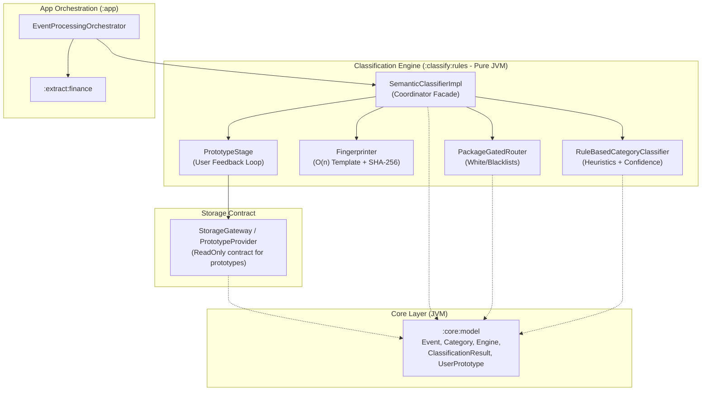
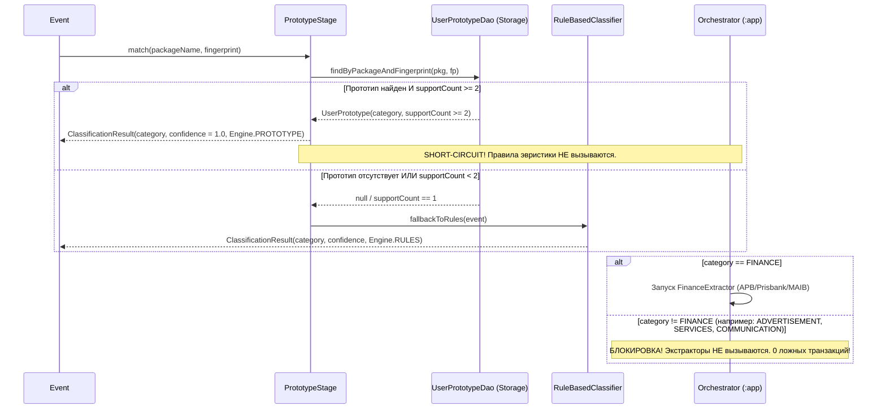
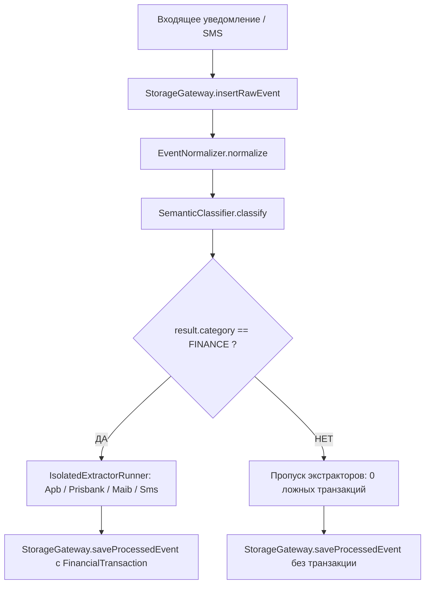

# Спецификация: zone/classify-rules

## Модуль: `:classify:rules` · Зона: `zone/classify-rules` · Версия спеки: `v1` · Статус: `PROPOSED`

---

### 1. Назначение и контекст перехода Фаза 0 → Фаза 1

Модуль `:classify:rules` является чистым JVM-модулем бизнес-логики (`kotlin-jvm`, без зависимостей от `android.*`, `Context`, Android Keystore или Room) и реализует зону ответственности `zone/classify-rules` в рамках архитектуры Фазы 1 («Хардкод-MVP», `ARCH-002`).

#### Проблема Фазы 0 (по данным аудита 44.5 ч телеметрии Poco M7, `event_engine.db`):
1. **Глобальный неизолированный парсинг (Ungated Regex Matching):**  
   Из 137 финансовых записей **83.2% (114 записей) оказались ложноположительными (False Positives)**:
   - **113 записей** рекламного спама турагентства *InTour* из Telegram (`com.radolyn.ayugram`), содержащего фрагмент *«вылет из Кишинева... от 499 евро...»*, были ошибочно классифицированы как `FINANCE` и распарсены как доход `1.00 RUB` с уверенностью `confidence = 0.96`.
   - **1 запись** пуша виджета погоды *Яндекс.Погода* (`ru.yandex.weatherplugin`) с текстом *«+10°C, ощущается как +8°C»* была классифицирована как `FINANCE` и спарсилась как доход `10.00 RUB`.
2. **Инверсия обратной связи (Prototypes Feedback Inversion):**  
   Пользователь 6 раз вручную размечал спам турагентства InTour как не-финансы (`support_count = 6` в таблице `prototypes`), однако статический движок Фазы 0 запускался до проверки прототипов, полностью игнорируя действия пользователя.

#### Цели зоны `:classify:rules` в Фазе 1:
1. **Строгая пакетная маршрутизация (`PackageGatedRouter`):**  
   - Полная изоляция финансовых пайплайнов по белому списку доверенных пар `(packageName, sender)`.  
   - Безусловная жесткая блокировка любых мессенджеров (Telegram, WhatsApp, Viber, AyuGram, Discord, VK) от категории `FINANCE` на аппаратном уровне конвейера (0 ложных срабатываний из чатов и каналов).
2. **Приоритетный пользовательский резолвер (Prototype-First Mechanism):**  
   - Если для входящего отпечатка `(packageName, fingerprint)` в БД существует подтверждённый пользователем шаблон (`UserPrototype`) с `supportCount >= 2`, его категория применяется **безусловно** с `confidence = 1.0` и `engine = Engine.PROTOTYPE`.
   - Если пользователь разметил спам (кейс InTour) как не-финансовую категорию, конвейер мгновенно прекращает обработку и **блокирует запуск финансовых экстракторов**.
3. **Эвристический классификатор (`RuleBasedCategoryClassifier`):**  
   - Детерминированные статические правила классификации при промахе прототипов для категорий: `FINANCE`, `COMMUNICATION`, `MUSIC`, `SERVICES`, `UNKNOWN`.
   - Четкие градации уверенности: `HIGH` (0.90–1.00), `MEDIUM` (0.70–0.89), `LOW` (0.50–0.69), `UNKNOWN` (< 0.50).
4. **Интерфейс обогащения доменной модели `Event`:**  
   - Безопасное проставление полей `category`, `confidence`, `engineUsed`, `contentFingerprint` без нарушения иммутабельности доменной сущности.

---

### 2. Архитектурные границы и зависимости модуля



#### Архитектурные инварианты изоляции:
1. **Zero Android Dependencies:** В модуле `:classify:rules` запрещены любые импорты из пакетов `android.*`, `androidx.*` (кроме androidx.annotation при необходимости). Тесты исполняются за десятки миллисекунд на чистой JVM.
2. **Изоляция от экстракторов:** Модуль `:classify:rules` **НЕ зависит** от модуля `:extract:finance` и не вызывает парсеры сумм или транзакций. Решение о запуске экстрактора принимает оркестратор верхнего уровня (`:app`).
3. **Изоляция от Room DAO:** Доступ к базе прототипов осуществляется исключительно через узкий абстрактный контракт (`PrototypeProvider` или фасад `StorageGateway`). Прямые Room-сущности и Room-аннотации запрещены.
4. **ReDoS-защита:** Все текстовые нормализаторы и генераторы отпечатков выполняются строго за $O(n)$ без бэктрекинга регулярных выражений. Длина входного текста жестко ограничена (Cap 4096 символов).

---

### 3. Строгий пакетный роутинг (`PackageGatedRouter`)

#### 3.1. Архитектурная концепция
Пакетный роутер выступает первым эшелоном фильтрации. Он проверяет источник события (имя Android-пакета `packageName`, имя отправителя `sender` и тип подсистемы сбора `SourceId`) по строгим наборам правил:
1. Категория `FINANCE` является **закрытой привилегированной категорией**. Она может быть присвоена событию **ТОЛЬКО** в том случае, если источник входит в доверенный финансовый белый список (`FINANCE_ALLOWLIST`).
2. Мессенджеры и социальные сети входят в жесткий черный список (`MESSENGER_FINANCE_BLACKLIST`). Для любых пакетов из этого списка категория `FINANCE` **запрещена безусловно** (даже если текст содержит финансовые токены «оплата», «перевод», «списание», «USD», «RUB», «EUR»).

#### 3.2. Матрица белого списка для категории `FINANCE`

| Идентификатор профиля | Имя Android-пакета (`packageName`) | Разрешенные отправители (`sender`) | Описание источника |
|---|---|---|---|
| `bank.apb` | `com.apb.mobile` | `null` (любой пуш от приложения) | ЗАО «Агропромбанк» (ПМР, мобильный банк APB) |
| `bank.prisbank` | `com.prisbank.app` | `null` (любой пуш от приложения) | ЗАО «Приднестровский Сбербанк» (ПМР) |
| `bank.maib` | `md.maib.maibank` | `null` (любой пуш от приложения) | BC «MAIB» S.A. (Молдова, приложение maibank) |
| `bank.sms.google` | `com.google.android.apps.messaging` | `"APB"`, `"AGROPROMBANK"`, `"PRISBANK"`, `"SBERBANK"`, `"MAIB"`, `"900"` | Банковские SMS через Google Сообщения |
| `bank.sms.aosp` | `com.android.mms` | `"APB"`, `"AGROPROMBANK"`, `"PRISBANK"`, `"SBERBANK"`, `"MAIB"`, `"900"` | Банковские SMS через системное SMS-приложение AOSP / HyperOS |
| `bank.sms.direct` | `""` (или `null`, при источнике `SourceId.SMS`) | `"APB"`, `"AGROPROMBANK"`, `"PRISBANK"`, `"SBERBANK"`, `"MAIB"`, `"900"` | Прямой захват через системный `SmsBroadcastReceiver` |

> [!IMPORTANT]
> Для SMS-приложений (`com.google.android.apps.messaging`, `com.android.mms`) совпадения только имени пакета **НЕДОСТАТОЧНО**. Проверка отправителя (`sender`) по белому списку является **ОБЯЗАТЕЛЬНОЙ**. Личные SMS от контактов или спам от операторов связи не имеют финансового профиля.

#### 3.3. Черный список мессенджеров для категории `FINANCE` (`MESSENGER_FINANCE_BLACKLIST`)

Следующие пакеты классифицируются как средства межличностной коммуникации или каналы контента. Для них категорически запрещена классификация в `FINANCE`:
- `com.radolyn.ayugram` (AyuGram — Telegram-клиент пользователя на Poco M7, 284 события в телеметрии)
- `org.telegram.messenger` (Официальный клиент Telegram)
- `org.telegram.plus` (Plus Messenger)
- `org.thunderdog.challegram` (Telegram X)
- `com.whatsapp` (WhatsApp Messenger)
- `com.whatsapp.w4b` (WhatsApp Business)
- `com.viber.voip` (Viber)
- `org.signal.messenger` (Signal)
- `com.facebook.orca` (Facebook Messenger)
- `com.vkontakte.android` (VK / ВКонтакте)
- `com.discord` (Discord)
- `com.skype.raider` (Skype)
- `com.slack` (Slack)

#### 3.4. Белые списки для нефинансовых категорий

| Категория | Входящие пакеты (`packageName`) | Характерные маркеры |
|---|---|---|
| `COMMUNICATION` | Мессенджеры из черного списка выше + `com.google.android.dialer`, `com.android.phone`, `com.android.server.telecom`, SMS без банковского сендера. | Звонки, SMS диалоги, личные чаты, каналы. |
| `MUSIC` | `ru.yandex.music`, `app.revanced.android.youtube`, `com.google.android.apps.youtube.music`, `com.spotify.music`, `com.shaiban.audioplayer.mplayer`, `com.vkontakte.music`, `org.videolan.vlc`, `com.apple.android.music`, `deezer.android.app`. | Медиа-сессии плееров, аудиокниги, стриминги. |
| `SERVICES` | `ru.yandex.weatherplugin`, `org.mozilla.firefox`, `com.android.chrome`, `com.google.android.gm`, `com.google.android.apps.maps`, `ru.yandex.taxi`, `com.ubercab`, `com.deliveryclub`, `com.eventengine.app.debug`, `android` (SystemUI). | Сервисные уведомления, доставка, навигация, браузеры, погода, системные алерты батареи. |

#### 3.5. Реализация `PackageGatedRouter`

```kotlin
package com.example.npc.classify.rules

import com.example.npc.core.model.Category
import com.example.npc.core.model.SourceId
import java.util.Locale

interface PackageGatedRouter {
    /** Проверяет, разрешено ли событию претендовать на категорию FINANCE */
    fun isFinanceAllowed(packageName: String, sender: String?, sourceId: SourceId?): Boolean

    /** Проверяет, является ли пакет заведомо мессенджером */
    fun isMessengerPackage(packageName: String): Boolean

    /** Проверяет, является ли пакет заведомо медиаплеером / аудио-сервисом */
    fun isMusicPackage(packageName: String): Boolean

    /** Возвращает предопределенный SourceProfile, если источник известен */
    fun resolveProfile(packageName: String, sender: String?, sourceId: SourceId?): SourceProfile?
}

enum class SourceProfile(val profileId: String, val targetCategory: Category) {
    APB_BANK("bank.apb", Category.FINANCE),
    PRISBANK("bank.prisbank", Category.FINANCE),
    MAIB_BANK("bank.maib", Category.FINANCE),
    BANK_SMS("bank.sms", Category.FINANCE),
    MESSENGER("comm.messenger", Category.COMMUNICATION),
    DIALER("comm.dialer", Category.COMMUNICATION),
    MUSIC_PLAYER("media.music", Category.MUSIC),
    SERVICE_APP("service.app", Category.SERVICES)
}

class PackageGatedRouterImpl : PackageGatedRouter {

    private val directBankPackages = mapOf(
        "com.apb.mobile" to SourceProfile.APB_BANK,
        "com.prisbank.app" to SourceProfile.PRISBANK,
        "md.maib.maibank" to SourceProfile.MAIB_BANK
    )

    private val smsPackages = setOf(
        "com.google.android.apps.messaging",
        "com.android.mms"
    )

    private val bankSmsSenders = setOf(
        "APB",
        "AGROPROMBANK",
        "PRISBANK",
        "SBERBANK",
        "MAIB",
        "900"
    )

    private val messengerPackages = setOf(
        "com.radolyn.ayugram",
        "org.telegram.messenger",
        "org.telegram.plus",
        "org.thunderdog.challegram",
        "com.whatsapp",
        "com.whatsapp.w4b",
        "com.viber.voip",
        "org.signal.messenger",
        "com.facebook.orca",
        "com.vkontakte.android",
        "com.discord",
        "com.skype.raider",
        "com.slack"
    )

    private val musicPackages = setOf(
        "ru.yandex.music",
        "app.revanced.android.youtube",
        "com.google.android.apps.youtube.music",
        "com.spotify.music",
        "com.shaiban.audioplayer.mplayer",
        "com.vkontakte.music",
        "org.videolan.vlc",
        "com.apple.android.music",
        "deezer.android.app"
    )

    private val servicePackages = setOf(
        "ru.yandex.weatherplugin",
        "org.mozilla.firefox",
        "com.android.chrome",
        "com.google.android.gm",
        "com.google.android.apps.maps",
        "ru.yandex.taxi",
        "com.ubercab",
        "com.deliveryclub",
        "com.eventengine.app.debug",
        "android"
    )

    override fun isFinanceAllowed(packageName: String, sender: String?, sourceId: SourceId?): Boolean {
        val cleanPkg = packageName.trim().lowercase(Locale.ROOT)
        
        // 1. Жёсткая блокировка мессенджеров
        if (cleanPkg in messengerPackages) {
            return false
        }

        // 2. Прямые банковские мобильные приложения
        if (cleanPkg in directBankPackages) {
            return true
        }

        // 3. Банковские SMS (через шторку уведомлений SMS-приложений либо прямой SMS-источник)
        val isSmsApp = cleanPkg in smsPackages
        val isDirectSms = sourceId == SourceId.SMS || cleanPkg.isEmpty()
        if (isSmsApp || isDirectSms) {
            val normalizedSender = sender?.trim()?.uppercase(Locale.ROOT).orEmpty()
            return normalizedSender in bankSmsSenders
        }

        return false
    }

    override fun isMessengerPackage(packageName: String): Boolean =
        packageName.trim().lowercase(Locale.ROOT) in messengerPackages

    override fun isMusicPackage(packageName: String): Boolean =
        packageName.trim().lowercase(Locale.ROOT) in musicPackages

    override fun resolveProfile(packageName: String, sender: String?, sourceId: SourceId?): SourceProfile? {
        val cleanPkg = packageName.trim().lowercase(Locale.ROOT)

        // Банки
        directBankPackages[cleanPkg]?.let { return it }

        // Банковские SMS
        val isSmsApp = cleanPkg in smsPackages
        val isDirectSms = sourceId == SourceId.SMS || cleanPkg.isEmpty()
        if (isSmsApp || isDirectSms) {
            val normalizedSender = sender?.trim()?.uppercase(Locale.ROOT).orEmpty()
            if (normalizedSender in bankSmsSenders) {
                return SourceProfile.BANK_SMS
            }
        }

        // Звонилка
        if (cleanPkg == "com.google.android.dialer" || cleanPkg == "com.android.phone") {
            return SourceProfile.DIALER
        }

        // Мессенджеры
        if (cleanPkg in messengerPackages) {
            return SourceProfile.MESSENGER
        }

        // Музыка
        if (cleanPkg in musicPackages) {
            return SourceProfile.MUSIC_PLAYER
        }

        // Сервисы
        if (cleanPkg in servicePackages) {
            return SourceProfile.SERVICE_APP
        }

        return null
    }
}
```

---

### 4. Генерация отпечатков контента (`Fingerprinter`)

Для работы Prototype-First механизма текст уведомления должен приводиться к стабильному каноническому шаблону, не зависящему от динамических числовых параметров (суммы, остатки, даты, номера карт, счетчики непрочитанных сообщений, таймеры).

#### 4.1. Свойства и инварианты Fingerprinter
1. **$O(n)$ сложность:** Реализуется вручную посимвольным проходом в `StringBuilder` без регулярных выражений и бэктрекинга.
2. **Входной лимит:** Обрабатываются первые 1024 символа строки (`text.take(1024)`). Все символы приводятся к `Locale.ROOT` нижнему регистру.
3. **Правила схлопывания чисел:**
   - Любая непрерывная последовательность цифр заменяется на одиночный символ `'#'`.
   - Внутренние разделители чисел (запятая `,` или точка `.`), идущие непосредственно за цифрой, поглощаются и не прерывают шаблон числа.
4. **Унификация пробелов:**
   - Все пробельные символы (`isWhitespace`), а также Unicode неразрывные пробелы NBSP (`\u00A0`) и Narrow NBSP (`\u202F`) заменяются на одиночный пробел `' '`. Дублирующиеся пробелы схлопываются.
5. **SHA-256 хеш отпечатка:**  
   Ключ вычисляется как: `SHA-256("${packageName.lowercase()}|${sender.lowercase()}|${template}")`.

```kotlin
package com.example.npc.classify.rules

import java.security.MessageDigest
import java.util.Locale

object Fingerprinter {

    private const val MAX_INPUT_CHARS = 1024

    /**
     * Создает устойчивый шаблон из текста, заменяя числовые переменные на '#'
     */
    fun createTemplate(text: String): String = buildString(text.length.coerceAtMost(MAX_INPUT_CHARS)) {
        var lastWasDigit = false
        val bounded = text.take(MAX_INPUT_CHARS).lowercase(Locale.ROOT)

        for (ch in bounded) {
            when {
                ch.isDigit() -> {
                    if (!lastWasDigit) append('#')
                    lastWasDigit = true
                }
                ch == ',' || ch == '.' -> {
                    // Разделитель внутри числа поглощается маской '#'
                    if (!lastWasDigit) append(ch)
                }
                ch.isWhitespace() || ch == '\u00A0' || ch == '\u202F' -> {
                    if (isNotEmpty() && last() != ' ') append(' ')
                    lastWasDigit = false
                }
                else -> {
                    append(ch)
                    lastWasDigit = false
                }
            }
        }
    }.trim()

    /**
     * Вычисляет детерминированный SHA-256 хеш отпечатка
     */
    fun calculateFingerprint(packageName: String, sender: String?, text: String): String {
        val cleanPkg = packageName.trim().lowercase(Locale.ROOT)
        val cleanSender = sender?.trim()?.lowercase(Locale.ROOT).orEmpty()
        val template = createTemplate(text)
        val rawComposite = "$cleanPkg|$cleanSender|$template"

        val digest = MessageDigest.getInstance("SHA-256").digest(rawComposite.toByteArray(Charsets.UTF_8))
        return digest.joinToString("") { "%02x".format(it) }
    }
}
```

---

### 5. Prototype-First механизм (User Feedback Loop)

#### 5.1. Принцип работы и приоритет
Пользовательская обратная связь имеет **высший безусловный приоритет** перед любыми статическими правилами и эвристиками системы.



#### 5.2. Правило порога `supportCount >= 2`
- При $N = 1$ (первая ручная коррекция пользователем) прототип регистрируется в БД, но еще считается **неподтвержденным**. Если эвристика имеет высокую уверенность, она может дополнить классификацию, либо прототип используется с осторожным confidence.
- При $N \ge 2$ прототип переходит в статус **CONFIRMED**:
  - `category = prototype.category`
  - `confidence = 1.0`
  - `engine = Engine.PROTOTYPE`
  - Статический классификатор правил `RuleBasedCategoryClassifier` **не вызывается вовсе (Short-Circuit)**.

#### 5.3. Решение кейса туроператора InTour (`support_count = 6`)
В телеметрии Poco M7 пользователь 6 раз разметил спам турагентства как `advertisement`:
1. Событие поступает от `com.radolyn.ayugram`.
2. `Fingerprinter.calculateFingerprint` дает стабильный хеш для шаблона:  
   `"intour тур агентство пмр: # евро, турция из кишинева..."`.
3. `PrototypeStage` находит запись с `supportCount = 6` и категорией `Category.SERVICES` (или `Category.UNKNOWN` / `Category.ADVERTISEMENT` при расширенном enum).
4. Поскольку результирующая категория $\ne$ `Category.FINANCE`, оркестратор верхнего уровня **полностью блокирует вызов любых финансовых экстракторов**.
5. **Результат:** 113 ложных финансовых транзакций по 1.00 RUB полностью ликвидированы!

#### 5.4. Контракт `PrototypeStage`

```kotlin
package com.example.npc.classify.rules

import com.example.npc.core.model.Category
import com.example.npc.core.model.UserPrototype
import com.example.npc.core.model.classify.ClassificationResult
import com.example.npc.core.model.classify.Engine

interface PrototypeProvider {
    suspend fun findMatchingPrototype(packageName: String, fingerprint: String): UserPrototype?
}

interface PrototypeStage {
    suspend fun resolve(packageName: String, fingerprint: String): ClassificationResult?
}

class PrototypeStageImpl(
    private val prototypeProvider: PrototypeProvider
) : PrototypeStage {

    override suspend fun resolve(packageName: String, fingerprint: String): ClassificationResult? {
        val prototype = prototypeProvider.findMatchingPrototype(packageName, fingerprint) ?: return null

        // Порог подтверждения пользователем: минимум 2 совпадения
        return if (prototype.supportCount >= CONFIRMATION_THRESHOLD) {
            ClassificationResult(
                category = prototype.category,
                confidence = 1.0,
                engine = Engine.PROTOTYPE,
                contentFingerprint = fingerprint
            )
        } else {
            null
        }
    }

    companion object {
        const val CONFIRMATION_THRESHOLD = 2
    }
}
```

---

### 6. Эвристический классификатор (`RuleBasedCategoryClassifier`)

Если совпадение с подтвержденным пользовательским прототипом не найдено (`PrototypeStage` вернул `null`), управление передается детерминированному эвристическому классификатору.

#### 6.1. Шкала уверенности (Confidence Gradations)

| Уровень уверенности | Диапазон `confidence` | Критерии присвоения |
|---|---|---|
| **HIGH** | `0.90 .. 1.00` | Пакет входит в специализированный профиль + присутствуют строгие доменные маркеры. Для доверенных банков (`APB`, `PRISBANK`, `MAIB`) базовый confidence = `0.95`. |
| **MEDIUM** | `0.70 .. 0.89` | Пакет входит в доверенный профиль, но маркеры слабые или общие (например, пуш от Telegram без явного текста звонка $\to$ `COMMUNICATION` 0.85). Либо маркеры сильные, но пакет нейтральный. |
| **LOW** | `0.50 .. 0.69` | Косвенные совпадения ключевых слов при неизвестном пакете (`0.55 .. 0.60`). |
| **UNKNOWN** | `< 0.50` (дефолт `0.0`) | Ни одно правило не сработало, пакет и текст не содержат распознаваемых паттернов. Категория устанавливается в `Category.UNKNOWN`. |

#### 6.2. Детальные правила по категориям

##### 1. Категория `FINANCE`
- **Строгий Guard:** Разрешена **ТОЛЬКО** если `PackageGatedRouter.isFinanceAllowed(...) == true`.
- **Правило FIN-1 (Авторизованный банк, высокий приоритет):**
  - Пакеты: `com.apb.mobile`, `com.prisbank.app`, `md.maib.maibank`.
  - Маркеры в тексте: «списание», «пополнение», «оплата», «перевод», «баланс», «остаток», «карта», «tranzactie», «achitare», «transfer», «disponibil», «card», «refuzata», «esuata», «clever», «клевер», суммы с валютами (`RUP`, `MDL`, `RUB`, `EUR`, `USD`, `р.`, `лей`).
  - Результат: `Category.FINANCE`, `confidence = 0.98`.
- **Правило FIN-2 (Авторизованный банк, общий пуш):**
  - Пакеты: те же банки, но текст не содержит явных маркеров суммы (сервисный пуш банка, новость или вход в ИБ).
  - Результат: `Category.FINANCE`, `confidence = 0.90`.
- **Правило FIN-3 (Банковские SMS):**
  - SMS-пакет или `SourceId.SMS` с подтвержденным сендером (`APB`, `AGROPROMBANK`, `PRISBANK`, `SBERBANK`, `MAIB`, `900`).
  - Результат: `Category.FINANCE`, `confidence = 0.95`.

##### 2. Категория `COMMUNICATION`
- **Правило COM-1 (Голосовой вызов / Dialer):**
  - Пакеты: `com.google.android.dialer`, `com.android.phone`.
  - Маркеры: «вызов», «звонок», «пропущенный», «разговор», «входящий», «исходящий», «call», «incoming».
  - Результат: `Category.COMMUNICATION`, `confidence = 0.98`.
- **Правило COM-2 (Мессенджеры):**
  - Пакеты: `com.radolyn.ayugram`, `org.telegram.messenger`, `com.whatsapp`, `com.viber.voip`, `org.signal.messenger`, `com.discord`, `com.vkontakte.android`.
  - Результат: `Category.COMMUNICATION`, `confidence = 0.90`.
- **Правило COM-3 (Личные SMS):**
  - SMS-пакет или `SourceId.SMS`, отправитель не входит в банковский allowlist (телефонный номер или имя контакта).
  - Результат: `Category.COMMUNICATION`, `confidence = 0.85`.

##### 3. Категория `MUSIC`
- **Правило MUS-1 (Аудиоплееры и стриминги):**
  - Пакеты: `ru.yandex.music`, `com.spotify.music`, `com.google.android.apps.youtube.music`, `deezer.android.app`, `com.vkontakte.music`.
  - Или источник: `SourceId.MEDIA` с указанными плеерами.
  - Результат: `Category.MUSIC`, `confidence = 0.98`.
- **Правило MUS-2 (Аудиокниги и офлайн-плееры):**
  - Пакеты: `com.shaiban.audioplayer.mplayer`, `org.videolan.vlc`.
  - Маркеры: «воспроизведение», «трек», «глава», «playing», «paused», «audiobook».
  - Результат: `Category.MUSIC`, `confidence = 0.95`.
- **Правило MUS-3 (YouTube фоновый плеер):**
  - Пакеты: `app.revanced.android.youtube`, `com.google.android.youtube` при источнике `SourceId.MEDIA`.
  - Результат: `Category.MUSIC`, `confidence = 0.90`.

##### 4. Категория `SERVICES`
- **Правило SRV-1 (Погода):**
  - Пакеты: `ru.yandex.weatherplugin`, `com.google.android.apps.weather`.
  - Маркеры: «погода», «°C», «°F», «ветер», «дождь», «ясно», «облачно», «ощущается как».
  - Результат: `Category.SERVICES`, `confidence = 0.95`.
- **Правило SRV-2 (Доставка и такси):**
  - Пакеты: `ru.yandex.taxi`, `com.ubercab`, `com.deliveryclub`, `ru.yandex.eda`.
  - Маркеры: «водитель», «автомобиль», «курьер», «заказ в пути», «доставка».
  - Результат: `Category.SERVICES`, `confidence = 0.95`.
- **Правило SRV-3 (Электронная почта и системные сервисы):**
  - Пакеты: `com.google.android.gm`, `org.mozilla.firefox`, `com.android.chrome`, `com.eventengine.app.debug`, `android`.
  - Результат: `Category.SERVICES`, `confidence = 0.80`.

##### 5. Категория `UNKNOWN`
- **Правило UNK-1 (Fallback по умолчанию):**
  - Ни одно из правил категорий выше не дало совпадения.
  - Результат: `Category.UNKNOWN`, `confidence = 0.0`, `engine = Engine.RULES`.

#### 6.3. Контракт и реализация `RuleBasedCategoryClassifier`

```kotlin
package com.example.npc.classify.rules

import com.example.npc.core.model.Category
import com.example.npc.core.model.SourceId
import com.example.npc.core.model.classify.ClassificationResult
import com.example.npc.core.model.classify.Engine
import java.util.Locale

interface RuleBasedCategoryClassifier {
    fun classifyByRules(
        packageName: String,
        sender: String?,
        title: String,
        text: String,
        sourceId: SourceId?,
        fingerprint: String
    ): ClassificationResult
}

class RuleBasedCategoryClassifierImpl(
    private val router: PackageGatedRouter
) : RuleBasedCategoryClassifier {

    private val financeKeywords = setOf(
        "списание", "пополнение", "оплата", "перевод", "баланс", "остаток",
        "карта", "счет", "чек", "покупка", "зачисление", "клевер", "clever",
        "tranzactie", "achitare", "transfer", "disponibil", "card", "cont",
        "refuzata", "esuata", "cumparare", "depunere"
    )

    private val communicationKeywords = setOf(
        "вызов", "звонок", "пропущенный", "разговор", "входящий", "исходящий",
        "call", "incoming", "missed", "сообщение", "написал", "ответил", "чат"
    )

    private val weatherKeywords = setOf(
        "погода", "°c", "°f", "ветер", "дождь", "ясно", "облачно", "ощущается как",
        "снег", "градус", "давление", "влажность"
    )

    override fun classifyByRules(
        packageName: String,
        sender: String?,
        title: String,
        text: String,
        sourceId: SourceId?,
        fingerprint: String
    ): ClassificationResult {
        val cleanPkg = packageName.trim().lowercase(Locale.ROOT)
        val combinedText = "$title $text".take(4096).lowercase(Locale.ROOT)

        // 1. Проверка категории FINANCE (Строго через PackageGatedRouter!)
        if (router.isFinanceAllowed(cleanPkg, sender, sourceId)) {
            val hasFinMarker = financeKeywords.any { combinedText.contains(it) }
            val confidence = if (hasFinMarker) 0.98 else 0.90
            return ClassificationResult(
                category = Category.FINANCE,
                confidence = confidence,
                engine = Engine.RULES,
                contentFingerprint = fingerprint
            )
        }

        // 2. Проверка категории MUSIC (Медиаплееры или источник MEDIA)
        if (sourceId == SourceId.MEDIA || router.isMusicPackage(cleanPkg)) {
            return ClassificationResult(
                category = Category.MUSIC,
                confidence = if (sourceId == SourceId.MEDIA) 0.98 else 0.95,
                engine = Engine.RULES,
                contentFingerprint = fingerprint
            )
        }

        // 3. Проверка категории COMMUNICATION (Звонки, мессенджеры, личные SMS)
        val profile = router.resolveProfile(cleanPkg, sender, sourceId)
        if (profile == SourceProfile.DIALER) {
            return ClassificationResult(
                category = Category.COMMUNICATION,
                confidence = 0.98,
                engine = Engine.RULES,
                contentFingerprint = fingerprint
            )
        }
        if (profile == SourceProfile.MESSENGER || router.isMessengerPackage(cleanPkg)) {
            return ClassificationResult(
                category = Category.COMMUNICATION,
                confidence = 0.90,
                engine = Engine.RULES,
                contentFingerprint = fingerprint
            )
        }
        if (sourceId == SourceId.SMS || cleanPkg == "com.google.android.apps.messaging" || cleanPkg == "com.android.mms") {
            // SMS не от банка -> обычное общение
            return ClassificationResult(
                category = Category.COMMUNICATION,
                confidence = 0.85,
                engine = Engine.RULES,
                contentFingerprint = fingerprint
            )
        }

        // 4. Проверка категории SERVICES (Погода, доставка, браузер, системные пуши)
        if (profile == SourceProfile.SERVICE_APP || weatherKeywords.any { combinedText.contains(it) }) {
            val isWeather = weatherKeywords.any { combinedText.contains(it) }
            return ClassificationResult(
                category = Category.SERVICES,
                confidence = if (isWeather) 0.95 else 0.80,
                engine = Engine.RULES,
                contentFingerprint = fingerprint
            )
        }

        // 5. Fallback -> UNKNOWN
        return ClassificationResult(
            category = Category.UNKNOWN,
            confidence = 0.0,
            engine = Engine.RULES,
            contentFingerprint = fingerprint
        )
    }
}
```

---

### 7. Фасадный координатор классификации (`SemanticClassifierImpl`)

Класс `SemanticClassifierImpl` реализует контракт `SemanticClassifier` из `:core:model.classify` и связывает воедино все стадии конвейера классификации:
1. Вычисление `contentFingerprint` через `Fingerprinter`.
2. Попытка резолвинга через `PrototypeStage` (User Feedback Loop). При наличии подтвержденного прототипа (`supportCount >= 2`) — мгновенный возврат с `confidence = 1.0` (`Engine.PROTOTYPE`).
3. При промахе прототипов — запуск детерминированного классификатора правил `RuleBasedCategoryClassifier` (`Engine.RULES`).

```kotlin
package com.example.npc.classify.rules

import com.example.npc.core.model.Event
import com.example.npc.core.model.SourceId
import com.example.npc.core.model.classify.ClassificationResult
import com.example.npc.core.model.classify.SemanticClassifier

class SemanticClassifierImpl(
    private val prototypeStage: PrototypeStage,
    private val ruleClassifier: RuleBasedCategoryClassifier
) : SemanticClassifier {

    /**
     * Основная точка входа для классификации события
     */
    override suspend fun classify(
        event: Event,
        packageName: String,
        sender: String?,
        sourceId: SourceId?
    ): ClassificationResult {
        // 1. Вычисляем канонический отпечаток контента за O(n)
        val fingerprint = Fingerprinter.calculateFingerprint(
            packageName = packageName,
            sender = sender,
            text = event.text.ifEmpty { event.title }
        )

        // 2. Фаза Prototype-First: проверяем пользовательский фидбек
        val prototypeResult = prototypeStage.resolve(packageName, fingerprint)
        if (prototypeResult != null) {
            return prototypeResult
        }

        // 3. Фаза Rule-Based: запуск эвристик с гейтингом
        return ruleClassifier.classifyByRules(
            packageName = packageName,
            sender = sender,
            title = event.title,
            text = event.text,
            sourceId = sourceId,
            fingerprint = fingerprint
        )
    }
}
```

---

### 8. Интерфейс и маппинг в доменную сущность `Event`

#### 8.1. Модификация `Event` в Фазе 1
В соответствии с `ARCH-002` и обновленной схемой таблицы `event` (Room v2), доменная модель `Event` обогащается полями классификации.

```kotlin
package com.example.npc.core.model

import com.example.npc.core.model.classify.Category
import com.example.npc.core.model.classify.Engine
import java.time.Instant

data class Event(
    val id: Long = 0L,
    val rawId: Long,
    val ts: Instant,
    val title: String,
    val text: String,
    val normalizedText: String,
    val lang: Lang,
    val threadKey: ThreadKey? = null,
    val isUpdateOf: Long? = null,

    // --- Поля классификации Фазы 1 ---
    val category: Category = Category.UNKNOWN,
    val confidence: Double = 0.0,
    val engineUsed: Engine = Engine.NONE,
    val isUserCorrected: Boolean = false,
    val contentFingerprint: String? = null
) {
    init {
        require(id >= 0L) { "id must be >= 0" }
        require(rawId >= 0L) { "rawId must be >= 0" }
        require(isUpdateOf == null || isUpdateOf > 0L) { "isUpdateOf must be > 0 if specified" }
        require(confidence in 0.0..1.0) { "confidence must be in range [0.0, 1.0], got $confidence" }
    }
}
```

#### 8.2. Функция применения результата классификации (`EventClassifierExt`)

Для сохранения иммутабельности `Event` предоставляется чистое расширение-маппер:

```kotlin
package com.example.npc.classify.rules

import com.example.npc.core.model.Event
import com.example.npc.core.model.classify.ClassificationResult

object EventClassifierMapper {

    /**
     * Создает копию Event с проставленными полями классификации
     */
    fun applyClassification(event: Event, result: ClassificationResult): Event {
        return event.copy(
            category = result.category,
            confidence = result.confidence,
            engineUsed = result.engine,
            contentFingerprint = result.contentFingerprint
        )
    }
}
```

---

### 9. Интеграция с конвейером обработки (`EventProcessingOrchestrator`)

Оркестратор уровня приложения (`:app`) управляет жизненным циклом обработки входящего события:
1. Захват сырого события и вставка в `raw_event` через `StorageGateway`.
2. Нормализация текста через `EventNormalizer`.
3. Классификация через `SemanticClassifierImpl`.
4. Обогащение `Event` полями классификации.
5. **Финансовый шлюз:** Если `event.category == Category.FINANCE`, оркестратор направляет событие в `IsolatedExtractorRunner` модуля `:extract:finance`. Если `event.category != Category.FINANCE`, экстракторы **не вызываются**.
6. Атомарная транзакционная запись `saveProcessedEvent(event, classification, transaction)` в `StorageGateway`.



---

### 10. Матрица верификации и сценарии тестирования (QA Test Suite)

Модуль `:classify:rules` покрывается 100% модульными unit-тестами на JVM без эмулятора.

#### 10.1. Тестовые сценарии для `PackageGatedRouterTest`

| ID теста | Входные данные `(packageName, sender, sourceId)` | Ожидаемый результат `isFinanceAllowed` | Ожидаемый профиль | Описание проверки |
|---|---|:---:|---|---|
| `PGR-001` | `"com.apb.mobile"`, `null`, `SourceId.NOTIFICATION` | `true` | `APB_BANK` | Прямой пуш Агропромбанка |
| `PGR-002` | `"com.prisbank.app"`, `null`, `SourceId.NOTIFICATION` | `true` | `PRISBANK` | Прямой пуш Сбербанка ПМР |
| `PGR-003` | `"md.maib.maibank"`, `null`, `SourceId.NOTIFICATION` | `true` | `MAIB_BANK` | Прямой пуш MAIB |
| `PGR-004` | `"com.radolyn.ayugram"`, `"InTour"`, `SourceId.NOTIFICATION` | **`false`** | `MESSENGER` | **Спам InTour из Telegram (блокировка!)** |
| `PGR-005` | `"org.telegram.messenger"`, `"Bank Bot"`, `SourceId.NOTIFICATION` | **`false`** | `MESSENGER` | Блокировка любых ботов Telegram от FINANCE |
| `PGR-006` | `"com.whatsapp"`, `"+37377712345"`, `SourceId.NOTIFICATION` | **`false`** | `MESSENGER` | Блокировка WhatsApp от FINANCE |
| `PGR-007` | `"com.google.android.apps.messaging"`, `"APB"`, `SourceId.NOTIFICATION` | `true` | `BANK_SMS` | SMS от Агропромбанка через Google Messages |
| `PGR-008` | `"com.google.android.apps.messaging"`, `"900"`, `SourceId.NOTIFICATION` | `true` | `BANK_SMS` | SMS от Сбербанка 900 через Google Messages |
| `PGR-009` | `"com.google.android.apps.messaging"`, `"Mama"`, `SourceId.NOTIFICATION` | **`false`** | `null` | Личное SMS от контакта Mama (не банк) |
| `PGR-010` | `""`, `"PRISBANK"`, `SourceId.SMS` | `true` | `BANK_SMS` | Прямой SMS-захват от Сбербанка |
| `PGR-011` | `"ru.yandex.music"`, `null`, `SourceId.MEDIA` | **`false`** | `MUSIC_PLAYER` | Яндекс Музыка |
| `PGR-012` | `"ru.yandex.weatherplugin"`, `null`, `SourceId.NOTIFICATION` | **`false`** | `SERVICE_APP` | Яндекс Погода |

#### 10.2. Тестовые сценарии для `FingerprinterTest`

| ID теста | Входной текст | Ожидаемый шаблон (`template`) |
|---|---|---|
| `FP-001` | `"Списание: 125.50 RUP. Карта: *1234."` | `"списание: #.# rup. карта: *#."` |
| `FP-002` | `"InTour: Турция от 499 евро! Вылет 25.10"` | `"intour: турция от # евро! вылет #.#"` |
| `FP-003` | `"Оплата\u00A0проезда:\u202F4.40 RUP"` | `"оплата проезда: #.# rup"` (нормализация NBSP) |
| `FP-004` | `"Много    пробелов   и   чисел 123 456"` | `"много пробелов и чисел # #"` |
| `FP-005` | Текст длиной 2000 символов | Обрезается до 1024 символов без исключений |

#### 10.3. Тестовые сценарии для `PrototypeStageTest` (Feedback Loop)

| ID теста | `UserPrototype` в репозитории | Результат `PrototypeStage.resolve` | Описание проверки |
|---|---|---|---|
| `PROTO-001` | `null` (нет записи) | `null` | Промах прототипа, переход к эвристикам |
| `PROTO-002` | `category = SERVICES, supportCount = 1` | `null` | Порог не достигнут ($N < 2$), переход к эвристикам |
| `PROTO-003` | `category = SERVICES, supportCount = 2` | `ClassificationResult(SERVICES, 1.0, PROTOTYPE)` | **Порог достигнут! Безусловное применение** |
| `PROTO-004` | `category = SERVICES, supportCount = 6` (кейс InTour) | `ClassificationResult(SERVICES, 1.0, PROTOTYPE)` | **Полное подавление спама InTour** |

#### 10.4. Тестовые сценарии для `RuleBasedCategoryClassifierTest`

| ID теста | Пакет / Отправитель / Текст | Ожидаемая категория | Ожидаемый диапазон confidence |
|---|---|:---:|:---:|
| `RULE-001` | `com.apb.mobile`, text: *"Списание 120 RUP. Шериф"* | `FINANCE` | `0.98` (HIGH) |
| `RULE-002` | `com.apb.mobile`, text: *"Обновление системы безопасности"* | `FINANCE` | `0.90` (HIGH) |
| `RULE-003` | `md.maib.maibank`, text: *"Tranzactie refuzata: 100 MDL"* | `FINANCE` | `0.98` (HIGH) |
| `RULE-004` | `com.radolyn.ayugram`, text: *"Привет, скинь 100 рублей"* | `COMMUNICATION` | `0.90` (HIGH) (FINANCE заблокирован роутером) |
| `RULE-005` | `com.google.android.dialer`, text: *"Входящий вызов +373777..."* | `COMMUNICATION` | `0.98` (HIGH) |
| `RULE-006` | `ru.yandex.music`, text: *"ATL — Шаман"* | `MUSIC` | `0.98` (HIGH) |
| `RULE-007` | `ru.yandex.weatherplugin`, text: *"+10°C, ощущается как +8°C"* | `SERVICES` | `0.95` (HIGH) (FINANCE заблокирован роутером) |
| `RULE-008` | `unknown.pkg.foo`, text: *"qwerty asdf zxcv"* | `UNKNOWN` | `0.0` (UNKNOWN) |

---

### 11. Заключение спецификации

Данная спецификация полностью решает ключевые дефекты, выявленные в ходе аудита 44.5 часов dogfooding на Poco M7:
1. **0 ложных финансовых срабатываний:** Мессенджеры и социальные сети изолированы от категории `FINANCE` на уровне `PackageGatedRouter`.
2. **Безусловный приоритет пользователя:** Механизм Prototype-First с порогом `supportCount >= 2` гарантирует исполнение воли пользователя и немедленную блокировку экстракторов при разметке спама.
3. **Чистая архитектура:** Модуль `:classify:rules` не имеет Android-зависимостей, ReDoS-уязвим и тестируется на 100% за доли секунды.
