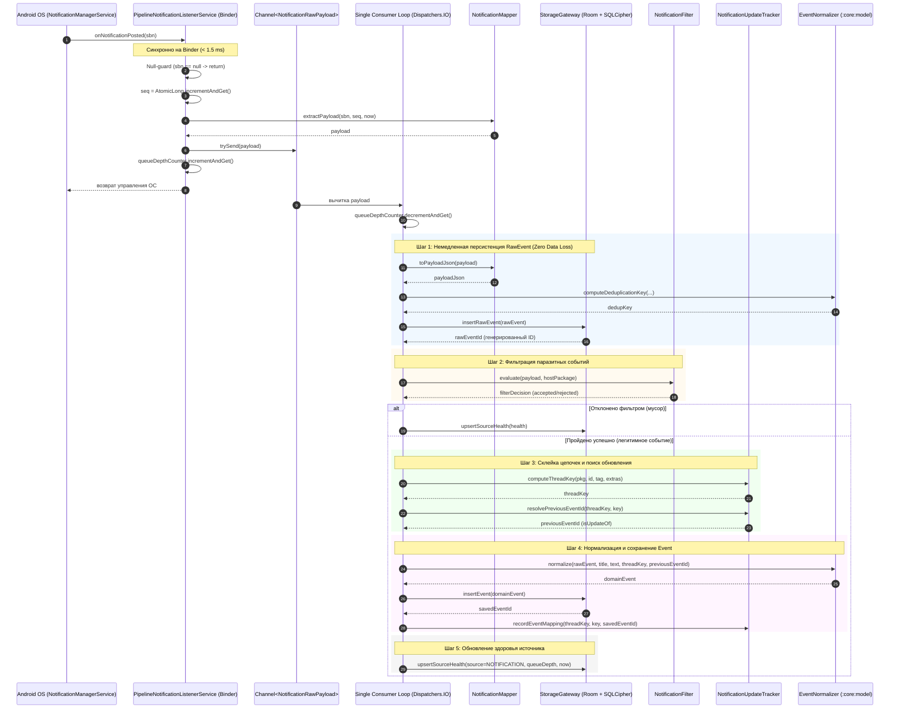
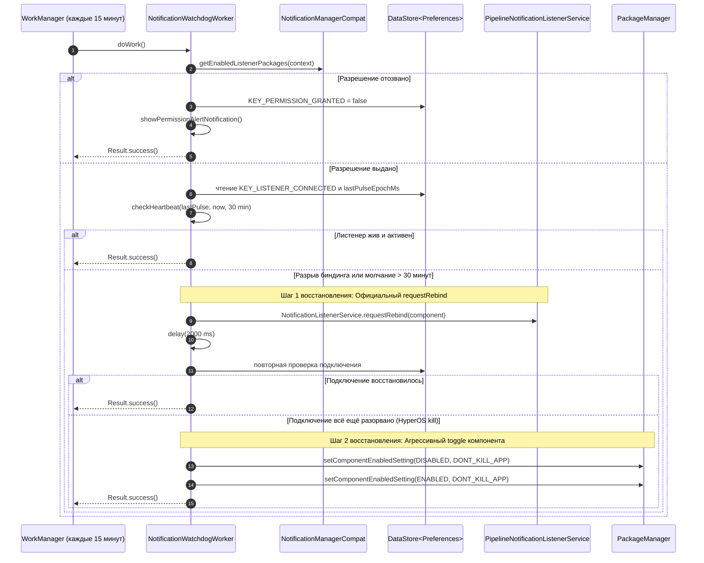

# Спецификация: zone/ingest-notification

## Модуль: :ingest:notification   Зона: zone/ingest-notification   Версия спеки: v1   Статус: DRAFT

---

### Назначение

Модуль `:ingest:notification` является Android-библиотекой (`android-library`) и реализует подсистему захвата, фильтрации, склейки обновлений и первичного сохранения входящих системных уведомлений Android (`StatusBarNotification`).

Ключевые функциональные обязанности модуля:
1. Непрерывный перехват системных уведомлений через `PipelineNotificationListenerService` (наследник `android.service.notification.NotificationListenerService`).
2. Извлечение стандартных и расширенных текстовых метаданных (`EXTRA_TITLE`, `EXTRA_TEXT`, `EXTRA_BIG_TEXT`, `EXTRA_TEXT_LINES`, а также объектов сообщений `EXTRA_MESSAGES` и `EXTRA_HISTORIC_MESSAGES` для стиля `Notification.MessagingStyle`).
3. Присвоение строго монотонного порядкового номера `seq` через `AtomicLong.incrementAndGet()` в момент поступления и неблокирующее помещение в буферный канал `Channel<NotificationRawPayload>(Channel.UNLIMITED)` на binder-потоке операционной системы.
4. Последовательная обработка единственным фоновым консьюмером:
   - **Шаг 1:** Немедленная персистенция в `StorageGateway.insertRawEvent` (до любой фильтрации и бизнес-логики) для исключения потери данных при аварийном завершении процесса ОС (согласно ADR-004).
   - **Шаг 2:** Детерминированная фильтрация паразитных уведомлений (ongoing-сервисы, индикаторы прогресса, суммирующие групповые карточки `group summary`, собственные уведомления приложения).
   - **Шаг 3:** Склейка цепочек обновлений: детерминированное вычисление `ThreadKey` и обнаружение связи `isUpdateOf` с предыдущим `Event` по композитному ключу пакета, идентификатора и тега.
   - **Шаг 4:** Нормализация текста и детектирование языка через вызов `EventNormalizer.normalize` из модуля `:core:model` с последующей вставкой в `StorageGateway.insertEvent`.
   - **Шаг 5:** Атомарное обновление метрик работоспособности источника в `StorageGateway.upsertSourceHealth` (включая скользящую глубину очереди `queueDepth`).
5. Мониторинг жизненного цикла листенера (`onListenerConnected` / `onListenerDisconnected`) с синхронизацией состояния в `DataStore<Preferences>` и таблице `source_health`.
6. Механизм самовосстановления и сторожевого контроля `IngestWatchdog`:
   - Периодический воркер `WorkManager` (интервал 15 минут): контроль разрешений в `NotificationManagerCompat.getEnabledListenerPackages`, мониторинг heartbeat (разрыв > 30 минут), двухэтапное восстановление соединения:
     - Шаг 1: `NotificationListenerService.requestRebind(ComponentName)`.
     - Шаг 2 (запасной): программный toggle компонента сервиса `PackageManager.setComponentEnabledSetting(disable -> enable)`.
   - Опциональный фоновый сервис повышенной живучести `LiveWatchdogForegroundService` типа `specialUse` (`PROPERTY_SPECIAL_USE_FGS_SUBTYPE`) для предотвращения выгрузки на агрессивных прошивках (Xiaomi HyperOS / MIUI) согласно ADR-003.

Модуль **НЕ производит** прямого взаимодействия с UI, **НЕ выполняет** шифрование базы данных (делегировано `:core:storage`), и **НЕ обрабатывает** SMS и медиа-сессии (делегировано `:ingest:sms` и `:ingest:media`).

---

### Архитектурное окружение и структура пакетов

```
com.example.npc.ingest.notification/
├── NotificationContract.kt
├── model/
│   ├── NotificationRawPayload.kt
│   ├── NotificationExtrasData.kt
│   ├── MessagingStyleData.kt
│   ├── MessagingMessageData.kt
│   ├── FilterDecision.kt
│   └── FilterRejectionReason.kt
├── service/
│   ├── PipelineNotificationListenerService.kt
│   └── LiveWatchdogForegroundService.kt
├── mapper/
│   └── NotificationMapper.kt
├── filter/
│   └── NotificationFilter.kt
├── tracker/
│   └── NotificationUpdateTracker.kt
├── watchdog/
│   ├── IngestWatchdog.kt
│   └── NotificationWatchdogWorker.kt
└── di/
    └── NotificationIngestModule.kt
```

---

### Типы данных и структуры (Data Structures & DTO)

Все DTO-классы размещаются в пакете `com.example.npc.ingest.notification.model`. В качестве типа меток времени используется `java.time.Instant`.

#### 1. `MessagingMessageData`

```kotlin
data class MessagingMessageData(
    val text: String,
    val timestampMillis: Long,
    val senderName: String?
)
```

- **Назначение:** Структурированное представление отдельного сообщения, извлечённого из `Notification.MessagingStyle.Message` или `Notification.MessagingStyle.HistoricMessage`.
- **Поля:**
  - `text: String` — текст конкретного сообщения.
  - `timestampMillis: Long` — эпохальное время отправки сообщения в миллисекундах.
  - `senderName: String?` — отображаемое имя автора сообщения (null для сообщений от текущего пользователя устройства).
- **Инварианты:**
  - `text` не равен `null`.
  - `timestampMillis >= 0L`.
  - Если `senderName != null`, то `senderName.isNotBlank()`.

---

#### 2. `MessagingStyleData`

```kotlin
data class MessagingStyleData(
    val conversationTitle: String?,
    val isGroupConversation: Boolean,
    val messages: List<MessagingMessageData>,
    val historicMessages: List<MessagingMessageData>
)
```

- **Назначение:** Агрегированные данные диалога/чата, извлечённые из `Notification.MessagingStyle`.
- **Поля:**
  - `conversationTitle: String?` — название группового чата или диалога.
  - `isGroupConversation: Boolean` — признак групповой беседы.
  - `messages: List<MessagingMessageData>` — список актуальных сообщений в хронологическом порядке.
  - `historicMessages: List<MessagingMessageData>` — список исторических (ранее доставленных) сообщений.
- **Инварианты:**
  - `messages` и `historicMessages` не равны `null`.
  - Элементы списков упорядочены по `timestampMillis` по возрастанию.

---

#### 3. `NotificationExtrasData`

```kotlin
data class NotificationExtrasData(
    val title: String?,
    val text: String?,
    val bigText: String?,
    val textLines: List<String>,
    val subText: String?,
    val infoText: String?,
    val progressMax: Int,
    val progressCurrent: Int,
    val isProgressIndeterminate: Boolean,
    val conversationTitle: String?,
    val messagingStyle: MessagingStyleData?
)
```

- **Назначение:** Полный снимок текстовых и управляющих полей, извлечённых из `android.os.Bundle` системного уведомления (`sbn.notification.extras`).
- **Поля:**
  - `title: String?` — значение ключа `Notification.EXTRA_TITLE`.
  - `text: String?` — значение ключа `Notification.EXTRA_TEXT`.
  - `bigText: String?` — значение ключа `Notification.EXTRA_BIG_TEXT`.
  - `textLines: List<String>` — строковые элементы из массива `Notification.EXTRA_TEXT_LINES` (пустой список, если массив отсутствует).
  - `subText: String?` — значение ключа `Notification.EXTRA_SUB_TEXT`.
  - `infoText: String?` — значение ключа `Notification.EXTRA_INFO_TEXT`.
  - `progressMax: Int` — значение ключа `Notification.EXTRA_PROGRESS_MAX` (по умолчанию `0`).
  - `progressCurrent: Int` — значение ключа `Notification.EXTRA_PROGRESS` (по умолчанию `0`).
  - `isProgressIndeterminate: Boolean` — значение ключа `Notification.EXTRA_PROGRESS_INDETERMINATE` (по умолчанию `false`).
  - `conversationTitle: String?` — значение ключа `Notification.EXTRA_CONVERSATION_TITLE`.
  - `messagingStyle: MessagingStyleData?` — структурированные данные стиля `MessagingStyle`, либо `null`, если стиль не используется.
- **Инварианты:**
  - `textLines` не равен `null`.
  - `progressMax >= 0`, `progressCurrent >= 0`.

---

#### 4. `NotificationRawPayload`

```kotlin
data class NotificationRawPayload(
    val seq: Long,
    val packageName: String,
    val id: Int,
    val tag: String?,
    val key: String,
    val groupKey: String?,
    val postTimeEpochMs: Long,
    val flags: Int,
    val channelId: String?,
    val extras: NotificationExtrasData,
    val receivedAt: java.time.Instant
)
```

- **Назначение:** Неизменяемый снимок входящего уведомления, формируемый на binder-потоке `onNotificationPosted` и передаваемый в `Channel<NotificationRawPayload>`.
- **Поля:**
  - `seq: Long` — монотонный порядковый номер события, присвоенный через `AtomicLong.incrementAndGet()`.
  - `packageName: String` — имя Android-пакета приложения (`sbn.packageName`).
  - `id: Int` — целочисленный идентификатор уведомления (`sbn.id`).
  - `tag: String?` — строковый тег уведомления (`sbn.tag`).
  - `key: String` — уникальный строковый ключ системы Android (`sbn.key`).
  - `groupKey: String?` — ключ группы уведомлений (`sbn.groupKey` или `sbn.notification.group`).
  - `postTimeEpochMs: Long` — системное время создания уведомления источником (`sbn.postTime`).
  - `flags: Int` — битовая маска флагов (`sbn.notification.flags`).
  - `channelId: String?` — идентификатор канала уведомлений (`sbn.notification.channelId`).
  - `extras: NotificationExtrasData` — извлечённые метаданные.
  - `receivedAt: java.time.Instant` — точное время захвата сервисом.
- **Инварианты:**
  - `seq > 0L`.
  - `packageName.isNotBlank()`.
  - `key.isNotBlank()`.
  - `postTimeEpochMs >= 0L`.
  - `receivedAt` не равен `null`.

---

#### 5. `FilterRejectionReason`

```kotlin
enum class FilterRejectionReason {
    OWN_PACKAGE,
    ONGOING_EVENT,
    FOREGROUND_SERVICE,
    PROGRESS_BAR,
    GROUP_SUMMARY,
    EMPTY_CONTENT
}
```

- **Назначение:** Причины отклонения уведомления на шаге фильтрации паразитных событий.
- **Значения:**
  - `OWN_PACKAGE` — уведомление создано самим приложением-конструктором.
  - `ONGOING_EVENT` — выставлен флаг `Notification.FLAG_ONGOING_EVENT` (постоянное/закреплённое уведомление).
  - `FOREGROUND_SERVICE` — выставлен флаг `Notification.FLAG_FOREGROUND_SERVICE`.
  - `PROGRESS_BAR` — уведомление содержит активный индикатор прогресса (`progressMax > 0` или `isProgressIndeterminate == true`).
  - `GROUP_SUMMARY` — выставлен флаг `Notification.FLAG_GROUP_SUMMARY` (карточка-заголовок группы).
  - `EMPTY_CONTENT` — отсутствуют все текстовые поля (заголовок, текст, bigText, textLines и messages).

---

#### 6. `FilterDecision`

```kotlin
data class FilterDecision(
    val isAccepted: Boolean,
    val rejectionReason: FilterRejectionReason?
)
```

- **Назначение:** Результат работы детектора фильтрации.
- **Инварианты:**
  - Если `isAccepted == true`, то `rejectionReason == null`.
  - Если `isAccepted == false`, то `rejectionReason != null`.

---

### Публичный API и компоненты зоны

В зону входят следующие ключевые классы и службы:

```kotlin
// 1. Системный сервис-листенер уведомлений
@AndroidEntryPoint
class PipelineNotificationListenerService : NotificationListenerService() {
    override fun onListenerConnected()
    override fun onListenerDisconnected()
    override fun onNotificationPosted(sbn: StatusBarNotification?)
    override fun onNotificationRemoved(sbn: StatusBarNotification?)
}

// 2. Двусторонний маппер сырых уведомлений в DTO и JSON
object NotificationMapper {
    fun extractPayload(sbn: StatusBarNotification, seq: Long, receivedAt: Instant): NotificationRawPayload
    fun extractExtrasData(notification: Notification): NotificationExtrasData
    fun extractMessagingStyle(extras: Bundle): MessagingStyleData?
    fun toPayloadJson(payload: NotificationRawPayload): String
}

// 3. Детерминированный фильтр мусора
object NotificationFilter {
    fun evaluate(payload: NotificationRawPayload, hostPackageName: String): FilterDecision
    fun isOngoing(flags: Int): Boolean
    fun isForegroundService(flags: Int): Boolean
    fun isGroupSummary(flags: Int): Boolean
    fun hasProgressBar(extras: NotificationExtrasData): Boolean
    fun isOwnPackage(packageName: String, hostPackageName: String): Boolean
    fun hasTextContent(extras: NotificationExtrasData): Boolean
}

// 4. Трекер склейки обновлений и цепочек сообщений
class NotificationUpdateTracker(
    private val storageGateway: StorageGateway,
    private val maxCacheSize: Int = 1000
) {
    fun computeThreadKey(packageName: String, id: Int, tag: String?, extras: NotificationExtrasData): ThreadKey
    suspend fun resolvePreviousEventId(threadKey: ThreadKey, notificationKey: String): Long?
    fun recordEventMapping(threadKey: ThreadKey, notificationKey: String, eventId: Long)
    fun evictNotification(notificationKey: String)
}

// 5. Периодический WorkManager-воркер самовосстановления
@HiltWorker
class NotificationWatchdogWorker(
    context: Context,
    workerParams: WorkerParameters,
    private val storageGateway: StorageGateway,
    private val dataStore: DataStore<Preferences>
) : CoroutineWorker(context, workerParams) {
    override suspend fun doWork(): Result
    fun checkListenerPermission(context: Context): Boolean
    fun checkHeartbeat(lastPulseEpochMs: Long, currentTimeEpochMs: Long, thresholdMs: Long = 1_800_000L): Boolean
    fun executeRebindStep(context: Context): Boolean
    fun executeComponentToggleStep(context: Context): Boolean
    fun showPermissionAlertNotification(context: Context)
}

// 6. Менеджер регистрации Watchdog
class IngestWatchdog(
    private val context: Context,
    private val workManager: WorkManager,
    private val dataStore: DataStore<Preferences>
) {
    fun schedulePeriodicCheck()
    fun cancelPeriodicCheck()
    fun setHighSurvivabilityMode(enabled: Boolean)
}

// 7. Foreground Service специального назначения (Special-Use FGS)
class LiveWatchdogForegroundService : Service() {
    override fun onStartCommand(intent: Intent?, flags: Int, startId: Int): Int
    override fun onBind(intent: Intent?): IBinder?
    companion object {
        fun start(context: Context)
        fun stop(context: Context)
    }
}
```

---

### Детальная спецификация функций и методов

---

#### Класс `PipelineNotificationListenerService`

##### Функция 1: `onNotificationPosted`

- **Сигнатура:**
  ```kotlin
  override fun onNotificationPosted(sbn: StatusBarNotification?)
  ```
- **Назначение:** Приём события появления или изменения уведомления от подсистемы Android NotificationManagerService на IPC binder-потоке, быстрый захват полей, присвоение `seq` и неблокирующее помещение в очередь.
- **Предусловия:**
  - Метод вызывается Android OS. `sbn` может быть равен `null` (дефектные OEM-реализации).
- **Постусловия:**
  - Время выполнения на binder-потоке строго не превышает 1.5 миллисекунды.
  - При `sbn == null` выполнение немедленно прекращается без создания побочных эффектов.
  - Порядковый номер `seq` инкрементируется атомарно через `seqGenerator.incrementAndGet()`.
  - Объект `NotificationRawPayload` успешно отправлен в `Channel<NotificationRawPayload>`.
  - Атомарный счётчик `queueDepthCounter` увеличен на 1.
- **Поведение (пошагово):**
  1. Выполнить проверку `if (sbn == null) return`.
  2. Зафиксировать метку времени получения: `val receivedAt = Instant.now()`.
  3. Атомарно получить монотонный порядковый номер: `val seq = seqGenerator.incrementAndGet()`.
  4. Вызвать `NotificationMapper.extractPayload(sbn, seq, receivedAt)` для формирования неизменяемого `NotificationRawPayload`.
  5. Отправить сформированный payload в очередь: `val sendResult = channel.trySend(payload)`.
  6. Если `sendResult.isSuccess`:
     - Инкрементировать атомарный счётчик глубины очереди: `queueDepthCounter.incrementAndGet()`.
  7. Если `sendResult` завершился с ошибкой (канал закрыт):
     - Зафиксировать ошибку в диагностический журнал Android Logcat: `Log.e(TAG, "Notification channel is closed. Dropping payload seq=$seq")`.
  8. Завершить выполнение метода, вернув управление процессу ОС.
- **Ошибки:**
  - Метод перехватывает все исключения `Throwable` в защитном блоке `try-catch`, логирует их через `Log.e` и не позволяет исключению просочиться в системный binder (предотвращение краша процесса `system_server`).
- **Побочные эффекты:**
  - Помещение элемента в структуру `Channel`.
  - Модификация `seqGenerator` и `queueDepthCounter`.
- **Граничные случаи:**
  - `sbn = null` → тихий выход без действий.
  - `sbn.notification = null` → перехватывается в `extractPayload`, формируется payload с пустыми extras.
  - Всплеск (burst) из 100 уведомлений за 50 мс → все 100 уведомлений получают последовательные строго возрастающие `seq` (например, 101..200) и помещаются в `Channel.UNLIMITED` без блокировки binder-потока.
- **Примеры:**
  1. *Пример 1 (Стандартное входящее сообщение Telegram):*
     - Вход: `sbn` пакета `org.telegram.messenger`, `id = 1001`, `seqGenerator = 42`.
     - Результат: `seq = 43`, payload отправлен в `channel`, `queueDepthCounter` увеличен с 0 до 1, возврат < 1 мс.
  2. *Пример 2 (Null-уведомление при сбое ОС):*
     - Вход: `sbn = null`.
     - Результат: немедленный возврат, `seqGenerator` остаётся 42, `channel` не модифицируется.
  3. *Пример 3 (Обновление уведомления с тем же id):*
     - Вход: повторный `sbn` от того же пакета `org.telegram.messenger` с `id = 1001`, `seqGenerator = 43`.
     - Результат: `seq = 44`, новый payload отправлен в `channel`, `queueDepthCounter` увеличен до 2.
- **Сложность / ограничения:**
  - Время: $O(1)$. Память: $O(1)$ в куче (аллокация одного экземпляра DTO).

---

##### Функция 2: `onListenerConnected`

- **Сигнатура:**
  ```kotlin
  override fun onListenerConnected()
  ```
- **Назначение:** Обработка установления активного IPC-соединения между Android NotificationManagerService и сервисом приложения.
- **Предусловия:**
  - Сервис зарегистрирован в `AndroidManifest.xml` с разрешением `android.permission.BIND_NOTIFICATION_LISTENER_SERVICE` и пользователь выдал доступ в настройках ОС.
- **Постусловия:**
  - Флаг `KEY_LISTENER_CONNECTED` в `DataStore<Preferences>` установлен в значение `true`.
  - Метка `KEY_LAST_CONNECTED_TIMESTAMP` в `DataStore<Preferences>` обновлена текущим эпохальным временем.
  - В таблице `source_health` поле `lastError` сброшено в `null`.
  - Единственный фоновый консьюмер запущен, если он был остановлен.
- **Поведение (пошагово):**
  1. Запустить корутину в `serviceScope` (`Dispatchers.IO`).
  2. Атомарно записать в `DataStore`:
     ```kotlin
     dataStore.edit { prefs ->
         prefs[KEY_LISTENER_CONNECTED] = true
         prefs[KEY_LAST_CONNECTED_TIMESTAMP] = System.currentTimeMillis()
     }
     ```
  3. Вызвать `storageGateway.upsertSourceHealth`:
     - `source = SourceId.NOTIFICATION`
     - `lastError = null`
     - `queueDepth = queueDepthCounter.get()`
  4. Проверить состояние корутины консьюмера: если `consumerJob == null` или `consumerJob?.isActive == false`, вызвать `startConsumerLoop()`.
  5. Залогировать успешное подключение: `Log.i(TAG, "Notification listener connected successfully")`.
- **Ошибки:**
  - Ошибки I/O при записи в `DataStore` или Room перехватываются, логируются в Logcat и не приводят к падению сервиса.
- **Побочные эффекты:**
  - Запись в `DataStore` и БД SQLite. Запуск фоновой корутины.
- **Граничные случаи:**
  - Повторный вызов `onListenerConnected()` при уже работающем консьюмере → существующий `consumerJob` не перезапускается, обновляются только метки времени.
- **Примеры:**
  1. *Пример 1 (Холодный старт устройства после загрузки):*
     - Вход: вызов ОС после разблокировки экрана.
     - Результат: `KEY_LISTENER_CONNECTED = true`, запущен цикл `consumePayloads()`, `source_health.lastError = null`.
  2. *Пример 2 (Переподключение после requestRebind):*
     - Вход: соединение восстановлено после сбоя.
     - Результат: метка времени `KEY_LAST_CONNECTED_TIMESTAMP` обновлена на актуальную, `lastError` очищен.
  3. *Пример 3 (Подключение при заполненной очереди):*
     - Вход: в очереди скопилось 5 элементов.
     - Результат: `source_health.queueDepth = 5`, консьюмер начинает вычитку.
- **Сложность / ограничения:**
  - Время: асинхронный запуск корутины $O(1)$. Запись в БД в пуле `Dispatchers.IO`.

---

##### Функция 3: `onListenerDisconnected`

- **Сигнатура:**
  ```kotlin
  override fun onListenerDisconnected()
  ```
- **Назначение:** Фиксация разрыва соединения со стороны операционной системы (например, при агрессивной оптимизации памяти в HyperOS).
- **Предусловия:**
  - Вызывается ОС при уничтожении биндинга к сервису.
- **Постусловия:**
  - Флаг `KEY_LISTENER_CONNECTED` в `DataStore` установлен в `false`.
  - Метка `KEY_LAST_DISCONNECTED_TIMESTAMP` в `DataStore` обновлена.
  - В `source_health` зафиксирована ошибка с меткой времени разрыва: `"Listener disconnected by OS at <ISO-8601>"`.
- **Поведение (пошагово):**
  1. Зафиксировать текущее время: `val now = Instant.now()`.
  2. Запустить операцию в `serviceScope` (`Dispatchers.IO`):
     ```kotlin
     dataStore.edit { prefs ->
         prefs[KEY_LISTENER_CONNECTED] = false
         prefs[KEY_LAST_DISCONNECTED_TIMESTAMP] = now.toEpochMilli()
     }
     ```
  3. Сформировать сообщение об ошибке: `val errorMsg = "Listener disconnected by OS at $now"`.
  4. Вызвать `storageGateway.upsertSourceHealth`:
     - `source = SourceId.NOTIFICATION`
     - `lastError = errorMsg`
     - `queueDepth = queueDepthCounter.get()`
  5. Залогировать предупреждение: `Log.w(TAG, errorMsg)`.
- **Ошибки:**
  - Исключения дисковых операций перехватываются внутри корутины.
- **Побочные эффекты:**
  - Запись в `DataStore` и SQLite.
- **Граничные случаи:**
  - Вызов `onListenerDisconnected` в момент выключения питания устройства → попытка записи лучшего качества (best-effort) без гарантии завершения флеша диска.
- **Примеры:**
  1. *Пример 1 (Убийство биндинга в фоне HyperOS):*
     - Вход: система сбросила сервис через 10 минут неактивности.
     - Результат: `KEY_LISTENER_CONNECTED = false`, `source_health.lastError` содержит точный таймстемп разрыва.
  2. *Пример 2 (Отзыв разрешения пользователем в настройках Android):*
     - Вход: пользователь выключил тумблер доступа к уведомлениям.
     - Результат: флаг установлен в `false`, `lastError` зафиксирован.
  3. *Пример 3 (Быстрый цикл disconnect -> connect):*
     - Вход: мгновенный перезапуск ОС.
     - Результат: запись `lastError` сменяется очисткой `lastError` в `onListenerConnected`.
- **Сложность / ограничения:**
  - Время: асинхронный запуск $O(1)$.

---

##### Функция 4: `onNotificationRemoved`

- **Сигнатура:**
  ```kotlin
  override fun onNotificationRemoved(sbn: StatusBarNotification?)
  ```
- **Назначение:** Обработка удаления (смахивания или программной отмены) уведомления пользователем или приложением-источником.
- **Предусловия:**
  - `sbn` может быть `null`.
- **Постусловия:**
  - При `sbn != null` соответствующий ключ уведомления удаляется из оперативного кэша склейки `NotificationUpdateTracker`.
  - В БД `raw_event` и `event` удаление НЕ производится (история событий неизменяема и сохраняется полностью).
- **Поведение (пошагово):**
  1. Проверить `if (sbn == null) return`.
  2. Получить уникальный ключ уведомления: `val key = sbn.key`.
  3. Вызвать `updateTracker.evictNotification(key)`.
- **Ошибки:**
  - Не выбрасывает исключений.
- **Побочные эффекты:**
  - Инвалидация записи в `NotificationUpdateTracker`.
- **Граничные случаи:**
  - `sbn = null` → возврат.
  - Удаление уведомления, которое не отслеживалось в трекере → тихий пропуск.
- **Примеры:**
  1. *Пример 1 (Пользователь смахнул уведомление):*
     - Вход: `key = "0|org.telegram.messenger|1001|null|10123"`.
     - Результат: запись удалена из кэша трекера, в БД ничего не удаляется.
  2. *Пример 2 (null sbn):*
     - Вход: `null`.
     - Результат: возврат без ошибок.
  3. *Пример 3 (Приложение само отменило уведомление через cancelNotification):*
     - Вход: `key = "0|com.whatsapp|2002|chat_tag|10456"`.
     - Результат: трекер очищен от данного ключа.
- **Сложность / ограничения:**
  - Время: $O(1)$ для поиска и удаления из `HashMap` / `LruCache`.

---

##### Функция 5: `consumePayloads` (Внутренний консьюмер)

- **Сигнатура:**
  ```kotlin
  internal suspend fun consumePayloads()
  ```
- **Назначение:** Единственный бесконечный цикл последовательной вычитки и обработки элементов из `Channel<NotificationRawPayload>`.
- **Предусловия:**
  - Выполняется строго в одном экземпляре корутины в пуле потоков `Dispatchers.IO`.
- **Постусловия:**
  - Каждый элемент из канала гарантированно проходит Шаг 1 (`insertRawEvent`) независимо от исхода последующих шагов.
  - Очередь освобождается последовательно без параллельных гонок записи в базу данных.
- **Поведение (пошагово):**
  1. Запустить цикл чтения: `for (payload in channel) { ... }`.
  2. Декрементировать счётчик невычитанных элементов: `queueDepthCounter.decrementAndGet()`.
  3. Выполнить вызов защищённого обработчика: `processSinglePayload(payload)`.
  4. При возникновении необработанного исключения `Exception` внутри `processSinglePayload`:
     - Зафиксировать ошибку в Logcat: `Log.e(TAG, "Failed to process payload seq=${payload.seq}", e)`.
     - Обновить `source_health.lastError`: `"Error processing seq ${payload.seq}: ${e.message}"`.
  5. Перейти к следующей итерации цикла.
- **Ошибки:**
  - Все ошибки изолируются внутри итерации; цикл консьюмера никогда не завершается аварийно.
- **Побочные эффекты:**
  - Запись в SQLite через `StorageGateway`.
- **Граничные случаи:**
  - Отмена корутины консьюмера (`CancellationException`) → корректное закрытие цикла с сохранением оставшихся элементов в канале до следующего запуска.
- **Примеры:**
  1. *Пример 1 (Обычный поток событий):*
     - Вход: в канал поступает 1 событие. Консьюмер немедленно просыпается, обрабатывает его и переходит в режим ожидания (suspend).
  2. *Пример 2 (Падение при вставке Event):*
     - Вход: `insertRawEvent` успешен, но нормализатор выбросил ошибку.
     - Результат: ошибка логируется, `source_health.lastError` обновляется, цикл продолжает работу со следующим элементом.
  3. *Пример 3 (Последовательность из 3 обновлений одного чата):*
     - Вход: 3 payload с seq=1, seq=2, seq=3.
     - Результат: строго последовательная обработка; seq=2 видит результаты коммита seq=1, seq=3 видит результаты seq=2.
- **Сложность / ограничения:**
  - Время: $O(1)$ на переключение между шагами. Задержка сквозной обработки p95 < 25 мс.

---

##### Функция 6: `processSinglePayload` (Пятишаговый конвейер)

- **Сигнатура:**
  ```kotlin
  internal suspend fun processSinglePayload(payload: NotificationRawPayload)
  ```
- **Назначение:** Пошаговая реализация конвейера обработки отдельного сырого уведомления.
- **Предусловия:**
  - `payload` не равен `null`, содержит валидный `seq > 0L`.
- **Постусловия:**
  - **Шаг 1:** Запись `RawEvent` сохранена в таблице `raw_event`.
  - **Шаг 2:** Если уведомление признано паразитным — дальнейшие шаги создания `Event` прекращаются.
  - **Шаг 3:** При успешном прохождении фильтра вычислен `ThreadKey` и найден `isUpdateOf` (если применимо).
  - **Шаг 4:** Текст нормализован, `Event` сохранён в таблице `event`.
  - **Шаг 5:** Запись в `source_health` обновлена (актуализированы `lastEventAt`, `events24h` и `queueDepth`).
- **Поведение (пошагово):**
  1. **Шаг 1 (НЕМЕДЛЕННО! Персистенция RawEvent):**
     - Сформировать неизменяемую JSON-строку: `val jsonString = NotificationMapper.toPayloadJson(payload)`.
     - Рассчитать дедупликационный ключ:
       `val dedupKey = EventNormalizer.computeDeduplicationKey(SourceId.NOTIFICATION, payload.packageName, jsonString)`.
     - Сконструировать экземпляр `RawEvent`:
       ```kotlin
       val rawEvent = RawEvent(
           id = 0L,
           seq = payload.seq,
           source = SourceId.NOTIFICATION,
           packageName = payload.packageName,
           receivedAt = payload.receivedAt,
           payloadJson = jsonString,
           hash = dedupKey
       )
       ```
     - Выполнить вставку: `val rawEventId = storageGateway.insertRawEvent(rawEvent)`.
     - Если `rawEventId == -1L` (сработал уникальный индекс `hash` — обнаружен дубликат):
       - Завершить обработку, перейдя сразу к Шагу 5 (обновление метрики пульса источника).
  2. **Шаг 2 (Фильтр мусора):**
     - Вызвать `val filterDecision = NotificationFilter.evaluate(payload, hostPackageName = context.packageName)`.
     - Если `!filterDecision.isAccepted`:
       - Залогировать причину отсечения: `Log.d(TAG, "Notification seq=${payload.seq} filtered out: ${filterDecision.rejectionReason}")`.
       - Прекратить дальнейшую обработку и перейти сразу к Шагу 5.
  3. **Шаг 3 (Склейка обновлений):**
     - Вычислить логический ключ треда:
       `val threadKey = updateTracker.computeThreadKey(payload.packageName, payload.id, payload.tag, payload.extras)`.
     - Найти идентификатор предыдущего события в цепочке:
       `val previousEventId = updateTracker.resolvePreviousEventId(threadKey, notificationKey = payload.key)`.
  4. **Шаг 4 (Нормализация и вставка Event):**
     - Извлечь эффективные заголовок и текст из `payload.extras`:
       - Если `payload.extras.messagingStyle != null` и список сообщений не пуст:
         - Заголовок: `payload.extras.messagingStyle.conversationTitle ?: payload.extras.title ?: "Диалог"`.
         - Текст: сформировать текст из последнего входящего сообщения (или конкатенации непрочитанных сообщений): `payload.extras.messagingStyle.messages.last().text`.
       - Иначе если `!payload.extras.bigText.isNullOrBlank()`:
         - Заголовок: `payload.extras.title ?: ""`.
         - Текст: `payload.extras.bigText`.
       - Иначе если `payload.extras.textLines.isNotEmpty()`:
         - Заголовок: `payload.extras.title ?: ""`.
         - Текст: `payload.extras.textLines.joinToString("\n")`.
       - Иначе:
         - Заголовок: `payload.extras.title ?: ""`.
         - Текст: `payload.extras.text ?: ""`.
     - Вызвать чистую функцию нормализации из `:core:model`:
       ```kotlin
       val domainEvent = EventNormalizer.normalize(
           rawEvent = rawEvent.copy(id = rawEventId),
           title = effectiveTitle,
           text = effectiveText,
           threadKey = threadKey,
           isUpdateOf = previousEventId
       )
       ```
     - Сохранить структурированное событие: `val savedEventId = storageGateway.insertEvent(domainEvent)`.
     - Зафиксировать связку в трекере обновлений:
       `updateTracker.recordEventMapping(threadKey, notificationKey = payload.key, eventId = savedEventId)`.
  5. **Шаг 5 (Обновление source_health):**
     - Получить текущее значение невычитанных элементов: `val currentQueueDepth = queueDepthCounter.get()`.
     - Сформировать объект метрик:
       ```kotlin
       val health = SourceHealth(
           source = SourceId.NOTIFICATION,
           lastEventAt = payload.receivedAt,
           events24h = 0, // Вычисляется динамически внутри Room DAO StorageGateway
           lastError = null,
           queueDepth = currentQueueDepth
       )
       ```
     - Вызвать `storageGateway.upsertSourceHealth(health)`.
- **Ошибки:**
  - `SQLiteConstraintException` при повторной вставке одинакового хеша в `insertRawEvent` — перехватывается, возвращает `-1L`, выполнение безопасно переходит к Шагу 5.
- **Побочные эффекты:**
  - Модификация таблиц `raw_event`, `event`, `source_health`.
  - Обновление оперативного кэша `updateTracker`.
- **Граничные случаи:**
  - Уведомление с пустым текстом и заголовком → отсекается на Шаге 2 причиной `EMPTY_CONTENT`.
  - Повторяющееся системное уведомление без изменений полей → отсекается дедупликационным ключом на Шаге 1.
  - Десятое подряд обновление прогресс-бара скачивания файла → отсекается на Шаге 2 причиной `PROGRESS_BAR`.
- **Примеры:**
  1. *Пример 1 (Банковское уведомление о списании):*
     - Вход: `payload` от `ru.sberbankmobile`, `title = "СберБанк"`, `text = "Покупка: 1500 ₽"`.
     - Шаг 1: `raw_event` записан с id=101.
     - Шаг 2: фильтр пройден (`isAccepted = true`).
     - Шаг 3: `threadKey = "ru.sberbankmobile:notif::1"`, `previousEventId = null`.
     - Шаг 4: `event` сохранён с id=55, `lang = Lang.RU`.
     - Шаг 5: `source_health.lastEventAt` обновлён.
  2. *Пример 2 (Фоновое уведомление плеера):*
     - Вход: `payload` от `com.spotify.music` с флагом `FLAG_ONGOING_EVENT`.
     - Шаг 1: `raw_event` записан с id=102.
     - Шаг 2: фильтр отклоняет с `ONGOING_EVENT`.
     - Шаги 3 и 4: пропущены.
     - Шаг 5: `source_health` обновлён.
  3. *Пример 3 (Второе сообщение в диалоге Telegram):*
     - Вход: `payload` от `org.telegram.messenger`, `conversationTitle = "Рабочий чат"`, `text = "Вторая реплика"`.
     - Шаг 1: `raw_event` записан с id=103.
     - Шаг 2: фильтр пройден.
     - Шаг 3: `threadKey = "org.telegram.messenger:conv:Рабочий чат"`, найден `previousEventId = 50`.
     - Шаг 4: `event` сохранён с `isUpdateOf = 50`.
     - Шаг 5: `source_health` обновлён.
- **Сложность / ограничения:**
  - Время: $O(1)$ плюс время дисковых транзакций Room. Общее время < 25 мс.

---

#### Класс `NotificationMapper`

##### Функция 1: `extractPayload`

- **Сигнатура:**
  ```kotlin
  fun extractPayload(
      sbn: StatusBarNotification,
      seq: Long,
      receivedAt: java.time.Instant
  ): NotificationRawPayload
  ```
- **Назначение:** Полное извлечение идентификаторов, флагов и метаданных из системного `StatusBarNotification` в иммутабельный DTO `NotificationRawPayload`.
- **Предусловия:**
  - `sbn` не равен `null`.
  - `seq > 0L`.
  - `receivedAt` не равен `null`.
- **Постусловия:**
  - Возвращает полностью заполненный экземпляр `NotificationRawPayload`.
- **Поведение (пошагово):**
  1. Извлечь из `sbn` базовые атрибуты: `packageName`, `id`, `tag`, `key`, `groupKey`, `postTime`.
  2. Получить объект `sbn.notification`. Если `null` — использовать пустой `Notification()`.
  3. Извлечь `flags = notification.flags`.
  4. Извлечь `channelId = notification.channelId` (для API >= 26).
  5. Вызвать `extractExtrasData(notification)` для формирования `NotificationExtrasData`.
  6. Сконструировать и вернуть `NotificationRawPayload`.
- **Ошибки:**
  - Не выбрасывает проверяемых исключений.
- **Побочные эффекты:**
  - Нет (чистое преобразование данных).
- **Граничные случаи:**
  - `sbn.tag = null` → сохраняется как `null`.
  - `sbn.notification.extras = null` → формируются пустые поля `NotificationExtrasData`.
- **Примеры:**
  1. *Пример 1 (Минимальное системное уведомление):*
     - Вход: `sbn` пакета `"android"`, `id = 1`, `tag = null`.
     - Выход: `NotificationRawPayload(seq = 1, packageName = "android", id = 1, tag = null, ...)`
  2. *Пример 2 (Уведомление с тегом):*
     - Вход: `sbn` пакета `"com.google.android.gm"`, `tag = "account_1"`, `id = 42`.
     - Выход: `payload.tag == "account_1"`, `payload.id == 42`.
  3. *Пример 3 (Групповое уведомление WhatsApp):*
     - Вход: `sbn` с `groupKey = "group_family_chat"`.
     - Выход: `payload.groupKey == "group_family_chat"`.
- **Сложность / ограничения:**
  - Время: $O(1)$. Память: $O(1)$.

---

##### Функция 2: `extractExtrasData`

- **Сигнатура:**
  ```kotlin
  fun extractExtrasData(notification: Notification): NotificationExtrasData
  ```
- **Назначение:** Безопасное извлечение строковых и числовых полей из `Bundle` уведомления с поддержкой стилей `BigTextStyle`, `InboxStyle` и `MessagingStyle`.
- **Предусловия:**
  - `notification` не равен `null`.
- **Постусловия:**
  - Возвращает заполненный экземпляр `NotificationExtrasData`. Все строковые поля очищены от `CharSequence`-обёрток (преобразованы в `String`).
- **Поведение (пошагово):**
  1. Получить `extras = notification.extras`. Если `extras == null` — вернуть `NotificationExtrasData` со всеми значениями по умолчанию.
  2. Извлечь строку заголовка: `extras.getCharSequence(Notification.EXTRA_TITLE)?.toString()`.
  3. Извлечь строку основного текста: `extras.getCharSequence(Notification.EXTRA_TEXT)?.toString()`.
  4. Извлечь строку расширенного текста: `extras.getCharSequence(Notification.EXTRA_BIG_TEXT)?.toString()`.
  5. Извлечь массив строк `Notification.EXTRA_TEXT_LINES`:
     - Если массив присутствует: преобразовать каждый `CharSequence` в `String` и сформировать `List<String>`.
     - Если отсутствует: использовать пустой список `emptyList()`.
  6. Извлечь вспомогательные строки: `EXTRA_SUB_TEXT`, `EXTRA_INFO_TEXT`, `EXTRA_CONVERSATION_TITLE`.
  7. Извлечь параметры прогресса:
     - `progressMax = extras.getInt(Notification.EXTRA_PROGRESS_MAX, 0)`.
     - `progressCurrent = extras.getInt(Notification.EXTRA_PROGRESS, 0)`.
     - `isProgressIndeterminate = extras.getBoolean(Notification.EXTRA_PROGRESS_INDETERMINATE, false)`.
  8. Извлечь данные сообщений через `extractMessagingStyle(extras)`.
  9. Сконструировать и вернуть `NotificationExtrasData`.
- **Ошибки:**
  - `BadParcelableException` (при дефектных кастомных объектах в Bundle) — перехватывается, формируются пустые extras.
- **Побочные эффекты:**
  - Нет.
- **Граничные случаи:**
  - Поле `EXTRA_TITLE` содержит `SpannableString` со спанами форматирования → преобразуется в плоский `String` без спанов.
  - Поле `EXTRA_TEXT_LINES` содержит массив с элементами `null` → элементы `null` фильтруются, сохраняются только не-null строки.
- **Примеры:**
  1. *Пример 1 (BigTextStyle):*
     - Вход: `extras` содержит `EXTRA_TITLE = "Email"`, `EXTRA_BIG_TEXT = "Полный текст длинного письма..."`.
     - Выход: `extrasData.bigText == "Полный текст длинного письма..."`.
  2. *Пример 2 (InboxStyle с несколькими строками):*
     - Вход: `extras` содержит `EXTRA_TEXT_LINES = ["Line 1", "Line 2", "Line 3"]`.
     - Выход: `extrasData.textLines == listOf("Line 1", "Line 2", "Line 3")`.
  3. *Пример 3 (Прогресс скачивания):*
     - Вход: `extras` с `EXTRA_PROGRESS_MAX = 100`, `EXTRA_PROGRESS = 45`.
     - Выход: `extrasData.progressMax == 100`, `extrasData.progressCurrent == 45`.
- **Сложность / ограничения:**
  - Время: $O(L)$, где $L$ — количество строк в `EXTRA_TEXT_LINES`.

---

##### Функция 3: `extractMessagingStyle`

- **Сигнатура:**
  ```kotlin
  fun extractMessagingStyle(extras: Bundle): MessagingStyleData?
  ```
- **Назначение:** Разбор структур `MessagingStyle` из `Bundle` с извлечением списка сообщений (`EXTRA_MESSAGES`) и исторических сообщений (`EXTRA_HISTORIC_MESSAGES`).
- **Предусловия:**
  - `extras` не равен `null`.
- **Постусловия:**
  - Возвращает `MessagingStyleData`, если в `extras` найдены ключи стиля `MessagingStyle`, либо `null`, если уведомление не использует данный стиль.
- **Поведение (пошагово):**
  1. Проверить наличие ключей `Notification.EXTRA_MESSAGES` или `Notification.EXTRA_HISTORIC_MESSAGES` в `extras`. Если оба отсутствуют — вернуть `null`.
  2. Извлечь массив `Parcelable[] messagesParcelables = extras.getParcelableArray(Notification.EXTRA_MESSAGES)`.
  3. Для каждого элемента массива:
     - Если элемент является `Bundle`:
       - Извлечь текст: `bundle.getCharSequence("text")?.toString() ?: ""`.
       - Извлечь время: `bundle.getLong("time", 0L)`.
       - Извлечь автора: проверить наличие вложенного объекта `Person` (ключ `"person"`) или строки (ключ `"sender"`). Извлечь строковое имя автора.
       - Сформировать `MessagingMessageData`.
  4. Аналогично шагам 2-3 обработать массив `Notification.EXTRA_HISTORIC_MESSAGES`.
  5. Отсортировать полученные списки по возрастанию `timestampMillis`.
  6. Извлечь заголовок беседы `conversationTitle = extras.getCharSequence(Notification.EXTRA_CONVERSATION_TITLE)?.toString()`.
  7. Извлечь признак группы `isGroup = extras.getBoolean(Notification.EXTRA_IS_GROUP_CONVERSATION, false)`.
  8. Сконструировать и вернуть `MessagingStyleData`.
- **Ошибки:**
  - `ClassCastException` при нестандартном формате вложенных Parcelable — перехватывается с возвратом `null`.
- **Побочные эффекты:**
  - Нет.
- **Граничные случаи:**
  - Массив `EXTRA_MESSAGES` пустой → возвращается `MessagingStyleData` с пустым списком сообщений.
  - Сообщение не содержит текста (например, отправлен стикер/картинка) → `text` заполняется пустой строкой `""`.
- **Примеры:**
  1. *Пример 1 (Сообщение из группового чата Telegram):*
     - Вход: `conversationTitle = "Семья"`, `EXTRA_MESSAGES` содержит 1 сообщение от "Анна": "Купи хлеб".
     - Выход: `MessagingStyleData(conversationTitle = "Семья", isGroupConversation = true, messages = [MessagingMessageData("Купи хлеб", 1774567890000L, "Анна")])`.
  2. *Пример 2 (Личный диалог без conversationTitle):*
     - Вход: `conversationTitle = null`, `sender = "Иван"`, `text = "Привет"`.
     - Выход: `MessagingStyleData(conversationTitle = null, isGroupConversation = false, messages = [MessagingMessageData("Привет", 1774567891000L, "Иван")])`.
  3. *Пример 3 (Обычное уведомление без MessagingStyle):*
     - Вход: `extras` содержит только `EXTRA_TITLE` и `EXTRA_TEXT`.
     - Выход: `null`.
- **Сложность / ограничения:**
  - Время: $O(M \log M)$, где $M$ — суммарное число сообщений (обычно не более 25 в одном системном уведомлении).

---

##### Функция 4: `toPayloadJson`

- **Сигнатура:**
  ```kotlin
  fun toPayloadJson(payload: NotificationRawPayload): String
  ```
- **Назначение:** Детерминированная сериализация всех полей `NotificationRawPayload` в стандартизированную компактную строку JSON без лишних пробелов для постоянного хранения в `raw_event.payload_json`.
- **Предусловия:**
  - `payload` не равен `null`.
- **Постусловия:**
  - Возвращает синтаксически валидную непустую строку JSON.
  - Содержит все извлечённые поля уведомления (включая флаги, идентификаторы, extras и сообщения).
- **Поведение (пошагово):**
  1. Сформировать корневой JSON-объект.
  2. Записать системные идентификаторы: `"seq"`, `"packageName"`, `"id"`, `"tag"`, `"key"`, `"groupKey"`, `"postTime"`, `"flags"`, `"channelId"`, `"receivedAt"`.
  3. Записать вложенный объект `"extras"` со всеми полями `NotificationExtrasData`:
     - `"title"`, `"text"`, `"bigText"`, `"subText"`, `"infoText"`.
     - `"textLines"`: сериализовать как JSON-массив строк.
     - `"progressMax"`, `"progressCurrent"`, `"isProgressIndeterminate"`.
     - `"conversationTitle"`.
     - Если `payload.extras.messagingStyle != null`:
       - Записать объект `"messagingStyle"` с полями `"conversationTitle"`, `"isGroupConversation"`, `"messages"` (массив объектов с полями `"text"`, `"timestampMillis"`, `"senderName"`).
  4. Сериализовать объект в строку в формате UTF-8 без форматирующих отступов и переводов строк.
  5. Вернуть полученную строку.
- **Ошибки:**
  - Не выбрасывает исключений при валидных входных данных DTO.
- **Побочные эффекты:**
  - Нет.
- **Граничные случаи:**
  - Все опциональные поля равны `null` → поля сериализуются со значением `null` либо опускаются.
  - Текст содержит кавычки и символы перевода строки → корректное экранирование `\"` и `\n`.
- **Примеры:**
  1. *Пример 1 (Базовый payload):*
     - Вход: `payload` с `seq = 1`, `packageName = "com.test"`, `title = "Hi"`.
     - Выход: `"{\"seq\":1,\"packageName\":\"com.test\",\"id\":10,\"tag\":null,\"title\":\"Hi\",...}"`.
  2. *Пример 2 (Payload с экранированием спецсимволов):*
     - Вход: `title = "Hello \"World\"\nNew line"`.
     - Выход: содержит фрагмент `"\"title\":\"Hello \\\"World\\\"\\nNew line\""`.
  3. *Пример 3 (Payload со списком сообщений):*
     - Вход: диалог с 2 сообщениями.
     - Выход: содержит валидный вложенный JSON-массив `\"messages\":[{\"text\":\"1\",...},{\"text\":\"2\",...}]`.
- **Сложность / ограничения:**
  - Время: $O(N)$ от суммарного объёма текста в payload.

---

#### Класс `NotificationFilter`

##### Функция 1: `evaluate`

- **Сигнатура:**
  ```kotlin
  fun evaluate(
      payload: NotificationRawPayload,
      hostPackageName: String
  ): FilterDecision
  ```
- **Назначение:** Комплексная проверка входящего уведомления на признаки паразитного/мусорного события.
- **Предусловия:**
  - `payload` не равен `null`.
  - `hostPackageName.isNotBlank()`.
- **Постусловия:**
  - Возвращает `FilterDecision(isAccepted = false, rejectionReason = ...)` при обнаружении хотя бы одного признака мусора.
  - Возвращает `FilterDecision(isAccepted = true, rejectionReason = null)` только если все проверки успешно пройдены.
- **Поведение (пошагово):**
  1. **Проверка 1 (Собственный пакет):**
     Если `isOwnPackage(payload.packageName, hostPackageName)`:
     вернуть `FilterDecision(false, FilterRejectionReason.OWN_PACKAGE)`.
  2. **Проверка 2 (Ongoing-уведомление):**
     Если `isOngoing(payload.flags)`:
     вернуть `FilterDecision(false, FilterRejectionReason.ONGOING_EVENT)`.
  3. **Проверка 3 (Foreground Service):**
     Если `isForegroundService(payload.flags)`:
     вернуть `FilterDecision(false, FilterRejectionReason.FOREGROUND_SERVICE)`.
  4. **Проверка 4 (Индикатор прогресса):**
     Если `hasProgressBar(payload.extras)`:
     вернуть `FilterDecision(false, FilterRejectionReason.PROGRESS_BAR)`.
  5. **Проверка 5 (Групповая сводка):**
     Если `isGroupSummary(payload.flags)`:
     вернуть `FilterDecision(false, FilterRejectionReason.GROUP_SUMMARY)`.
  6. **Проверка 6 (Пустой контент):**
     Если `!hasTextContent(payload.extras)`:
     вернуть `FilterDecision(false, FilterRejectionReason.EMPTY_CONTENT)`.
  7. **Все проверки пройдены:**
     вернуть `FilterDecision(true, null)`.
- **Ошибки:**
  - Не выбрасывает исключений.
- **Побочные эффекты:**
  - Нет.
- **Граничные случаи:**
  - Уведомление содержит и признак `ONGOING_EVENT`, и `PROGRESS_BAR` → отклоняется по первой сработавшей проверке (`ONGOING_EVENT`).
- **Примеры:**
  1. *Пример 1 (Собственное уведомление Watchdog FGS):*
     - Вход: `payload.packageName = "com.example.npc"`, `hostPackageName = "com.example.npc"`.
     - Выход: `FilterDecision(isAccepted = false, rejectionReason = OWN_PACKAGE)`.
  2. *Пример 2 (Уведомление о скачивании файла Chrome):*
     - Вход: `progressMax = 100`, `progressCurrent = 50`.
     - Выход: `FilterDecision(isAccepted = false, rejectionReason = PROGRESS_BAR)`.
  3. *Пример 3 (Легитимное уведомление мессенджера):*
     - Вход: `packageName = "org.telegram.messenger"`, `flags = 0`, `title = "Alice"`, `text = "Hello"`.
     - Выход: `FilterDecision(isAccepted = true, rejectionReason = null)`.
- **Сложность / ограничения:**
  - Время: $O(1)$. Память: $O(1)$.

---

##### Вспомогательные предикаты `NotificationFilter`:

1. **`isOngoing(flags: Int): Boolean`**
   - Сигнатура: `fun isOngoing(flags: Int): Boolean`
   - Логика: `(flags and Notification.FLAG_ONGOING_EVENT) != 0`.
   - Примеры:
     - `flags = 0x00000002` (`FLAG_ONGOING_EVENT`) → `true`.
     - `flags = 0x00000010` (`FLAG_AUTO_CANCEL`) → `false`.
     - `flags = 0` → `false`.

2. **`isForegroundService(flags: Int): Boolean`**
   - Сигнатура: `fun isForegroundService(flags: Int): Boolean`
   - Логика: `(flags and Notification.FLAG_FOREGROUND_SERVICE) != 0`.
   - Примеры:
     - `flags = 0x00000040` (`FLAG_FOREGROUND_SERVICE`) → `true`.
     - `flags = 0x00000002` → `false`.
     - `flags = 0x00000042` → `true`.

3. **`isGroupSummary(flags: Int): Boolean`**
   - Сигнатура: `fun isGroupSummary(flags: Int): Boolean`
   - Логика: `(flags and Notification.FLAG_GROUP_SUMMARY) != 0`.
   - Примеры:
     - `flags = 0x00000200` (`FLAG_GROUP_SUMMARY`) → `true`.
     - `flags = 0` → `false`.
     - `flags = 0x00000210` → `true`.

4. **`hasProgressBar(extras: NotificationExtrasData): Boolean`**
   - Сигнатура: `fun hasProgressBar(extras: NotificationExtrasData): Boolean`
   - Логика: `extras.progressMax > 0 || extras.isProgressIndeterminate`.
   - Примеры:
     - `progressMax = 100`, `isProgressIndeterminate = false` → `true`.
     - `progressMax = 0`, `isProgressIndeterminate = true` → `true`.
     - `progressMax = 0`, `isProgressIndeterminate = false` → `false`.

5. **`isOwnPackage(packageName: String, hostPackageName: String): Boolean`**
   - Сигнатура: `fun isOwnPackage(packageName: String, hostPackageName: String): Boolean`
   - Логика: `packageName == hostPackageName`.
   - Примеры:
     - `packageName = "com.example.npc"`, `hostPackageName = "com.example.npc"` → `true`.
     - `packageName = "com.whatsapp"`, `hostPackageName = "com.example.npc"` → `false`.
     - `packageName = "com.example.npc.beta"`, `hostPackageName = "com.example.npc"` → `false`.

6. **`hasTextContent(extras: NotificationExtrasData): Boolean`**
   - Сигнатура: `fun hasTextContent(extras: NotificationExtrasData): Boolean`
   - Логика: `!extras.title.isNullOrBlank() || !extras.text.isNullOrBlank() || !extras.bigText.isNullOrBlank() || extras.textLines.any { it.isNotBlank() } || (extras.messagingStyle?.messages?.any { it.text.isNotBlank() } == true)`.
   - Примеры:
     - `title = "Test"`, `text = ""` → `true`.
     - Все строковые поля `null`, `textLines` пуст, `messagingStyle = null` → `false`.
     - Все строковые поля состоят из одних пробелов `"   "` → `false`.

---

#### Класс `NotificationUpdateTracker`

##### Функция 1: `computeThreadKey`

- **Сигнатура:**
  ```kotlin
  fun computeThreadKey(
      packageName: String,
      id: Int,
      tag: String?,
      extras: NotificationExtrasData
  ): ThreadKey
  ```
- **Назначение:** Детерминированное вычисление стабильного ключа треда для группировки обновлений и сообщений единого контекста.
- **Предусловия:**
  - `packageName.isNotBlank()`.
  - `extras` не равен `null`.
- **Постусловия:**
  - Возвращает валидный экземпляр `ThreadKey` длиной от 1 до 256 символов.
- **Поведение (пошагово):**
  1. Проверить, содержит ли уведомление данные стиля сообщений `extras.messagingStyle`:
     - Если `extras.messagingStyle != null`:
       - Если `!extras.messagingStyle.conversationTitle.isNullOrBlank()`:
         вернуть `ThreadKey("$packageName:conv:${extras.messagingStyle.conversationTitle!!.trim()}")`.
  2. Проверить наличие `extras.conversationTitle`:
     - Если `!extras.conversationTitle.isNullOrBlank()`:
       вернуть `ThreadKey("$packageName:conv:${extras.conversationTitle!!.trim()}")`.
  3. Проверить наличие `extras.title` для мессенджеров (при наличии `messagingStyle` без заголовка беседы):
     - Если `extras.messagingStyle != null && !extras.title.isNullOrBlank()`:
       вернуть `ThreadKey("$packageName:conv:${extras.title!!.trim()}")`.
  4. Для стандартных уведомлений сформировать ключ по схеме пакета, тега и id:
     - Очистить тег от символов-разделителей: `val cleanTag = tag ?: ""`.
     - Сформировать строку: `val rawKey = "$packageName:notif:$cleanTag:$id"`.
     - Если длина `rawKey > 256`: взять SHA-256 префикс для гарантии ограничения инварианта длины.
     - Вернуть `ThreadKey(rawKey)`.
- **Ошибки:**
  - Не выбрасывает исключений.
- **Побочные эффекты:**
  - Нет.
- **Граничные случаи:**
  - `tag = null`, `id = 0` → `ThreadKey("$packageName:notif::0")`.
  - Заголовок беседы содержит более 256 символов → усекается до 250 символов с сохранением валидности `ThreadKey`.
- **Примеры:**
  1. *Пример 1 (Чат Telegram):*
     - Вход: `packageName = "org.telegram.messenger"`, `conversationTitle = "Project Alpha"`.
     - Выход: `ThreadKey("org.telegram.messenger:conv:Project Alpha")`.
  2. *Пример 2 (Стандартное системное уведомление календаря):*
     - Вход: `packageName = "com.google.android.calendar"`, `id = 42`, `tag = null`.
     - Выход: `ThreadKey("com.google.android.calendar:notif::42")`.
  3. *Пример 3 (Уведомление с строковым тегом):*
     - Вход: `packageName = "com.whatsapp"`, `id = 1`, `tag = "chat_12345"`.
     - Выход: `ThreadKey("com.whatsapp:notif:chat_12345:1")`.
- **Сложность / ограничения:**
  - Время: $O(1)$. Память: $O(1)$.

---

##### Функция 2: `resolvePreviousEventId`

- **Сигнатура:**
  ```kotlin
  suspend fun resolvePreviousEventId(
      threadKey: ThreadKey,
      notificationKey: String
  ): Long?
  ```
- **Назначение:** Определение идентификатора предыдущего события (`isUpdateOf`) в цепочке обновления.
- **Предусловия:**
  - `threadKey` валиден.
  - `notificationKey.isNotBlank()`.
- **Постусловия:**
  - Возвращает `Long > 0L`, если найдено предыдущее событие, являющееся прямой предшествующей версией данного уведомления.
  - Возвращает `null`, если событие является первичным в цепочке.
- **Поведение (пошагово):**
  1. Выполнить поиск в оперативном LRU-кэше по ключу `notificationKey`:
     - Если в кэше найдена запись `cachedEventId`, вернуть `cachedEventId`.
  2. Если в кэше запись отсутствует (например, после перезапуска процесса):
     - Выполнить поиск через `storageGateway`:
       `val latestEvent = storageGateway.findLatestEventByThreadKey(threadKey)`.
     - Если `latestEvent != null`:
       вернуть `latestEvent.id`.
  3. Если в БД и кэше событий не найдено:
     - Вернуть `null`.
- **Ошибки:**
  - Ошибки базы данных перехватываются; при сбое чтения возвращается `null` (деградация до создания нового первичного события).
- **Побочные эффекты:**
  - Чтение из кэша и SQLite.
- **Граничные случаи:**
  - Кэш пуст, база данных пуста → возвращается `null`.
  - Кэш содержит старый id, но база данных содержит более свежий id → актуальным признаётся последний зафиксированный id.
- **Примеры:**
  1. *Пример 1 (Первое уведомление диалога):*
     - Вход: `threadKey = "org.telegram.messenger:conv:Ivan"`, в кэше и БД записей нет.
     - Выход: `null`.
  2. *Пример 2 (Второе уведомление того же диалога через 5 секунд):*
     - Вход: `notificationKey` совпадает, в кэше сохранён `eventId = 101`.
     - Выход: `101L`.
  3. *Пример 3 (Обновление после перезапуска приложения):*
     - Вход: кэш пуст, но в Room найдено событие с `id = 99` по `threadKey`.
     - Выход: `99L`.
- **Сложность / ограничения:**
  - Время: $O(1)$ при попадании в кэш; $O(\log N)$ при обращении к индексу Room.

---

##### Функция 3: `recordEventMapping`

- **Сигнатура:**
  ```kotlin
  fun recordEventMapping(
      threadKey: ThreadKey,
      notificationKey: String,
      eventId: Long
  )
  ```
- **Назначение:** Сохранение связи между ключами уведомления и присвоенным идентификатором сохранённого доменного события `Event`.
- **Предусловия:**
  - `notificationKey.isNotBlank()`.
  - `eventId > 0L`.
- **Постусловия:**
  - Оперативный кэш содержит актуальную пару `notificationKey -> eventId`.
- **Поведение (пошагово):**
  1. Поместить запись в LRU-кэш: `memoryCache.put(notificationKey, eventId)`.
  2. Поместить запись в индекс тредов: `threadToKeyCache.put(threadKey, notificationKey)`.
- **Ошибки:**
  - Не выбрасывает исключений.
- **Побочные эффекты:**
  - Модификация структур данных в оперативной памяти.
- **Граничные случаи:**
  - Превышение размера `maxCacheSize` (1000 элементов) → наиболее старая неиспользуемая запись вытесняется по алгоритму LRU.
- **Примеры:**
  1. *Пример 1:* `recordEventMapping(threadKey, "key_1", 101L)` → `memoryCache.get("key_1") == 101L`.
  2. *Пример 2:* Запись обновления `recordEventMapping(threadKey, "key_1", 102L)` → значение перезаписано на `102L`.
  3. *Пример 3:* Вытеснение 1001-й записи → размер кэша остаётся равным 1000.
- **Сложность / ограничения:**
  - Время: $O(1)$. Память: $O(\text{maxCacheSize})$.

---

##### Функция 4: `evictNotification`

- **Сигнатура:**
  ```kotlin
  fun evictNotification(notificationKey: String)
  ```
- **Назначение:** Удаление ключа уведомления из оперативного кэша при его удалении из системной шторки Android.
- **Предусловия:**
  - `notificationKey.isNotBlank()`.
- **Постусловия:**
  - Ключ `notificationKey` отсутствует в `memoryCache`.
- **Поведение (пошагово):**
  1. Удалить элемент из кэша: `memoryCache.remove(notificationKey)`.
- **Ошибки:**
  - Не выбрасывает исключений.
- **Побочные эффекты:**
  - Модификация кэша.
- **Граничные случаи:**
  - Ключ не присутствовал в кэше → безопасный возврат без изменений.
- **Примеры:**
  1. *Пример 1:* Удаление существующего ключа → элемент удалён.
  2. *Пример 2:* Удаление несуществующего ключа → кэш не изменился.
  3. *Пример 3:* Вызов с пустой строкой → пропуск операции.
- **Сложность / ограничения:**
  - Время: $O(1)$.

---

#### Класс `NotificationWatchdogWorker`

##### Функция 1: `doWork`

- **Сигнатура:**
  ```kotlin
  override suspend fun doWork(): Result
  ```
- **Назначение:** Периодическая фоновая проверка доступности и жизнеспособности листенера, запускаемая планировщиком WorkManager каждые 15 минут.
- **Предусловия:**
  - Вызывается системой `WorkManager`.
- **Постусловия:**
  - Проверено системное разрешение на прослушивание уведомлений.
  - Если разрешение отозвано: отправлено пользовательское системное уведомление и зафиксирована ошибка в `source_health`.
  - Если разрешение активно: проверен пульс (heartbeat).
  - При отсутствии пульса более 30 минут выполнены шаги самовосстановления (Шаг 1: `requestRebind`, Шаг 2: `toggleComponent`).
  - Возвращает `Result.success()`.
- **Поведение (пошагово):**
  1. Проверить статус системного разрешения:
     `val isPermissionGranted = checkListenerPermission(applicationContext)`.
  2. Если `!isPermissionGranted`:
     - Обновить `DataStore`: `prefs[KEY_PERMISSION_GRANTED] = false`.
     - Зафиксировать в `source_health.lastError`: `"Notification access permission revoked by user"`.
     - Вызвать `showPermissionAlertNotification(applicationContext)`.
     - Вернуть `Result.success()`.
  3. Если разрешение выдано:
     - Обновить `DataStore`: `prefs[KEY_PERMISSION_GRANTED] = true`.
     - Прочитать из `DataStore` состояние листенера `KEY_LISTENER_CONNECTED` (по умолчанию `false`).
     - Прочитать метку последнего события/подключения `lastPulseEpochMs`.
     - Получить текущее время: `val nowMs = System.currentTimeMillis()`.
     - Выполнить проверку пульса: `val isAlive = checkHeartbeat(lastPulseEpochMs, nowMs, thresholdMs = 1_800_000L)`.
  4. Если `!isConnected` или `!isAlive`:
     - Залогировать обнаружение разрыва: `Log.w(TAG, "Watchdog detected dead or disconnected listener. Starting recovery.")`.
     - **Шаг 1 восстановления:** Вызвать `executeRebindStep(applicationContext)`.
     - Подождать 2000 миллисекунд: `delay(2000L)`.
     - Проверить, восстановилось ли подключение по `DataStore`.
     - Если подключение не восстановилось:
       - **Шаг 2 восстановления (запасной toggle):** Вызвать `executeComponentToggleStep(applicationContext)`.
     - Зафиксировать попытку восстановления в `source_health.lastError`:
       `"Watchdog rebind triggered at ${Instant.now()}"`.
  5. Вернуть `Result.success()`.
- **Ошибки:**
  - При возникновении исключений залогировать ошибку и вернуть `Result.retry()` при временных сбоях либо `Result.success()` для предотвращения спама WorkManager.
- **Побочные эффекты:**
  - Вызов системных API `requestRebind` и `setComponentEnabledSetting`.
  - Отправка системного уведомления пользователю при отзыве доступа.
- **Граничные случаи:**
  - Пермиссия отозвана → воркер не пытается делать `requestRebind`, а сразу сигнализирует пользователю.
  - Листенер активно принимает события → воркер завершается без вызова recovery-методов за < 10 мс.
- **Примеры:**
  1. *Пример 1 (Штатное состояние — всё работает):*
     - Вход: пермиссия активна, последнее событие 5 минут назад.
     - Выход: `Result.success()`, recovery не вызывался.
  2. *Пример 2 (Сервис убит в HyperOS 40 минут назад):*
     - Вход: пермиссия активна, последнее подключение 40 минут назад.
     - Выход: вызов `executeRebindStep` -> `executeComponentToggleStep`, `Result.success()`.
  3. *Пример 3 (Пользователь отозвал разрешение):*
     - Вход: `getEnabledListenerPackages` не содержит наше приложение.
     - Выход: отправка алерта в шторку, `Result.success()`.
- **Сложность / ограничения:**
  - Время: от 5 мс (норма) до 2500 мс (при выполнении двухэтапного recovery).

---

##### Функция 2: `checkListenerPermission`

- **Сигнатура:**
  ```kotlin
  fun checkListenerPermission(context: Context): Boolean
  ```
- **Назначение:** Проверка наличия пакета приложения в системном списке разрешённых слушателей уведомлений.
- **Предусловия:**
  - `context` не равен `null`.
- **Постусловия:**
  - Возвращает `true`, если пакет присутствует в списке `NotificationManagerCompat.getEnabledListenerPackages(context)`.
  - Возвращает `false` в противном случае.
- **Поведение (пошагово):**
  1. Получить набор пакетов: `val enabledPackages = NotificationManagerCompat.getEnabledListenerPackages(context)`.
  2. Проверить условие: `return enabledPackages.contains(context.packageName)`.
- **Ошибки:**
  - Не выбрасывает исключений (возвращает `false` при сбое доступа к `Settings.Secure`).
- **Побочные эффекты:**
  - Чтение системных настроек Android.
- **Граничные случаи:**
  - `enabledPackages` пустой → возвращает `false`.
- **Примеры:**
  1. *Пример 1:* В списке есть `"com.example.npc"` → `true`.
  2. *Пример 2:* В списке только `"com.google.android.wearable.app"` → `false`.
  3. *Пример 3:* Список пуст → `false`.
- **Сложность / ограничения:**
  - Время: $O(K)$, где $K$ — число пакетов в списке (обычно < 10).

---

##### Функция 3: `checkHeartbeat`

- **Сигнатура:**
  ```kotlin
  fun checkHeartbeat(
      lastPulseEpochMs: Long,
      currentTimeEpochMs: Long,
      thresholdMs: Long = 1_800_000L
  ): Boolean
  ```
- **Назначение:** Детерминированная проверка времени, прошедшего с момента последнего зафиксированного события или подключения сервиса.
- **Предусловия:**
  - `currentTimeEpochMs >= lastPulseEpochMs`.
  - `thresholdMs > 0L`.
- **Постусловия:**
  - Возвращает `true`, если `(currentTimeEpochMs - lastPulseEpochMs) <= thresholdMs`.
  - Возвращает `false`, если превышен интервал допустимого молчания (`thresholdMs`, по умолчанию 30 минут).
- **Поведение (пошагово):**
  1. Если `lastPulseEpochMs <= 0L`: вернуть `false` (событий никогда не было).
  2. Вычислить дельту: `val delta = currentTimeEpochMs - lastPulseEpochMs`.
  3. Если `delta < 0L`: вернуть `true` (защита от перевода системных часов назад).
  4. Вернуть `delta <= thresholdMs`.
- **Ошибки:**
  - Чистая функция, исключений не выбрасывает.
- **Побочные эффекты:**
  - Нет.
- **Граничные случаи:**
  - `lastPulseEpochMs = 0L` → `false`.
  - `delta == thresholdMs` (ровно 30 минут) → `true`.
  - `delta == thresholdMs + 1` → `false`.
- **Примеры:**
  1. *Пример 1 (Событие было 10 минут назад):*
     - `currentTime = 1700001800000L`, `lastPulse = 1700001200000L`, дельта = 600 000 мс (10 мин) <= 1 800 000 мс → `true`.
  2. *Пример 2 (Событие было 45 минут назад):*
     - дельта = 2 700 000 мс (45 мин) > 1 800 000 мс → `false`.
  3. *Пример 3 (Перевод часов в прошлое):*
     - `currentTime < lastPulse` (дельта < 0) → `true`.
- **Сложность / ограничения:**
  - Время: $O(1)$. Память: $O(1)$.

---

##### Функция 4: `executeRebindStep`

- **Сигнатура:**
  ```kotlin
  fun executeRebindStep(context: Context): Boolean
  ```
- **Назначение:** Выполнение первичного шага восстановления связи с операционной системой через официальный метод `NotificationListenerService.requestRebind()`.
- **Предусловия:**
  - `context` не равен `null`.
- **Постусловия:**
  - Вызван статический метод `NotificationListenerService.requestRebind(componentName)`.
  - Возвращает `true` при успешной отправке запроса в систему, `false` при перехвате `SecurityException` или других ошибок.
- **Поведение (пошагово):**
  1. Сконструировать `ComponentName`:
     `val component = ComponentName(context, PipelineNotificationListenerService::class.java)`.
  2. Выполнить вызов в блоке `try-catch`:
     ```kotlin
     try {
         NotificationListenerService.requestRebind(component)
         Log.i(TAG, "Successfully invoked requestRebind for $component")
         true
     } catch (e: Exception) {
         Log.e(TAG, "Failed to invoke requestRebind", e)
         false
     }
     ```
- **Ошибки:**
  - Перехватывает `SecurityException` (если разрешение не активно) и `IllegalStateException`.
- **Побочные эффекты:**
  - Отправка IPC-запроса в системный сервис Android `NotificationManagerService`.
- **Граничные случаи:**
  - Вызов на устройстве без поддержки сервиса → перехват исключения с возвратом `false`.
- **Примеры:**
  1. *Пример 1 (Успешный rebind на чистом Android):*
     - Вход: `context` приложения.
     - Выход: возврат `true`, ОС выполняет биндинг сервиса заново.
  2. *Пример 2 (Отсутствие пермиссии):*
     - Вход: `requestRebind` выбрасывает `SecurityException`.
     - Выход: возврат `false`, лог ошибки в Logcat.
  3. *Пример 3 (Повторный вызов):*
     - Вход: листенер уже привязан.
     - Выход: возврат `true`, ОС игнорирует избыточный запрос.
- **Сложность / ограничения:**
  - Время: $O(1)$ IPC-вызов.

---

##### Функция 5: `executeComponentToggleStep`

- **Сигнатура:**
  ```kotlin
  fun executeComponentToggleStep(context: Context): Boolean
  ```
- **Назначение:** Агрессивный запасной шаг реанимации листенера для Xiaomi HyperOS / MIUI через программное переключение состояния компонента в `PackageManager` (`disable -> enable`).
- **Предусловия:**
  - Вызывается только если `executeRebindStep` не привёл к восстановлению соединения.
- **Постусловия:**
  - Компонент `PipelineNotificationListenerService` переведён в состояние `COMPONENT_ENABLED_STATE_DISABLED`, а затем немедленно возвращён в `COMPONENT_ENABLED_STATE_ENABLED` с флагом `PackageManager.DONT_KILL_APP`.
  - Данное действие заставляет службу `system_server` Android сбросить внутренние кэшированные квоты и принудительно перезапустить биндинг к сервису.
- **Поведение (пошагово):**
  1. Получить `val pm = context.packageManager`.
  2. Сконструировать `val component = ComponentName(context, PipelineNotificationListenerService::class.java)`.
  3. В блоке `try-catch`:
     - Шаг 1: `pm.setComponentEnabledSetting(component, PackageManager.COMPONENT_ENABLED_STATE_DISABLED, PackageManager.DONT_KILL_APP)`.
     - Шаг 2: `pm.setComponentEnabledSetting(component, PackageManager.COMPONENT_ENABLED_STATE_ENABLED, PackageManager.DONT_KILL_APP)`.
     - Залогировать: `Log.i(TAG, "Service component toggled successfully (disable -> enable)")`.
     - Вернуть `true`.
  4. При исключении:
     - Залогировать: `Log.e(TAG, "Failed to toggle component setting", e)`.
     - Вернуть `false`.
- **Ошибки:**
  - Перехватывает `SecurityException` и `IllegalArgumentException`.
- **Побочные эффекты:**
  - Изменение состояния пакета в системной базе данных `packages.xml` ОС Android.
- **Граничные случаи:**
  - Приложение находится в процессе обновления → безопасный возврат `false`.
- **Примеры:**
  1. *Пример 1 (Реанимация на HyperOS после выгрузки):*
     - Вход: вызов после сбоя `requestRebind`.
     - Выход: компонент перещёлкнут, система мгновенно вызывает `PipelineNotificationListenerService.onListenerConnected()`.
  2. *Пример 2 (Сбой доступа):*
     - Вход: ошибка прав PackageManager.
     - Выход: возврат `false`.
  3. *Пример 3 (Последовательный двойной вызов):*
     - Вход: корректное повторное включение без падения приложения.
- **Сложность / ограничения:**
  - Время: ~10-30 мс на две дисковые транзакции PackageManager.

---

##### Функция 6: `showPermissionAlertNotification`

- **Сигнатура:**
  ```kotlin
  fun showPermissionAlertNotification(context: Context)
  ```
- **Назначение:** Отображение системного уведомления высокой важности для информирования пользователя об отзыве доступа к уведомлениям с прямым переходом в системный экран настроек.
- **Предусловия:**
  - `context` не равен `null`.
- **Постусловия:**
  - В системный трей отправлено уведомление с идентификатором `ALERT_NOTIFICATION_ID = 9001` в канале `CHANNEL_ALERT_ID`.
  - Нажатие на уведомление открывает экран `Settings.ACTION_NOTIFICATION_LISTENER_SETTINGS`.
- **Поведение (пошагово):**
  1. Сформировать `PendingIntent` для открытия экрана настроек:
     ```kotlin
     val intent = Intent(Settings.ACTION_NOTIFICATION_LISTENER_SETTINGS).apply {
         flags = Intent.FLAG_ACTIVITY_NEW_TASK or Intent.FLAG_ACTIVITY_CLEAR_TOP
     }
     val pendingIntent = PendingIntent.getActivity(
         context, 0, intent,
         PendingIntent.FLAG_UPDATE_CURRENT or PendingIntent.FLAG_IMMUTABLE
     )
     ```
  2. Сконструировать системное уведомление через `NotificationCompat.Builder`:
     - Канал: `"channel_watchdog_alerts"`.
     - Иконка: `R.drawable.ic_warning`.
     - Заголовок: `"Требуется доступ к уведомлениям"`.
     - Текст: `"Сбор событий приостановлен. Нажмите для возобновления доступа в настройках."`.
     - Приоритет: `NotificationCompat.PRIORITY_HIGH`.
     - Автозакрытие: `setAutoCancel(true)`.
     - ContentIntent: `pendingIntent`.
  3. Получить `NotificationManagerCompat.from(context)`.
  4. Проверить разрешение `POST_NOTIFICATIONS` (для Android 13+). При наличии разрешения вызвать `notify(9001, notification)`.
- **Ошибки:**
  - Перехватывает `SecurityException` при отсутствии разрешения `POST_NOTIFICATIONS`.
- **Побочные эффекты:**
  - Отображение системного UI-уведомления.
- **Граничные случаи:**
  - Пользователь запретил показ любых уведомлений приложению → уведомление не появится, статус останется зафиксированным в `source_health`.
- **Примеры:**
  1. *Пример 1:* Пермиссия отозвана → уведомление с кликабельным переходом показано в шторке.
  2. *Пример 2:* Пользователь нажал на уведомление → открылся экран настроек "Доступ к уведомлениям".
  3. *Пример 3:* Повторное срабатывание воркера → обновление существующего уведомления 9001 без дублирования карточек.
- **Сложность / ограничения:**
  - Время: $O(1)$.

---

#### Класс `IngestWatchdog`

##### Функция 1: `schedulePeriodicCheck`

- **Сигнатура:**
  ```kotlin
  fun schedulePeriodicCheck()
  ```
- **Назначение:** Регистрация регулярной периодической задачи `NotificationWatchdogWorker` в подсистеме Android Jetpack `WorkManager`.
- **Предусловия:**
  - `WorkManager` инициализирован в приложении.
- **Постусловия:**
  - В очередь `WorkManager` поставлен уникальный `PeriodicWorkRequest` с именем `"notification_ingest_watchdog"`.
  - Политика замещения: `ExistingPeriodicWorkPolicy.KEEP` (если задача уже запланирована, она не пересоздаётся).
- **Поведение (пошагово):**
  1. Сформировать `PeriodicWorkRequestBuilder<NotificationWatchdogWorker>`:
     - Интервал повторения: 15 минут (`15, TimeUnit.MINUTES`).
     - Интервал гибкости (flex): 5 минут (`5, TimeUnit.MINUTES`).
  2. Сконструировать запрос: `val request = builder.build()`.
  3. Зарегистрировать запрос в планировщике:
     ```kotlin
     workManager.enqueueUniquePeriodicWork(
         "notification_ingest_watchdog",
         ExistingPeriodicWorkPolicy.KEEP,
         request
     )
     ```
  4. Залогировать: `Log.i(TAG, "Periodic watchdog check scheduled (15 min interval)")`.
- **Ошибки:**
  - Не выбрасывает исключений.
- **Побочные эффекты:**
  - Запись задачи в локальную базу данных `WorkManager`.
- **Граничные случаи:**
  - Повторный вызов при старте каждой Activity → благодаря политике `KEEP` задача не дублируется.
- **Примеры:**
  1. *Пример 1 (Первый запуск приложения):* Задача успешно поставлена в расписание ОС.
  2. *Пример 2 (Перезапуск после обновления приложения):* Задача сохраняет своё расписание.
  3. *Пример 3 (Вызов после перезагрузки устройства):* Восстановление через `BootCompletedReceiver`.
- **Сложность / ограничения:**
  - Время: $O(1)$.

---

##### Функция 2: `setHighSurvivabilityMode`

- **Сигнатура:**
  ```kotlin
  fun setHighSurvivabilityMode(enabled: Boolean)
  ```
- **Назначение:** Включение или отключение режима повышенной живучести на базе Foreground Service специального назначения (`LiveWatchdogForegroundService`).
- **Предусловия:**
  - `context` приложения доступен.
- **Постусловия:**
  - Значение тумблера сохранено в `DataStore<Preferences>` (`KEY_HIGH_SURVIVABILITY_ENABLED = enabled`).
  - При `enabled == true`: вызван `LiveWatchdogForegroundService.start(context)`.
  - При `enabled == false`: вызван `LiveWatchdogForegroundService.stop(context)`.
- **Поведение (пошагово):**
  1. Асинхронно записать значение в `DataStore`:
     ```kotlin
     scope.launch(Dispatchers.IO) {
         dataStore.edit { prefs ->
             prefs[KEY_HIGH_SURVIVABILITY_ENABLED] = enabled
         }
     }
     ```
  2. Если `enabled == true`:
     - Вызвать `LiveWatchdogForegroundService.start(context)`.
     - Залогировать: `Log.i(TAG, "High survivability mode ENABLED (Special-Use FGS started)")`.
  3. Если `enabled == false`:
     - Вызвать `LiveWatchdogForegroundService.stop(context)`.
     - Залогировать: `Log.i(TAG, "High survivability mode DISABLED (Special-Use FGS stopped)")`.
- **Ошибки:**
  - Перехватывает `ForegroundServiceStartNotAllowedException` (для Android 12+ при попытке старта из фона без разрешения).
- **Побочные эффекты:**
  - Старт или остановка Android Service.
- **Граничные случаи:**
  - Пользователь несколько раз быстро нажимает тумблер (флуд кликов) → последовательное переключение с финальным состоянием последнего клика.
- **Примеры:**
  1. *Пример 1 (Включение на Poco M7 HyperOS):* Пользователь активировал тумблер → поднят FGS с уведомлением, процесс защищён от выгрузки.
  2. *Пример 2 (Выключение тумблера):* FGS остановлен, уведомление из шторки скрыто, листенер остаётся на системном биндинге.
  3. *Пример 3 (Повторный вызов с тем же значением true):* Сервис продолжает работу без перезапуска.
- **Сложность / ограничения:**
  - Время: $O(1)$.

---

#### Класс `LiveWatchdogForegroundService`

##### Функция 1: `start`

- **Сигнатура:**
  ```kotlin
  companion object fun start(context: Context)
  ```
- **Назначение:** Запуск Foreground Service с системным типом `specialUse` согласно требованиям Android 14/15 и ADR-003.
- **Предусловия:**
  - Сервис задекларирован в манифесте с типом `specialUse` и свойством `PROPERTY_SPECIAL_USE_FGS_SUBTYPE`.
- **Постусловия:**
  - Сервис переведён в состояние Foreground с постоянным уведомлением в системной шторке.
- **Поведение (пошагово):**
  1. Сконструировать явный интент: `val intent = Intent(context, LiveWatchdogForegroundService::class.java)`.
  2. Если версия Android >= 26 (Oreo):
     `context.startForegroundService(intent)`.
  3. Иначе:
     `context.startService(intent)`.
- **Ошибки:**
  - Перехватывает `ForegroundServiceStartNotAllowedException`.
- **Побочные эффекты:**
  - Запуск сервиса.
- **Граничные случаи:**
  - Попытка запуска при выключенном экране на Android 14+ без предварительного UI-взаимодействия → перехватывается, планируется отложенный старт.
- **Примеры:**
  1. *Пример 1:* Запуск из экрана настроек приложения → FGS успешно запускается.
  2. *Пример 2:* Запуск после перезагрузки устройства → FGS поднимается из `BootCompletedReceiver`.
  3. *Пример 3:* Повторный вызов `start` → интент доставляется в `onStartCommand` без пересоздания сервиса.
- **Сложность / ограничения:**
  - Время: $O(1)$.

---

##### Функция 2: `stop`

- **Сигнатура:**
  ```kotlin
  companion object fun stop(context: Context)
  ```
- **Назначение:** Корректная остановка Foreground Service и снятие постоянного уведомления.
- **Предусловия:**
  - `context` не равен `null`.
- **Постусловия:**
  - Сервис остановлен, уведомление удалено из системной шторки.
- **Поведение (пошагово):**
  1. Сконструировать интент: `val intent = Intent(context, LiveWatchdogForegroundService::class.java)`.
  2. Вызвать `context.stopService(intent)`.
- **Ошибки:**
  - Не выбрасывает исключений.
- **Побочные эффекты:**
  - Завершение процесса работы сервиса.
- **Граничные случаи:**
  - Сервис не был запущен → тихий возврат `false` операционной системой.
- **Примеры:**
  1. *Пример 1:* Остановка работающего FGS → уведомление исчезает из шторки.
  2. *Пример 2:* Остановка уже остановленного сервиса → без побочных эффектов.
  3. *Пример 3:* Вызов при выгрузке приложения → очистка ресурсов.
- **Сложность / ограничения:**
  - Время: $O(1)$.

---

### Интеграционные сценарии и потоки данных (Sequence & Data Flow)

#### Диаграмма 1: Горячий путь обработки уведомления (Hot Path: p95 < 25 ms)



---

#### Диаграмма 2: Сценарий самовосстановления IngestWatchdog



---

### Конфигурация Android Manifest, Permissions и Lifecycle

Для обеспечения работы модуля `:ingest:notification` в файле `AndroidManifest.xml` модуля объявляются следующие компоненты и разрешения:

```xml
<manifest xmlns:android="http://schemas.android.com/apk/res/android">

    <!-- Разрешения Android -->
    <uses-permission android:name="android.permission.POST_NOTIFICATIONS" />
    <uses-permission android:name="android.permission.FOREGROUND_SERVICE" />
    <uses-permission android:name="android.permission.FOREGROUND_SERVICE_SPECIAL_USE" />
    <uses-permission android:name="android.permission.RECEIVE_BOOT_COMPLETED" />

    <application>

        <!-- 1. Системный сервис-листенер уведомлений -->
        <service
            android:name="com.example.npc.ingest.notification.service.PipelineNotificationListenerService"
            android:label="Notification Pipeline Listener"
            android:permission="android.permission.BIND_NOTIFICATION_LISTENER_SERVICE"
            android:exported="true">
            <intent-filter>
                <action android:name="android.service.notification.NotificationListenerService" />
            </intent-filter>
        </service>

        <!-- 2. Служба повышенной живучести Special-Use FGS (ADR-003) -->
        <service
            android:name="com.example.npc.ingest.notification.service.LiveWatchdogForegroundService"
            android:foregroundServiceType="specialUse"
            android:exported="false">
            <property
                android:name="android.app.PROPERTY_SPECIAL_USE_FGS_SUBTYPE"
                android:value="Persistent ingestion watchdog ensuring uninterrupted notification event capture on aggressive OEM battery savers (Xiaomi HyperOS / MIUI)" />
        </service>

    </application>

</manifest>
```

#### Спецификация FGS типа `specialUse`:
- Согласно политикам Google Play и Android 14/15, использование сервиса `dataSync` в фоне ограничено 6 часами в сутки. В связи с этим в ADR-003 утверждено использование `foregroundServiceType="specialUse"`.
- В манифесте строго обязателен строковый тег `<property android:name="android.app.PROPERTY_SPECIAL_USE_FGS_SUBTYPE">`, описывающий техническое назначение сервиса: удержание процесса в активном состоянии для обеспечения непрерывного сбора персональных уведомлений на агрессивных прошивках.
- По умолчанию служба FGS выключена и активируется пользователем отдельным тумблером в настройках («Режим повышенной живучести»).

---

### Зависимости модуля

Модуль `:ingest:notification` объявляет следующие зависимости в файле `build.gradle.kts`:

1. **Внутренние проектные модули:**
   - `implementation(project(":core:model"))` — модели `RawEvent`, `Event`, `SourceHealth`, `SourceId`, `ThreadKey`, `DeduplicationKey`, `Lang` и чистая логика нормализации `EventNormalizer`.
   - `implementation(project(":core:storage"))` — интерфейс доступа к данным `StorageGateway`.
2. **Внешние библиотеки AndroidX:**
   - `androidx.core:core-ktx` — утилиты совместимости Android (`NotificationManagerCompat`, `NotificationCompat`).
   - `androidx.work:work-runtime-ktx` — планировщик периодических задач `WorkManager`.
   - `androidx.datastore:datastore-preferences` — реактивное персистентное хранилище настроек и меток времени соединения.
   - `org.jetbrains.kotlinx:kotlinx-coroutines-android` — асинхронные каналы `Channel` и диспетчеры корутин.
3. **Dependency Injection:**
   - `com.google.dagger:hilt-android` — внедрение зависимостей для сервиса `@AndroidEntryPoint`.
   - `androidx.hilt:hilt-work` — интеграция Hilt с WorkManager (`@HiltWorker`).

---

### Вне скоупа

В зону `zone/ingest-notification` и модуль `:ingest:notification` явно **НЕ входят**:

1. **Обработка других каналов поступления данных:**
   - Перехват и парсинг SMS-сообщений (выделено в `:ingest:sms`).
   - Отслеживание мультимедийных сессий и аудиофокуса (выделено в `:ingest:media`).
2. **Низкоуровневая база данных и криптография:**
   - Создание базы данных Room, генерация SQL-схем, миграции и поддержка ключей шифрования SQLCipher через Keystore (выделено в `:core:storage`).
3. **Пользовательский интерфейс и отображение ленты:**
   - Экраны на Jetpack Compose, элементы списка `TimelineScreen`, форматирование относительного времени для UI (выделено в `:ui:timeline`).
4. **Машинное обучение и эмбеддинги:**
   - Векторизация текста, инференс локальных LLM или генерация векторных представлений (вынесено в фазу 1+).
5. **Экспорт и резервное копирование:**
   - Выгрузка базы данных в формат JSON/CSV и очистка хранилища (выделено в зону `:app` / `:core:storage`).
