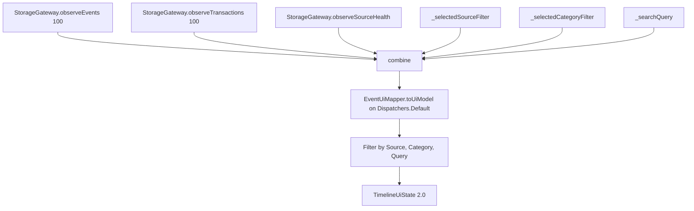
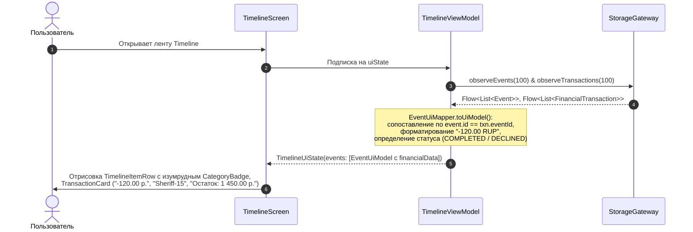
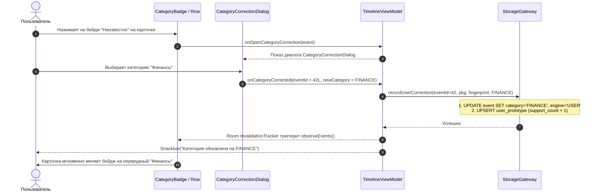
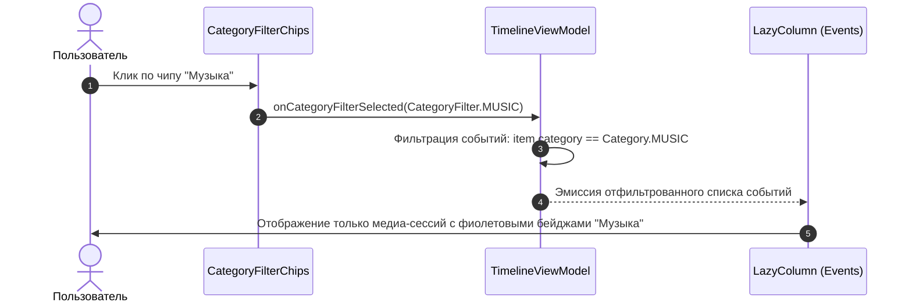

# Спецификация: zone/ui-timeline (Фаза 1: «Хардкод-MVP»)

## Модуль: :ui:timeline   Зона: zone/ui-timeline   Версия спеки: v2 (Timeline 2.0)   Статус: APPROVED

---

### 1. Назначение и контекст модуля

Модуль `:ui:timeline` является Android-библиотекой (`android-library`) на базе **Jetpack Compose** и дизайн-системы **Material 3**. В рамках Фазы 1 («Хардкод-MVP») модуль эволюционирует в **Timeline 2.0** — реактивный интерфейс мониторинга, семантической классификации и управления финансовыми транзакциями.

#### Ключевые возможности Timeline 2.0:
1. **Интерактивная лента событий 2.0:** Отображение структурированных событий с визуальной категоризацией, бейджами уверенности (`confidence`) и признаком классификатора (`Engine`: `PROTOTYPE`, `RULES`, `USER`).
2. **Специализированные финансовые карточки (`TransactionCard`):** Выделенный UI-блок для событий с категорией `FINANCE`, содержащий крупную форматированную сумму со знаком и валютой (`-120.00 RUP`, `+500.00 MDL`), имя мерчанта, маску счёта/карты (`*1234`), остаток баланса и статус транзакции.
3. **Визуализация статуса транзакций и отказов:** Специальный индикатор отказа (красный бейдж `Отказ` / `DECLINED`) для неуспешных банковских операций (`DECLINED`, `REFUZATA`, `FAILED`), исключающий путаницу с реальными расходами.
4. **Интерактивный контур обратной связи (Feedback Loop Dialogs):**
   - `CategoryCorrectionDialog`: Модальный диалог мгновенной ручной коррекции категории в 1-2 клика при клике на бейдж категории карточки или из экрана деталей. Переопределение категории инициирует создание/обновление пользовательского шаблона `UserPrototype` в хранилище через `StorageGateway.recordUserCorrection`.
   - `EventDetailsDialog 2.0`: Расширенный просмотр детальных метаданных события, распарсенных атрибутов финансовой транзакции, отпечатка контента (`contentFingerprint`), движка классификации и форматированного сырого JSON исходного пуша (`raw_event.payload_json`).
5. **Мультикритериальная реактивная фильтрация:** Поддержка фильтрации по категориям (чипы «Все», «Финансы», «Связь», «Музыка», «Сервисы»), источникам («Уведомления», «SMS», «Медиа») и сквозному поисковому запросу (`searchQuery`).
6. **Системные операции:** Экспорт базы данных в JSON (`Intent.ACTION_SEND`) и безопасная очистка данных с подтверждением (`DeleteConfirmationDialog`).

#### Архитектурные границы:
- Модуль **НЕ обращается напрямую** к Room DAO или SQLite.
- Модуль **НЕ содержит** regex-парсеров или логики захвата пушей/SMS/медиа.
- Все операции чтения и мутации осуществляются строго через контракт `StorageGateway`.

---

### 2. Архитектурное окружение и структура пакетов

```
ui/timeline/
├── build.gradle.kts
└── src/
    ├── main/
    │   ├── AndroidManifest.xml
    │   ├── kotlin/com/example/npc/ui/timeline/
    │   │   ├── di/
    │   │   │   └── TimelineModule.kt
    │   │   ├── mapper/
    │   │   │   └── EventUiMapper.kt
    │   │   ├── model/
    │   │   │   ├── CategoryFilter.kt
    │   │   │   ├── EventDetailsUiState.kt
    │   │   │   ├── EventUiModel.kt
    │   │   │   ├── FinancialTransactionUiModel.kt
    │   │   │   ├── SourceFilter.kt
    │   │   │   ├── SourceHealthStatus.kt
    │   │   │   ├── SourceHealthUiModel.kt
    │   │   │   ├── TimelineUiEffect.kt
    │   │   │   ├── TimelineUiState.kt
    │   │   │   └── TransactionStatusUi.kt
    │   │   └── ui/
    │   │       ├── TimelineScreen.kt
    │   │       ├── TimelineViewModel.kt
    │   │       ├── components/
    │   │       │   ├── CategoryBadge.kt
    │   │       │   ├── CategoryCorrectionDialog.kt
    │   │       │   ├── CategoryFilterChips.kt
    │   │       │   ├── DeleteConfirmationDialog.kt
    │   │       │   ├── EmptyTimelineView.kt
    │   │       │   ├── EventDetailsDialog.kt
    │   │       │   ├── RawPayloadJsonViewer.kt
    │   │       │   ├── SourceHealthBadge.kt
    │   │       │   ├── SourceHealthHeader.kt
    │   │       │   ├── TimelineItemRow.kt
    │   │       │   ├── TimelineSearchBar.kt
    │   │       │   └── TransactionCard.kt
    │   │       └── theme/
    │   │           └── CategoryColors.kt
    │   └── res/
    │       └── drawable/
    │           ├── ic_source_media.xml
    │           ├── ic_source_notification.xml
    │           └── ic_source_sms.xml
    └── test/
        └── kotlin/com/example/npc/ui/timeline/
            ├── mapper/
            │   └── EventUiMapperTest.kt
            └── ui/
                └── TimelineViewModelTest.kt
```

---

### 3. Модели данных представления (UI Models & State)

Все модели пользовательского интерфейса размещаются в пакете `com.example.npc.ui.timeline.model` и являются строго иммутабельными (`@Immutable`).

#### 3.1. `TransactionStatusUi`

```kotlin
package com.example.npc.ui.timeline.model

enum class TransactionStatusUi {
    COMPLETED,
    DECLINED
}
```

- **Назначение:** UI-статус финансовой транзакции.
- **Значения:**
  - `COMPLETED` — операция успешно завершена (списание, пополнение или перевод).
  - `DECLINED` — отказ в авторизации / отклонённая банком операция (`DECLINED`, `REFUZATA`, `ОТКАЗ`, `НЕДОСТАТОЧНО СРЕДСТВ`). Отображает специальный красный бейдж `Отказ` и зачёркнутую либо приглушённую сумму.

---

#### 3.2. `FinancialTransactionUiModel`

```kotlin
package com.example.npc.ui.timeline.model

import androidx.compose.runtime.Immutable
import com.example.npc.core.model.finance.Direction

@Immutable
data class FinancialTransactionUiModel(
    val id: Long,
    val bank: String,
    val direction: Direction,
    val formattedAmount: String,
    val currencyCode: String,
    val currencySymbol: String,
    val merchant: String?,
    val accountMask: String?,
    val formattedBalance: String?,
    val status: TransactionStatusUi = TransactionStatusUi.COMPLETED,
    val extractorInfo: String
) {
    val isExpense: Boolean get() = direction == Direction.DEBIT
    val isIncome: Boolean get() = direction == Direction.CREDIT
    val isTransfer: Boolean get() = direction == Direction.TRANSFER
    val isDeclined: Boolean get() = status == TransactionStatusUi.DECLINED
}
```

- **Назначение:** Модель отображения параметров финансовой транзакции внутри карточки события и в диалоге подробностей.
- **Поля:**
  - `id: Long` — идентификатор транзакции (`FinancialTransaction.id`).
  - `bank: String` — идентификатор банка (`"APB"`, `"PRISBANK"`, `"MAIB"`, `"SMS"`).
  - `direction: Direction` — направление движения средств (`DEBIT`, `CREDIT`, `TRANSFER`).
  - `formattedAmount: String` — форматированная сумма со знаком и разделителями, например `"-120.00"`, `"+1 500.00"`.
  - `currencyCode: String` — строковый код валюты (`"RUP"`, `"MDL"`, `"RUB"`, `"EUR"`, `"USD"`).
  - `currencySymbol: String` — символ валюты (`"р."`, `"L"`, `"₽"`, `"€"`, `"$"`, `"$"`).
  - `merchant: String?` — наименование мерчанта/получателя (например `"Sheriff-15"`, `"Linella"`, `"P2P"`).
  - `accountMask: String?` — маска счёта/карты (например `"*4321"`).
  - `formattedBalance: String?` — отформатированный остаток с символом валюты (`"Остаток: 1 450.00 р."` или `null`).
  - `status: TransactionStatusUi` — статус успешности транзакции (`COMPLETED` или `DECLINED`).
  - `extractorInfo: String` — версия и ID экстрактора для отладки (`"apb.push v1"`).
- **Инварианты:**
  - `formattedAmount` всегда содержит знак: `"-"` для `DEBIT`, `"+"` для `CREDIT`, `""` или `""` для `TRANSFER`.
  - Сумма форматируется с 2 знаками после запятой и пробелом между тысячами.

---

#### 3.3. `EventUiModel` 2.0

```kotlin
package com.example.npc.ui.timeline.model

import androidx.annotation.DrawableRes
import androidx.compose.runtime.Immutable
import com.example.npc.core.model.Category
import com.example.npc.core.model.classify.Engine

@Immutable
data class EventUiModel(
    val id: Long,
    val rawId: Long,
    val displayTitle: String,
    val displayText: String,
    val normalizedText: String,
    val timeLabel: String,
    val sourceName: String,
    @DrawableRes val sourceIconRes: Int,
    val langLabel: String,
    val isUpdate: Boolean,
    val threadKey: String?,
    val packageName: String? = null,
    val isUpdateOf: Long? = null,
    val payloadJson: String? = null,
    
    // --- Новые поля Фазы 1 (Timeline 2.0) ---
    val category: Category = Category.UNKNOWN,
    val confidence: Float = 0.0f,
    val engineUsed: Engine = Engine.NONE,
    val isUserCorrected: Boolean = false,
    val contentFingerprint: String? = null,
    val financialData: FinancialTransactionUiModel? = null
) {
    init {
        require(id >= 0L) { "id must be >= 0" }
        require(rawId >= 0L) { "rawId must be >= 0" }
        require(displayTitle.isNotEmpty()) { "displayTitle must not be empty" }
        require(timeLabel.isNotEmpty()) { "timeLabel must not be empty" }
        require(confidence in 0.0f..1.0f) { "confidence must be in 0.0..1.0, got $confidence" }
    }

    val title: String get() = displayTitle
    val text: String get() = displayText
    val source: String get() = sourceName
    val formattedTime: String get() = timeLabel
    val isPrototypeDerived: Boolean get() = engineUsed == Engine.PROTOTYPE
    val hasFinancialData: Boolean get() = financialData != null
}
```

- **Новые поля Фазы 1:**
  - `category: Category` — классифицированная категория (`FINANCE`, `COMMUNICATION`, `MUSIC`, `SERVICES`, `UNKNOWN`).
  - `confidence: Float` — степень уверенности классификатора в диапазоне `[0.0f, 1.0f]`. При матчинге пользовательского прототипа всегда `1.0f`.
  - `engineUsed: Engine` — движок, определивший категорию (`PROTOTYPE`, `RULES`, `USER`, `NONE`).
  - `isUserCorrected: Boolean` — флаг того, что категория была явно отредактирована пользователем.
  - `contentFingerprint: String?` — SHA-256 отпечаток шаблона текста для матчинга прототипов.
  - `financialData: FinancialTransactionUiModel?` — связанная распарсенная финансовая транзакция.

---

#### 3.4. `CategoryFilter`

```kotlin
package com.example.npc.ui.timeline.model

import com.example.npc.core.model.Category

enum class CategoryFilter(val displayName: String, val category: Category?) {
    ALL("Все", null),
    FINANCE("Финансы", Category.FINANCE),
    COMMUNICATION("Связь", Category.COMMUNICATION),
    MUSIC("Музыка", Category.MUSIC),
    SERVICES("Сервисы", Category.SERVICES)
}
```

- **Назначение:** Набор чипов быстрой категорийной фильтрации на главном экране.
- **Инвариант:** `ALL.category == null` — означает отсутствие фильтрации по категориям.

---

#### 3.5. `TimelineUiState` 2.0

```kotlin
package com.example.npc.ui.timeline.model

import androidx.compose.runtime.Immutable
import com.example.npc.core.model.Category

@Immutable
data class TimelineUiState(
    val events: List<EventUiModel> = emptyList(),
    val sourceHealth: List<SourceHealthUiModel> = emptyList(),
    val selectedSourceFilter: SourceFilter = SourceFilter.ALL,
    val selectedCategoryFilter: CategoryFilter = CategoryFilter.ALL,
    val searchQuery: String = "",
    val isLoading: Boolean = false,
    val selectedEventForDetails: EventUiModel? = null,
    val eventForCategoryCorrection: EventUiModel? = null,
    val isDeleteConfirmationVisible: Boolean = false,
    val isExporting: Boolean = false,
    val errorMessage: String? = null
) {
    val sourceHealthList: List<SourceHealthUiModel> get() = sourceHealth
    val isSuccess: Boolean get() = !isLoading && errorMessage == null && events.isNotEmpty()
    val isEmpty: Boolean get() = !isLoading && errorMessage == null && events.isEmpty()
    val isError: Boolean get() = errorMessage != null
    val isCorrectionDialogOpen: Boolean get() = eventForCategoryCorrection != null
}
```

---

#### 3.6. `TimelineUiEffect`

```kotlin
package com.example.npc.ui.timeline.model

sealed interface TimelineUiEffect {
    data class ShowSnackbar(val message: String) : TimelineUiEffect
    data class ShareJsonExport(val json: String) : TimelineUiEffect
    data class ShareJsonFile(val jsonContent: String, val filename: String) : TimelineUiEffect
    data class CopyToClipboard(val text: String, val label: String) : TimelineUiEffect
}
```

---

### 4. Цветовая палитра и стили категорий (`CategoryColors`)

Для обеспечения мгновенной узнаваемости категорий и отсутствия «AI-slop» эффекта в UI фиксируется строгая палитра цветов и визуальных токенов.

```kotlin
package com.example.npc.ui.timeline.ui.theme

import androidx.compose.ui.graphics.Color
import com.example.npc.core.model.Category

data class CategoryStyle(
    val label: String,
    val primaryColor: Color,
    val containerColor: Color,
    val onContainerColor: Color,
    val borderColor: Color
)

object CategoryColors {
    // 1. Финансы — изумрудный (Emerald Green)
    val Finance = CategoryStyle(
        label = "Финансы",
        primaryColor = Color(0xFF059669),
        containerColor = Color(0xFFD1FAE5),
        onContainerColor = Color(0xFF065F46),
        borderColor = Color(0xFF10B981)
    )

    // 2. Связь — насыщенный синий (Royal Blue)
    val Communication = CategoryStyle(
        label = "Связь",
        primaryColor = Color(0xFF2563EB),
        containerColor = Color(0xFFDBEAFE),
        onContainerColor = Color(0xFF1E40AF),
        borderColor = Color(0xFF3B82F6)
    )

    // 3. Музыка / Медиа — фиолетовый (Purple / Violet)
    val Music = CategoryStyle(
        label = "Музыка",
        primaryColor = Color(0xFF7C3AED),
        containerColor = Color(0xFFEDE9FE),
        onContainerColor = Color(0xFF5B21B6),
        borderColor = Color(0xFF8B5CF6)
    )

    // 4. Сервисы — тёплый оранжевый (Vibrant Orange)
    val Services = CategoryStyle(
        label = "Сервисы",
        primaryColor = Color(0xFFEA580C),
        containerColor = Color(0xFFFFEDD5),
        onContainerColor = Color(0xFF9A3412),
        borderColor = Color(0xFFF97316)
    )

    // 5. Неизвестно / Прочее — нейтральный серый (Slate Neutral)
    val Unknown = CategoryStyle(
        label = "Неизвестно",
        primaryColor = Color(0xFF64748B),
        containerColor = Color(0xFFF1F5F9),
        onContainerColor = Color(0xFF334155),
        borderColor = Color(0xFF94A3B8)
    )

    // Специальные цвета статусов
    val DeclinedBadgeContainer = Color(0xFFFEE2E2)
    val DeclinedBadgeContent = Color(0xFF991B1B)
    val DeclinedBadgeBorder = Color(0xFFEF4444)

    val ExpenseAmount = Color(0xFFDC2626) // Красный оттенок для списаний
    val IncomeAmount = Color(0xFF16A34A)  // Зелёный оттенок для зачислений
    val TransferAmount = Color(0xFF2563EB) // Синий оттенок для переводов

    fun forCategory(category: Category): CategoryStyle = when (category) {
        Category.FINANCE -> Finance
        Category.COMMUNICATION -> Communication
        Category.MUSIC -> Music
        Category.SERVICES -> Services
        Category.UNKNOWN -> Unknown
    }
}
```

---

### 5. Спецификация компонентов Jetpack Compose (Timeline 2.0)

#### 5.1. `CategoryBadge` — цветной бейдж категории и признака прототипа

```kotlin
@Composable
fun CategoryBadge(
    category: Category,
    confidence: Float,
    isPrototype: Boolean,
    isUserCorrected: Boolean,
    onClick: () -> Unit,
    modifier: Modifier = Modifier
)
```

- **Визуальное представление:**
  - Скруглённый контейнер (`RoundedCornerShape(8.dp)`), фон `containerColor`, тонкая обводка `borderColor` (0.75.dp).
  - Слева отображается цветная точка (6.dp) либо микро-иконка:
    - Если `isUserCorrected == true` — иконка `Icons.Default.Person` (пользовательское правило).
    - Если `isPrototype == true` — иконка `Icons.Default.AutoAwesome` (выученный прототип).
  - Текст: название категории (`"Финансы"`, `"Связь"` и т.д.) шрифтом `MaterialTheme.typography.labelSmall`.
  - При `confidence > 0` справа выводится процент уверенности (`"100%"`, `"85%"`).
  - Кликабельность: весь бейдж является интерактивным (`clickable(onClick = onClick)`), при тапе открывается `CategoryCorrectionDialog`.

```
┌──────────────────────────────────────────────┐
│  (★) Финансы  100%  [chevron / edit icon]     │
└──────────────────────────────────────────────┘
```

---

#### 5.2. `TransactionCard` — блок финансовых транзакций

```kotlin
@Composable
fun TransactionCard(
    transaction: FinancialTransactionUiModel,
    modifier: Modifier = Modifier
)
```

- **Размещение:** Встраивается внутрь `TimelineItemRow` непосредственно под текстом сообщения, если `event.financialData != null`.
- **Внутренняя иерархия:**
  - Контейнер: `Surface` со скруглёнными углами 10.dp, фоном `surfaceContainerLow` и тонкой границей `outlineVariant`.
  - **Верхняя строка (Сумма и статус):**
    - Слева: крупная сумма со знаком и символом валюты (`"-120.00 р."` или `"+1 500.00 L"`), стиль `MaterialTheme.typography.titleLarge`, жирность `FontWeight.Bold`.
      - Цвет текста: `CategoryColors.IncomeAmount` (зелёный) при `CREDIT`, `MaterialTheme.colorScheme.onSurface` или `ExpenseAmount` при `DEBIT`.
      - Если `status == DECLINED`: сумма перечеркивается (`textDecoration = TextDecoration.LineThrough`) либо окрашивается в нейтрально-серый цвет.
    - Справа: если `transaction.status == DECLINED`, рендерится ярко выраженный бейдж `Отказ`:
      - Фон: `CategoryColors.DeclinedBadgeContainer` (`#FEE2E2`).
      - Текст: `"ОТКАЗ"`, цвет `CategoryColors.DeclinedBadgeContent` (`#991B1B`), жирный `FontWeight.Bold`, стиль `labelSmall`.
    - Если транзакция успешна (`COMPLETED`), выводится бейдж направления: `"Списание"` / `"Пополнение"` / `"Перевод"`.
  - **Средняя строка (Мерчант и карта):**
    - Если `transaction.merchant != null`: текст мерчанта (например, `"Шериф-15"` или `"Linella"`), иконка магазина `Icons.Default.Storefront`.
    - Если `transaction.accountMask != null`: чип маски карты (например, `"*4812"`).
  - **Нижняя строка (Остаток баланса):**
    - Если `transaction.formattedBalance != null`: аккуратный текст `transaction.formattedBalance` (например, `"Остаток: 1 450.00 р."`), стиль `bodySmall`, цвет `outline`.

---

#### 5.3. `TimelineItemRow` 2.0 — карточка элемента ленты

```kotlin
@Composable
fun TimelineItemRow(
    event: EventUiModel,
    onClick: () -> Unit,
    onCategoryClick: () -> Unit,
    modifier: Modifier = Modifier
)
```

- **Структура карточки:**
  ```
  Card(modifier.clickable(onClick = onClick))
  └── Row
      ├── [Если event.isUpdate] Боковая полоса 4.dp (primary)
      └── Column(Modifier.padding(12.dp))
          ├── HeaderRow:
          │   ├── Источник: Icon(sourceIconRes) + Text(sourceName)
          │   ├── Spacer(weight = 1f)
          │   ├── [CategoryBadge] (кликабелен! -> onCategoryClick)
          │   ├── [Если isUpdate] Бейдж "ИЗМЕНЕНО"
          │   ├── Бейдж языка "RU"
          │   └── Время: Text(timeLabel)
          ├── Title: Text(displayTitle, fontWeight = Bold)
          ├── Text: Text(displayText, maxLines = 3)
          ├── [Если event.financialData != null]
          │   └── TransactionCard(event.financialData)
          └── [Если threadKey != null] Footer: Text("Тред: ...")
  ```

---

#### 5.4. `CategoryCorrectionDialog` — интерактивный диалог ручной коррекции категории

```kotlin
@Composable
fun CategoryCorrectionDialog(
    event: EventUiModel,
    onDismiss: () -> Unit,
    onCategorySelected: (Category) -> Unit
)
```

- **Назначение:** Модальный диалог (`AlertDialog` / `Dialog`), позволяющий пользователю в 1 тап исправить категорию события.
- **Поведение и шаги:**
  1. Отображает заголовок: `"Коррекция категории"`.
  2. Подзаголовок с контекстом: исходный отправитель/заголовок события (`event.displayTitle`) и фрагмент текста.
  3. Если у события есть отпечаток `event.contentFingerprint`, выводится пояснение: *«Это правило применится ко всем будущим похожим уведомлениям от этого источника»*.
  4. Список доступных категорий в виде интерактивных строк с радиокнопками/чипами:
     - `FINANCE` («Финансы») — цветная иконка кошелька, изумрудный бейдж.
     - `COMMUNICATION` («Связь») — иконка чата, синий бейдж.
     - `MUSIC` («Музыка») — иконка ноты, фиолетовый бейдж.
     - `SERVICES` («Сервисы») — иконка шестерёнки, оранжевый бейдж.
     - `UNKNOWN` («Неизвестно / Сброс») — нейтральный серый бейдж.
  5. Текущая категория отмечена радиокнопкой.
  6. При выборе категории: диалог немедленно вызывает `onCategorySelected(selectedCategory)` и закрывается.
  7. Кнопка «Отмена» для закрытия без сохранения.

---

#### 5.5. `EventDetailsDialog` 2.0 (Bottom Sheet / Full Dialog)

```kotlin
@Composable
fun EventDetailsDialog(
    event: EventUiModel,
    onDismiss: () -> Unit,
    onOpenCategoryCorrection: () -> Unit,
    onCopyJson: (String) -> Unit
)
```

- **Содержимое:**
  1. **Шапка:** ID события, время, кнопка закрытия, кнопка «Скопировать JSON».
  2. **Секция семантической классификации:**
     - Текущая категория с бейджем `CategoryBadge`.
     - Кнопка *«Изменить категорию»* (акцентный `OutlinedButton` с иконкой редактирования), вызывающая `onOpenCategoryCorrection`.
     - Движок классификации: `event.engineUsed.name` (`PROTOTYPE`, `RULES`, `USER`, `NONE`).
     - Уверенность: `"${(event.confidence * 100).toInt()}%"`.
     - Отпечаток контента: `event.contentFingerprint ?: "Не вычислен"` (моноширинный текст с кнопкой копирования).
  3. **Секция финансовой транзакции (если `event.financialData != null`):**
     - Банк: `event.financialData.bank`.
     - Направление операции: `event.financialData.direction.name`.
     - Сумма и валюта: `"${event.financialData.formattedAmount} ${event.financialData.currencySymbol} (${event.financialData.currencyCode})"`.
     - Статус: `event.financialData.status` (с бейджем `ОТКАЗ`, если `DECLINED`).
     - Мерчант: `event.financialData.merchant ?: "—"`.
     - Маска счёта: `event.financialData.accountMask ?: "—"`.
     - Остаток на счёте: `event.financialData.formattedBalance ?: "—"`.
     - Экстрактор: `event.financialData.extractorInfo`.
  4. **Секция текста:** Заголовок, полный текст, нормализованный текст.
  5. **Секция сырого JSON:** Встроенный `RawPayloadJsonViewer` с форматированием.

---

#### 5.6. `CategoryFilterChips` — полоса чипов категорий

```kotlin
@Composable
fun CategoryFilterChips(
    selectedCategory: CategoryFilter,
    onCategorySelected: (CategoryFilter) -> Unit,
    modifier: Modifier = Modifier
)
```

- Горизонтальный скролл (`LazyRow` / `Row(Modifier.horizontalScroll)`) со списком чипов:
  `[Все] [Финансы] [Связь] [Музыка] [Сервисы]`
- Активный чип подсвечивается цветом соответствующей категории (для Финансов — изумрудный, для Связи — синий, для Музыки — фиолетовый).

---

### 6. Спецификация `EventUiMapper` 2.0

Класс `com.example.npc.ui.timeline.mapper.EventUiMapper` отвечает за детерминированную трансформацию доменных моделей `Event`, `FinancialTransaction`, `RawEvent`, `SourceHealth` в модели UI на диспетчере фонового потока.

```kotlin
package com.example.npc.ui.timeline.mapper

import com.example.npc.core.model.Event
import com.example.npc.core.model.FinancialTransaction
import com.example.npc.core.model.Lang
import com.example.npc.core.model.RawEvent
import com.example.npc.core.model.SourceHealth
import com.example.npc.core.model.SourceId
import com.example.npc.core.model.finance.Direction
import com.example.npc.ui.timeline.R
import com.example.npc.ui.timeline.model.EventUiModel
import com.example.npc.ui.timeline.model.FinancialTransactionUiModel
import com.example.npc.ui.timeline.model.SourceHealthStatus
import com.example.npc.ui.timeline.model.SourceHealthUiModel
import com.example.npc.ui.timeline.model.TransactionStatusUi
import java.text.DecimalFormat
import java.text.DecimalFormatSymbols
import java.time.Instant
import java.time.ZoneId
import java.time.format.DateTimeFormatter
import java.time.temporal.ChronoUnit
import java.util.Locale

object EventUiMapper {

    private val TIME_FORMATTER = DateTimeFormatter.ofPattern("HH:mm")
    private val DATE_TIME_FORMATTER = DateTimeFormatter.ofPattern("dd MMM, HH:mm")

    private val AMOUNT_FORMATTER = DecimalFormat("#,##0.00", DecimalFormatSymbols(Locale.US).apply {
        groupingSeparator = ' '
        decimalSeparator = '.'
    })

    fun toUiModel(
        event: Event,
        rawEvent: RawEvent? = null,
        transaction: FinancialTransaction? = null,
        zoneId: ZoneId = ZoneId.systemDefault()
    ): EventUiModel {
        val (sourceName, iconRes) = if (rawEvent != null) {
            when (rawEvent.source.value) {
                SourceId.SMS.value -> Pair("SMS", R.drawable.ic_source_sms)
                SourceId.MEDIA.value -> Pair("Медиа", R.drawable.ic_source_media)
                else -> Pair("Уведомление", R.drawable.ic_source_notification)
            }
        } else {
            resolveSourceInfo(event.threadKey?.value)
        }

        val timeLabel = formatTimestamp(event.ts, zoneId)
        val langLabel = when (event.lang) {
            Lang.RU -> "RU"
            Lang.EN -> "EN"
            Lang.UNK -> "UNK"
        }
        val displayTitle = if (event.title.isBlank()) "Без названия" else event.title.trim()

        val financialDataUi = transaction?.let { toTransactionUiModel(it) }

        return EventUiModel(
            id = event.id,
            rawId = event.rawId,
            displayTitle = displayTitle,
            displayText = event.text,
            normalizedText = event.normalizedText,
            timeLabel = timeLabel,
            sourceName = sourceName,
            sourceIconRes = iconRes,
            langLabel = langLabel,
            isUpdate = event.isUpdateOf != null,
            isUpdateOf = event.isUpdateOf,
            threadKey = event.threadKey?.value,
            packageName = rawEvent?.packageName,
            payloadJson = rawEvent?.payloadJson,
            category = event.category,
            confidence = event.confidence.toFloat(),
            engineUsed = event.engineUsed,
            isUserCorrected = event.isUserCorrected,
            contentFingerprint = event.contentFingerprint,
            financialData = financialDataUi
        )
    }

    fun toTransactionUiModel(txn: FinancialTransaction): FinancialTransactionUiModel {
        val majorAmount = txn.amount.toMajorBigDecimal()
        val formattedNumber = AMOUNT_FORMATTER.format(majorAmount)

        val signedFormattedAmount = when (txn.direction) {
            Direction.DEBIT -> "-$formattedNumber"
            Direction.CREDIT -> "+$formattedNumber"
            Direction.TRANSFER -> formattedNumber
        }

        val formattedBalance = txn.balance?.let { bal ->
            val balNumber = AMOUNT_FORMATTER.format(bal.toMajorBigDecimal())
            "Остаток: $balNumber ${bal.currency.symbol}"
        }

        val statusUi = if (isDeclinedTransaction(txn)) {
            TransactionStatusUi.DECLINED
        } else {
            TransactionStatusUi.COMPLETED
        }

        return FinancialTransactionUiModel(
            id = txn.id,
            bank = txn.bank,
            direction = txn.direction,
            formattedAmount = signedFormattedAmount,
            currencyCode = txn.amount.currency.code,
            currencySymbol = txn.amount.currency.symbol,
            merchant = txn.merchant,
            accountMask = txn.accountMask,
            formattedBalance = formattedBalance,
            status = statusUi,
            extractorInfo = "${txn.extractorId} v${txn.extractorVersion}"
        )
    }

    private fun isDeclinedTransaction(txn: FinancialTransaction): Boolean {
        // Проверка флага отказа по ключевым признакам в мерчанте или типе
        val m = txn.merchant?.uppercase(Locale.ROOT).orEmpty()
        return m.contains("DECLINED") || m.contains("ОТКАЗ") || m.contains("REFUZATA")
    }

    fun toHealthUiModel(
        health: SourceHealth,
        now: Instant = Instant.now(),
        zoneId: ZoneId = ZoneId.systemDefault()
    ): SourceHealthUiModel {
        val status = resolveHealthStatus(health, now)
        val (displayName, iconRes) = when (health.source.value) {
            SourceId.SMS.value -> Pair("SMS", R.drawable.ic_source_sms)
            SourceId.MEDIA.value -> Pair("Медиа", R.drawable.ic_source_media)
            else -> Pair("Уведомления", R.drawable.ic_source_notification)
        }
        val lastEventLabel = health.lastEventAt?.let { formatRelativeTime(it, now, zoneId) } ?: "нет событий"

        return SourceHealthUiModel(
            sourceId = health.source.value,
            displayName = displayName,
            iconRes = iconRes,
            status = status,
            events24h = health.events24h,
            events24hLabel = "24ч: ${health.events24h}",
            lastEventTimeLabel = lastEventLabel,
            queueDepth = health.queueDepth,
            lastError = health.lastError
        )
    }

    fun resolveHealthStatus(health: SourceHealth, now: Instant = Instant.now()): SourceHealthStatus {
        if (!health.lastError.isNullOrBlank() || health.queueDepth > 20) {
            return SourceHealthStatus.RED
        }
        val isStale = health.lastEventAt == null || ChronoUnit.HOURS.between(health.lastEventAt, now) >= 24
        if (isStale && health.events24h == 0 && health.queueDepth == 0) {
            return SourceHealthStatus.YELLOW
        }
        if (health.queueDepth in 6..20) {
            return SourceHealthStatus.YELLOW
        }
        return SourceHealthStatus.GREEN
    }

    private fun resolveSourceInfo(threadKey: String?): Pair<String, Int> {
        if (threadKey == null) {
            return Pair("Уведомление", R.drawable.ic_source_notification)
        }
        return when {
            threadKey.startsWith("sms:") -> Pair("SMS", R.drawable.ic_source_sms)
            threadKey.startsWith("media:") -> Pair("Медиа", R.drawable.ic_source_media)
            else -> Pair("Уведомление", R.drawable.ic_source_notification)
        }
    }

    private fun formatTimestamp(timestamp: Instant, zoneId: ZoneId): String {
        val eventZdt = timestamp.atZone(zoneId)
        val nowZdt = Instant.now().atZone(zoneId)
        return if (eventZdt.toLocalDate() == nowZdt.toLocalDate()) {
            eventZdt.format(TIME_FORMATTER)
        } else {
            eventZdt.format(DATE_TIME_FORMATTER)
        }
    }

    private fun formatRelativeTime(timestamp: Instant, now: Instant, zoneId: ZoneId): String {
        val minutes = ChronoUnit.MINUTES.between(timestamp, now)
        return when {
            minutes < 1 -> "только что"
            minutes < 60 -> "$minutes мин назад"
            minutes < 1440 -> "${minutes / 60} ч назад"
            else -> formatTimestamp(timestamp, zoneId)
        }
    }

    fun formatJsonPretty(rawJson: String): String {
        val trimmed = rawJson.trim()
        if (!trimmed.startsWith("{") && !trimmed.startsWith("[")) {
            return rawJson
        }
        return try {
            val jsonElement = org.json.JSONObject(trimmed)
            jsonElement.toString(2)
        } catch (_: Throwable) {
            try {
                val jsonArray = org.json.JSONArray(trimmed)
                jsonArray.toString(2)
            } catch (_: Throwable) {
                rawJson
            }
        }
    }
}
```

---

### 7. Спецификация `TimelineViewModel` 2.0

#### 7.1. Реактивный конвейер объединения потоков (Stream Combination Pipeline)



#### 7.2. Полный контракт `TimelineViewModel`

```kotlin
package com.example.npc.ui.timeline.ui

import androidx.lifecycle.ViewModel
import androidx.lifecycle.viewModelScope
import com.example.npc.core.model.Category
import com.example.npc.core.model.Event
import com.example.npc.core.model.FinancialTransaction
import com.example.npc.core.model.SourceHealth
import com.example.npc.core.storage.StorageGateway
import com.example.npc.ui.timeline.mapper.EventUiMapper
import com.example.npc.ui.timeline.model.CategoryFilter
import com.example.npc.ui.timeline.model.EventUiModel
import com.example.npc.ui.timeline.model.SourceFilter
import com.example.npc.ui.timeline.model.SourceHealthUiModel
import com.example.npc.ui.timeline.model.TimelineUiEffect
import com.example.npc.ui.timeline.model.TimelineUiState
import dagger.hilt.android.lifecycle.HiltViewModel
import kotlinx.coroutines.Dispatchers
import kotlinx.coroutines.flow.MutableSharedFlow
import kotlinx.coroutines.flow.MutableStateFlow
import kotlinx.coroutines.flow.SharedFlow
import kotlinx.coroutines.flow.SharingStarted
import kotlinx.coroutines.flow.StateFlow
import kotlinx.coroutines.flow.asSharedFlow
import kotlinx.coroutines.flow.combine
import kotlinx.coroutines.flow.flowOn
import kotlinx.coroutines.flow.stateIn
import kotlinx.coroutines.launch
import java.time.Instant
import javax.inject.Inject

@HiltViewModel
class TimelineViewModel @Inject constructor(
    private val storageGateway: StorageGateway
) : ViewModel() {

    private val _searchQuery = MutableStateFlow("")
    private val _selectedSourceFilter = MutableStateFlow(SourceFilter.ALL)
    private val _selectedCategoryFilter = MutableStateFlow(CategoryFilter.ALL)
    private val _selectedEventForDetails = MutableStateFlow<EventUiModel?>(null)
    private val _eventForCategoryCorrection = MutableStateFlow<EventUiModel?>(null)
    private val _isDeleteConfirmationVisible = MutableStateFlow(false)
    private val _isExporting = MutableStateFlow(false)

    private val _effects = MutableSharedFlow<TimelineUiEffect>(extraBufferCapacity = 64)
    val effects: SharedFlow<TimelineUiEffect> = _effects.asSharedFlow()

    private data class FilterParams(
        val query: String,
        val sourceFilter: SourceFilter,
        val categoryFilter: CategoryFilter
    )

    private val _filterParamsFlow = combine(
        _searchQuery,
        _selectedSourceFilter,
        _selectedCategoryFilter
    ) { query, srcFilter, catFilter ->
        FilterParams(query, srcFilter, catFilter)
    }

    private data class CombinedData(
        val events: List<EventUiModel>,
        val health: List<SourceHealthUiModel>,
        val filterParams: FilterParams
    )

    private val _filteredDataFlow = combine(
        storageGateway.observeEvents(limit = 100),
        storageGateway.observeTransactions(limit = 100),
        storageGateway.observeSourceHealth(),
        _filterParamsFlow
    ) { rawEvents: List<Event>, transactions: List<FinancialTransaction>, rawHealth: List<SourceHealth>, params: FilterParams ->
        val txnsByEventId = transactions.filter { it.eventId != null }.associateBy { it.eventId!! }
        val healthUiList = rawHealth.map { EventUiMapper.toHealthUiModel(it) }

        val eventUiList = rawEvents.map { event ->
            val txn = txnsByEventId[event.id]
            EventUiMapper.toUiModel(event = event, rawEvent = null, transaction = txn)
        }

        val filtered = eventUiList.filter { item ->
            // 1. Фильтр источника
            val matchesSource = when (params.sourceFilter) {
                SourceFilter.ALL -> true
                SourceFilter.NOTIFICATION -> item.source.equals("notification", ignoreCase = true) || item.source.contains("уведомлен", ignoreCase = true)
                SourceFilter.SMS -> item.source.equals("sms", ignoreCase = true)
                SourceFilter.MEDIA -> item.source.equals("media", ignoreCase = true) || item.source.contains("медиа", ignoreCase = true)
            }

            // 2. Фильтр категории
            val matchesCategory = when (params.categoryFilter) {
                CategoryFilter.ALL -> true
                CategoryFilter.FINANCE -> item.category == Category.FINANCE
                CategoryFilter.COMMUNICATION -> item.category == Category.COMMUNICATION
                CategoryFilter.MUSIC -> item.category == Category.MUSIC
                CategoryFilter.SERVICES -> item.category == Category.SERVICES
            }

            // 3. Поисковый запрос
            val matchesQuery = if (params.query.isBlank()) {
                true
            } else {
                val q = params.query.trim()
                item.title.contains(q, ignoreCase = true) ||
                    item.text.contains(q, ignoreCase = true) ||
                    (item.packageName?.contains(q, ignoreCase = true) == true) ||
                    item.normalizedText.contains(q, ignoreCase = true) ||
                    (item.financialData?.merchant?.contains(q, ignoreCase = true) == true) ||
                    (item.financialData?.formattedAmount?.contains(q, ignoreCase = true) == true)
            }

            matchesSource && matchesCategory && matchesQuery
        }

        CombinedData(filtered, healthUiList, params)
    }.flowOn(Dispatchers.Default)

    val uiState: StateFlow<TimelineUiState> = combine(
        _filteredDataFlow,
        _selectedEventForDetails,
        _eventForCategoryCorrection,
        _isDeleteConfirmationVisible,
        _isExporting
    ) { data, detailsEvent, correctionEvent, isDeleteVisible, isExporting ->
        TimelineUiState(
            events = data.events,
            sourceHealth = data.health,
            selectedSourceFilter = data.filterParams.sourceFilter,
            selectedCategoryFilter = data.filterParams.categoryFilter,
            searchQuery = data.filterParams.query,
            isLoading = false,
            selectedEventForDetails = detailsEvent,
            eventForCategoryCorrection = correctionEvent,
            isDeleteConfirmationVisible = isDeleteVisible,
            isExporting = isExporting
        )
    }.stateIn(
        scope = viewModelScope,
        started = SharingStarted.Eagerly,
        initialValue = TimelineUiState(isLoading = true)
    )

    // --- Обработчики поиска и фильтрации ---

    fun onSearchQueryChanged(query: String) {
        _searchQuery.value = query
    }

    fun onSourceFilterSelected(filter: SourceFilter) {
        _selectedSourceFilter.value = filter
    }

    fun onCategoryFilterSelected(filter: CategoryFilter) {
        _selectedCategoryFilter.value = filter
    }

    // --- Обработчики деталей события ---

    fun onEventClicked(event: EventUiModel) {
        _selectedEventForDetails.value = event
    }

    fun onDismissEventDetails() {
        _selectedEventForDetails.value = null
    }

    // --- Обработчики коррекции категории (Feedback Loop) ---

    fun onOpenCategoryCorrection(event: EventUiModel) {
        _eventForCategoryCorrection.value = event
    }

    fun onDismissCategoryCorrection() {
        _eventForCategoryCorrection.value = null
    }

    fun onCategoryCorrected(eventId: Long, newCategory: Category) {
        val targetEvent = _eventForCategoryCorrection.value ?: _selectedEventForDetails.value
        _eventForCategoryCorrection.value = null

        viewModelScope.launch {
            try {
                val pkg = targetEvent?.packageName ?: "unknown.package"
                val fp = targetEvent?.contentFingerprint ?: ""
                
                storageGateway.recordUserCorrection(
                    eventId = eventId,
                    packageName = pkg,
                    contentFingerprint = fp,
                    newCategory = newCategory,
                    correctedAt = Instant.now()
                )

                _effects.emit(TimelineUiEffect.ShowSnackbar("Категория обновлена на ${newCategory.name}"))
            } catch (e: Exception) {
                _effects.emit(TimelineUiEffect.ShowSnackbar("Ошибка сохранения: ${e.message}"))
            }
        }
    }

    // --- Системные операции ---

    fun onDeleteAllClicked() {
        _isDeleteConfirmationVisible.value = true
    }

    fun onDismissDeleteDialog() {
        _isDeleteConfirmationVisible.value = false
    }

    fun onConfirmDeleteAll() {
        _isDeleteConfirmationVisible.value = false
        viewModelScope.launch {
            try {
                storageGateway.deleteAll()
                _effects.emit(TimelineUiEffect.ShowSnackbar("Все данные успешно удалены"))
            } catch (e: Exception) {
                _effects.emit(TimelineUiEffect.ShowSnackbar("Ошибка удаления: ${e.message}"))
            }
        }
    }

    fun onExportJsonClicked() {
        viewModelScope.launch {
            try {
                _isExporting.value = true
                val json = storageGateway.exportAllToJson()
                _effects.emit(TimelineUiEffect.ShareJsonExport(json))
            } catch (e: Exception) {
                _effects.emit(TimelineUiEffect.ShowSnackbar("Ошибка экспорта: ${e.message}"))
            } finally {
                _isExporting.value = false
            }
        }
    }
}
```

---

### 8. Сквозные сценарии взаимодействия (Use Cases & Sequence Diagrams)

#### 8.1. Сценарий 1: Отображение банковского пуша с финансовой карточкой и статусом



#### 8.2. Сценарий 2: Ручная коррекция категории (User Feedback Loop)



#### 8.3. Сценарий 3: Фильтрация по категории «Музыка»



---

### 9. План тестирования и критерии приёмки (DoD)

#### 9.1. Unit-тесты маппера (`EventUiMapperTest`)
1. **Тест форматирования сумм и знаков:**
   - `DEBIT` 12000 копеек `RUP` → `"-120.00"`, символ `"р."`.
   - `CREDIT` 50000 копеек `MDL` → `"+500.00"`, символ `"L"`.
   - `TRANSFER` 1000 центов `USD` → `"10.00"`, символ `"$"`.
2. **Тест статуса DECLINED:**
   - Транзакция с мерчантом `"DECLINED_AUTH"` маппится в `TransactionStatusUi.DECLINED`.
   - Транзакция с обычным мерчантом маппится в `TransactionStatusUi.COMPLETED`.
3. **Тест форматирования баланса:**
   - Наличие `balance` → `"Остаток: 1 450.00 р."`.
   - `balance == null` → `formattedBalance == null`.
4. **Тест передачи полей категории и прототипа:**
   - `Category.FINANCE`, `confidence = 1.0f`, `Engine.PROTOTYPE`, `isUserCorrected = true` корректно пробрасываются в `EventUiModel`.

#### 9.2. Unit-тесты ViewModel (`TimelineViewModelTest` на Turbine)
1. **Тест объединения событий и транзакций:**
   - Эмиссия `Event(id = 1)` и `FinancialTransaction(eventId = 1)` приводит к `EventUiModel` с заполненным `financialData`.
2. **Тест фильтрации по категориям:**
   - Выбор `CategoryFilter.FINANCE` отсекает события с `Category.COMMUNICATION` и `Category.MUSIC`.
3. **Тест фильтрации по источникам и сквозному поиску:**
   - Поиск по имени мерчанта находит карточку даже если текст события отличается.
4. **Тест Feedback Loop:**
   - Вызов `onCategoryCorrected(42L, Category.FINANCE)` вызывает `storageGateway.recordUserCorrection` с корректными аргументами и эмитит `ShowSnackbar`.

#### 9.3. Definition of Done (DoD) для Фазы 1:
- [x] Все поля `category: Category`, `confidence: Float`, `financialData: FinancialTransactionUiModel?` добавлены в `EventUiModel`.
- [x] Компонент `CategoryBadge` реализован с палитрой цветов: Финансы — изумрудный, Связь — синий, Музыка — фиолетовый, Сервисы — оранжевый, Неизвестно — нейтральный.
- [x] Блок `TransactionCard` поддерживает крупную сумму, мерчанта, остаток и красный бейдж `Отказ` для `DECLINED`.
- [x] Диалог `CategoryCorrectionDialog` позволяет выбрать новую категорию и вызывает `recordUserCorrection`.
- [x] Диалог `EventDetailsDialog` 2.0 отображает распарсенные поля транзакции и сырой JSON.
- [x] Чипы `CategoryFilterChips` позволяют фильтровать по «Все», «Финансы», «Связь», «Музыка», «Сервисы».
- [x] Все unit-тесты выполняются за < 500 мс на чистой JVM.
