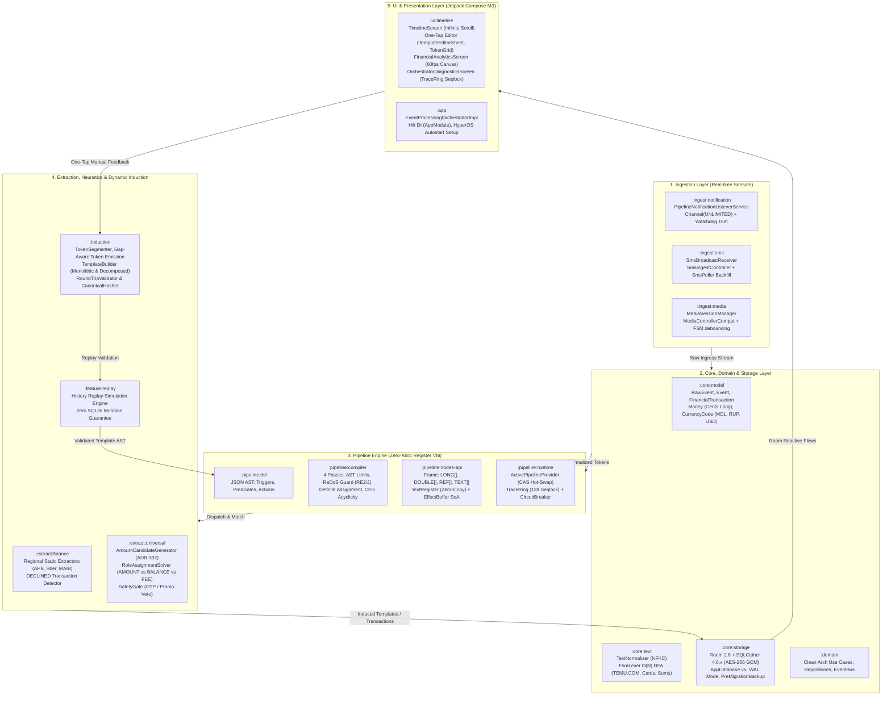

# Notification Pipeline Constructor (NPC)

[](https://developer.android.com)
[](https://kotlinlang.org)
[](https://developer.android.com/jetpack/compose)
[](#architecture)
[](https://www.zetetic.net/sqlcipher/)

High-performance, zero-alloc reactive event processing & financial transaction parser for Android.

NPC intercepts device events (push notifications, SMS, media sessions), normalizes them via zero-copy DFA lexers, matches them against declarative AST pipelines using a custom register-based virtual machine, extracts financial transactions across multiple currencies (`MDL`, `RUP`, `USD`, `EUR`, `RUB`), and supports dynamic on-device regex induction through a 1-tap visual editor.

---

## 🏛 Architecture Overview

NPC is organized into **16 modular Gradle components** across 5 distinct architectural layers:



---

## 📦 Modules Directory

| Module | Responsibilities | Key Components |
|---|---|---|
| [`:core:model`](core/model) | Immutable domain primitives, Money arithmetic, strict validation | `RawEvent`, `FinancialTransaction`, `Money`, `CurrencyCode` |
| [`:core:text`](core/text) | Unicode NFKC normalization, Zero-alloc O(N) DFA Lexer | `TextNormalizer`, `FsmLexer`, `TokenType`, `Token` |
| [`:core:storage`](core/storage) | AES-256 encrypted Room database, migrations, deduplication | `AppDatabase`, `FinancialTransactionDao`, `FinancialTransactionDeduplicator` |
| [`:domain`](domain) | Clean Architecture UseCases and inter-module contracts | `ProcessIncomingEventUseCase`, `TemplateBankUseCase` |
| [`:pipeline:dsl`](pipeline/dsl) | Declarative AST schema for pipeline stages and triggers | `PipelineDefinition`, `StageDefinition`, `PredicateAST` |
| [`:pipeline:compiler`](pipeline/compiler) | 4-pass compiler: AST validation, ReDoS guard, Dataflow, CFG | `PipelineCompiler`, `Re2jSecurityValidator`, `KahnTopologicalSorter` |
| [`:pipeline:nodes-api`](pipeline/nodes-api) | Primitive register structures, Zero-copy text views | `Frame`, `TextRegister`, `EffectBuffer` |
| [`:pipeline:runtime`](pipeline/runtime) | CAS pipeline hot-swapper, Seqlock lock-free telemetry ring | `ActivePipelineProvider`, `TraceRing`, `PipelineExecutor` |
| [`:extract:finance`](extract/finance) | Regional bank parsers, decline detection, OTP veto | `MaibPushExtractor`, `ApbPushExtractor`, `PrisbankExtractor` |
| [`:extract:universal`](extract/universal) | Heuristic token solver for unknown multi-currency notifications | `AmountCandidateGenerator`, `RoleAssignmentSolver`, `SafetyGate` |
| [`:induction`](induction) | Gap-aware regex synthesis, token role auto-tagging | `TemplateBuilder`, `TokenSegmenter`, `RoundTripValidator` |
| [`:feature:replay`](feature/replay) | Replay simulation against historical events without DB mutation | `HistoryReplayEngine`, `ReplayAuditValidator` |
| [`:ingest:notification`](ingest/notification) | System notification listener, watchdog, HyperOS recovery | `PipelineNotificationListenerService`, `LiveWatchdogForegroundService` |
| [`:ingest:sms`](ingest/sms) | SMS broadcast receiver and background provider pollers | `SmsBroadcastReceiver`, `SmsIngestController`, `SmsPoller` |
| [`:ingest:media`](ingest/media) | Media session listener with debounced playback state | `MediaSessionObserver`, `MediaControllerHolder` |
| [`:ui:timeline`](ui/timeline) | Jetpack Compose M3 UI: Timeline, One-Tap Editor, Analytics | `TimelineScreen`, `TemplateEditorSheet`, `FinancialAnalyticsScreen` |
| [`:app`](app) | Hilt DI root, Application lifecycle, Orchestrator coordinator | `NpcApplication`, `MainActivity`, `EventProcessingOrchestratorImpl` |

---

## 🎨 Interactive Architecture Infographic

For a detailed interactive visual walkthrough of the zero-allocation pipeline and real-time state machines, open:
👉 **[`npc_architecture_infographic.html`](npc_architecture_infographic.html)**

---

## 🚀 Building & Testing

### Prerequisites
- JDK 17 or JDK 21
- Android SDK (API 34 / 35)

### Build Commands
```bash
# Assemble Debug APK
./gradlew assembleDebug

# Run All Unit Tests
./gradlew test

# Run Specific Module Tests
./gradlew :pipeline:compiler:test
./gradlew :induction:test
./gradlew :core:storage:test
```

---

## 🛡 Security & Privacy
- **100% On-Device:** Zero cloud telemetry or external network calls for transaction parsing.
- **SQLCipher AES-256 GCM:** Database encrypted with hardware Keystore keys.
- **ReDoS Protection:** All user and dynamic regexes are compiled and validated with Google RE2/J (guaranteed linear-time evaluation).
- **Safety Gate:** One-Time Passwords (2FA/OTP) and sensitive verification codes are strictly vetoed from transaction extraction.

---

## 📄 License
MIT License. Created by [Asm'o'Dan](https://github.com/Asm-o-Dan).
